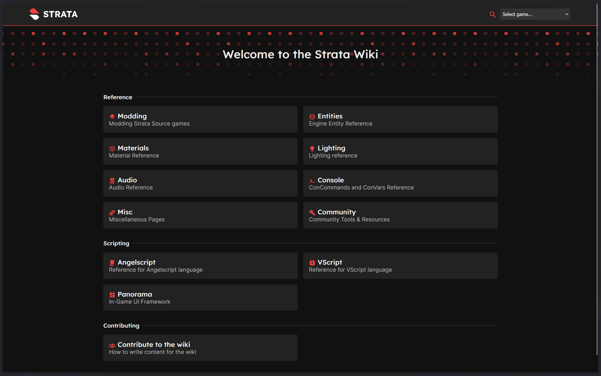

# Making A New Category

Categories are the top level groups you can see on the home page of the Strata Source Wiki. Ex. Panorama, Materials, Entities. These categories contain topics relating to the category and from there articles for each topic.



Currently as of writing (1/12/26), Wiki categories are unfortunately controlled by the Wiki software, rather than simply making a folder, a `meta.json` file, and the Markdown articles, this is planned to hopefully change in the future.

Before making a new category, a Markdown file and a `meta.json` file is needed to make an category work. Check out the [Category section](../basics/structure#categories) of the `Wiki Structure` article to know how the Wiki is fully structured and how to set up the `meta.json` file.

Once the files and folders setup in the `docs` folder, head to the `site/src/routes/+page.svelte` file. This file is the page file for the `Home` page of the Wiki.

## Adding The Category

The area that should be focused in this file is the line that starts with `const categories: (`. This line is the beginning of the list of all the categories features on the `Home` page. A few lines down should describe how each section should be structured to provide the information needed to tell the software what the category itself is.

There are two parts to the list of categories, the categories themselves, and header separators. Separators are simply the bigger text that separates the categories out, ex. "Reference", "Scripting", "Contributing".

The easy thing to do is copy and paste a preexisting category or header separator that is already in the `categories` list. Do note, order does matter here, categories first on the list will be at the top of the page.

### Category

```ts
    {
        id: string; // The article (without the ".md") that should be entered into by default when the category is selected.
        title: string; // Title displayed for the category.
        description: string; // Description of the category.
        icon: string; // Icon to use for the category displayed before the "title". Recommended to use a icon imported from the material icons package.
        separation: false; // This needs to be false for categories.
    }
```

### Header Separator

```ts
{ title: string; separation: true; } // Alternate structure for headers separators.
```

## Testing Changes

If the local instance of the Wiki is currently running, once a change is made to the file, the changes will be automatically applied live for checking if changes appear correctly. Svelte will display a error if there is a issue with the file that has been edited.
