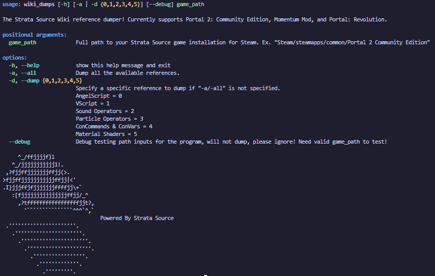

# Updating Wiki Dumps

The Strata Wiki's reference topics are all created by the Wiki software, which reads JSON files that are generated by the engine. Currently as of 02/03/26, these files are not generated and added to the Wiki automatically and must be manually provided to the Wiki repositories dump folder so the public facing Wiki can display the latest references.

***It is highly recommended to use the `wiki_dumps.py` Python script which will get ALL the available dumps for you by the engine, as well as renaming and sticking them into the appropriate Wiki dumps directory.***

If you wish to get individual dumps, there are several Console commands and methods to take to get certain dumps. Most of these commands should dump to the `data` folder located in the current game folder (Ex. `p2ce/data`). It will be specified if otherwise. Those with `(WIKI)` in the front are dumps used by the Wiki.

There exists a executable in the `bin/win64` directory of the Strata game which will provide dumps for various references of the engine. `docdump` can be used in a terminal with a specifying parameter and filename to get a JSON dump of the specified reference. Running `docdump` on it's own provides available parameters.

## The Dumps

### AngelScript

The AngelScript scripting system is setup to dump several different dumps of the registered AngelScript. These are separated by server and client by have matching commands with the exception of the front.

`sv/cl_scriptsystem_dump`: Dumps a `api_reference` HTML page which provides a local reference of the registered AngelScript.
(WIKI) `sv/cl_scriptsystem_dump_json`: Dumps the `api_reference` JSON file used for the Wiki's AngelScript reference pages. This should be renamed to `angelscript_server_p2ce.json` or `angelscript_client_p2ce.json` respectively before replacing the current dumps in the `dumps` folder.
`sv/cl_scriptsystem_dump_lsp`: Dumps a `as.predefined` file used with the AngelScript Language Server Visual Studio Code extension.

There also exists a separate Hammer dump for AngelScript, instead of using the game, Hammer's added Console must be used instead.

`scriptsystem_dump`: Dumps a `api_reference` HTML page which provides a local reference of the registered AngelScript for Hammer.
(WIKI) `scriptsystem_dump_json`: Dumps the `api_reference` JSON file used for the Wiki's AngelScript reference pages. This should be renamed to `angelscript_hammer_p2ce.json` before replacing the current dumps in the `dumps` folder.
`scriptsystem_dump_lsp`: Dumps a `as.predefined` file used with the AngelScript Language Server Visual Studio Code extension.

### VScript

Like AngelScript, VScript also comes with a server-client model for its dumps. However, as of 02/03/26, there is no difference between the two and the server one should be used for the Wiki.

(WIKI) `sv/cl_script_dump_docs`: Dumps a `vscript_docs.server` JSON file used for the Wiki's VScript reference pages. This should be renamed to `vscript.json` before replacing the current dumps in the `dumps` folder.

### Sound Operators

`snd_sos_print_operators (filename-to-dump-to)`: This ConCommand alone will partially dump all available sound operators to the console, this generally isn't helpful, but adding a file name at the end will instead save the sound operators to a JSON file relative to the game directory (Ex. `p2ce`).

(WIKI) Using `docdump`: Run `docdump` with the parameters `sound_ops sound_operators` and the program will output all available sound operators to a JSON file for the Wiki to parse.

### Particles

`cl_particles_dump_json`: Dumps a `particle_docs` JSON file containing particle operators.

(WIKI) Using `docdump`: Run `docdump` with the parameters `particle_ops materials` and the program will output all available material shaders to a JSON file for the Wiki to parse.

## ConCommands & ConVars

(WIKI) `cvar_dump`: Dumps a `cvars` JSON file containing all registered non-developer ConCommands and ConVars in the engine. This file is used on the Wiki's ConCommand and ConVar reference pages. This file should be renamed to `commands_(game).json` where `(game)` is the current game folder (Ex. `commands_p2ce.json`).

### Material Shaders

(WIKI) Using `docdump`: Run `docdump` with the parameters `shader materials` and the program will output all available material shaders to a JSON file for the Wiki to parse.
