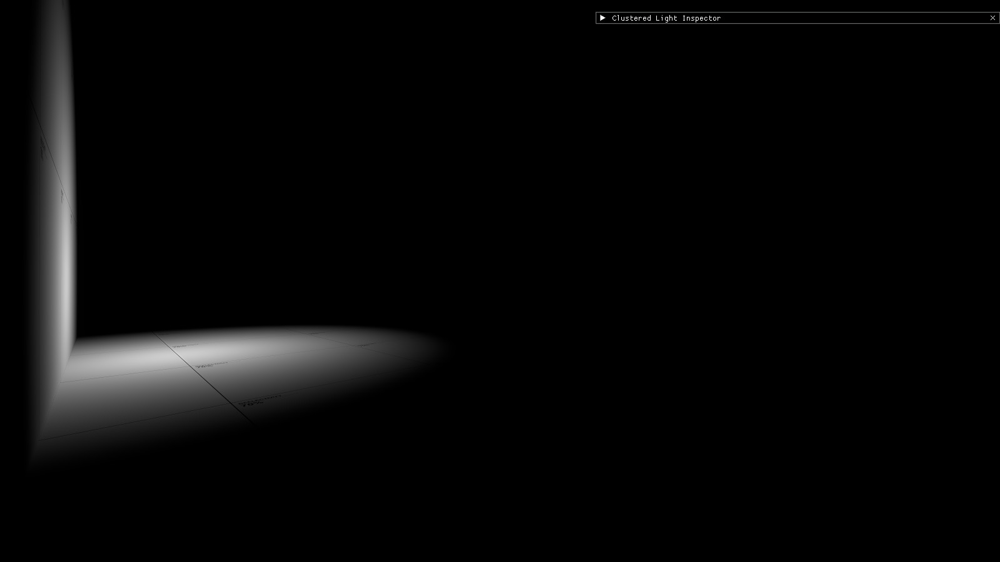
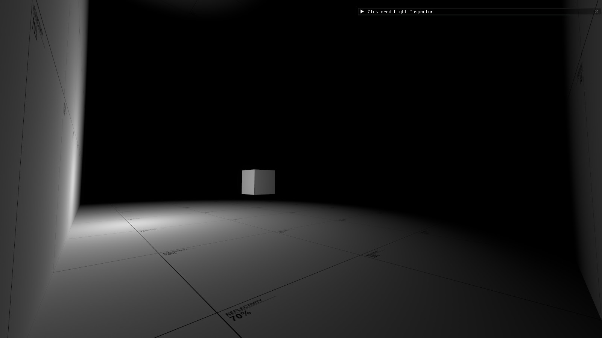
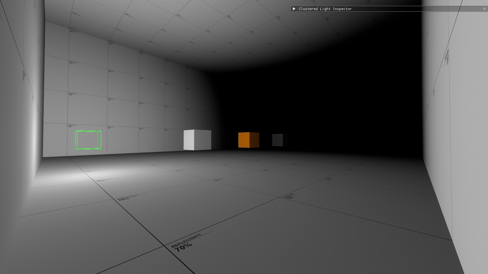
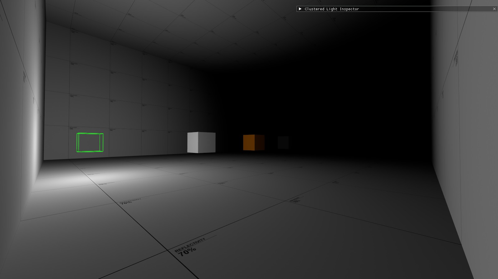
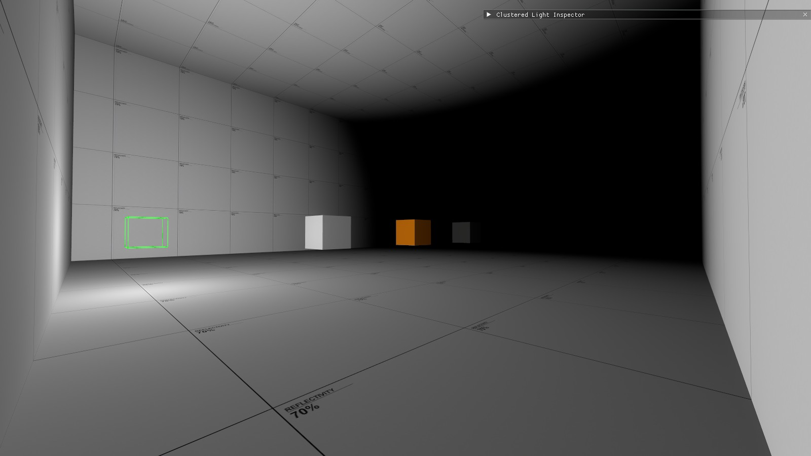
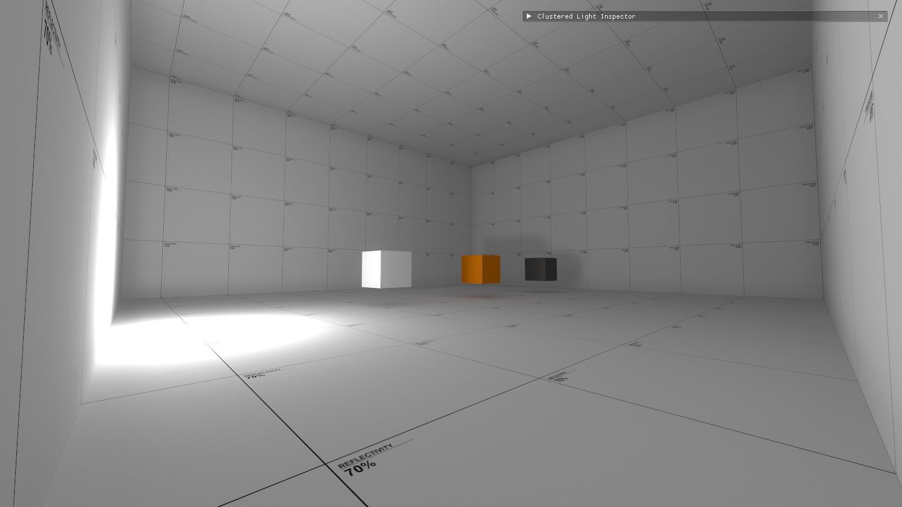
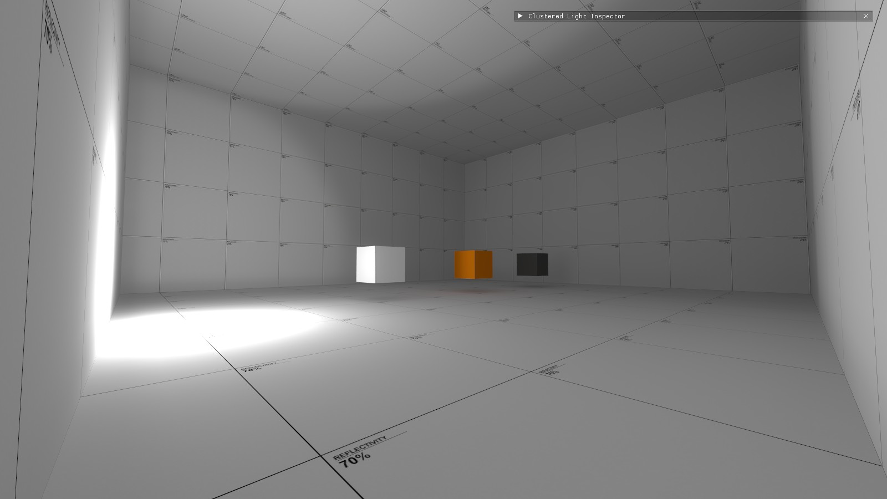
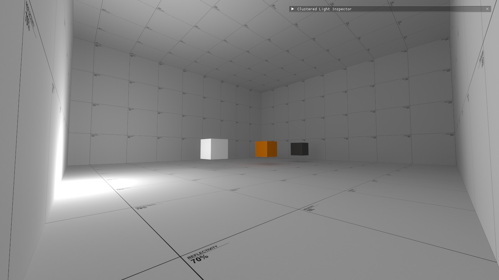
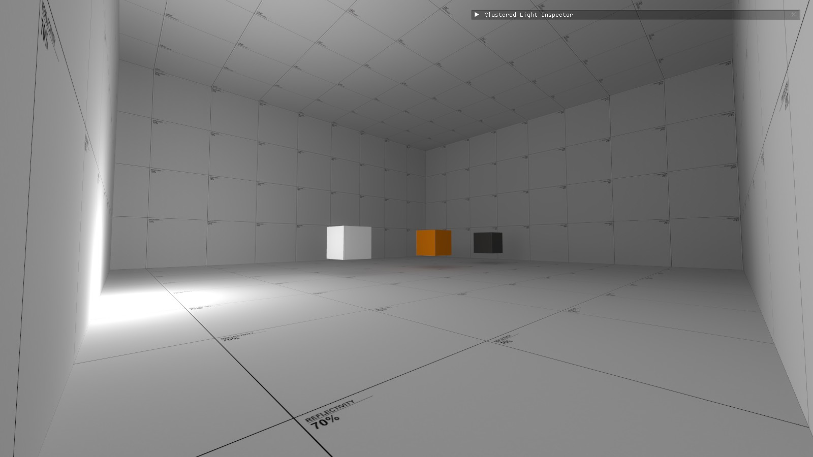

# _rt light entities
This page documents the new additions and differences between the new `light_rt` entites and the old `light` entities. For a more in-depth description of the different light types, visit the [Light Type Reference](light_type_reference) page.

> [!TIP]
> You can adjust the Radius and 50% falloff keyvalues for the dynamic light types in-game in real time. Open the console and type `devui_toggle_menu`, then go to the Graphics tab and click "Clustered Light Inspector".

## Light distance/falloff
Unlike the previous lights, which could have falloff defined by either Constant, Linear, Quadratic or 50% falloff and 0% falloff, clustered lights are instead defined by the "Radius" and "50 percent scale" values. The Radius Keyvalue defines the distance from the center of the entity that light is allowed to cast. At this distance, light will fade off to 1/256 brightness, essentially negligible.

In the below and all following images, the white cube is set at 256 units away from the light, the orange cube is set 512 units away from the light, and the gray cube is set 768 units away from the light, while the white wall at the end is set 1024 units away from the light. Fully dynamic lights are used to demonstrate the affect these keyvalues have on direct lighting.
* Top: Radius is set to 256
* Middle: Radius is set to 512
* Bottom: Radius is set to 1024

 

 

The "50 percent scale" keyvalue defines where the light will fade to 50% brightness inside the radius. This KV will accept any decimal value between 0 and 1, but after about 0.53, it becomes nonfunctional. If set to 0, the light will default back to .50
* Top: Light with a radius of 1024, 50% scale of 0.25
* Middle: Light with a radius of 1024, 50% scale of 0.50
* Bottom: Light with a radius of 1024, 50% scale of 0.75

 

 

### Hard Falloff
The Hard Falloff keyvalue defines the distance where light will fall to exactly 0%. This keyvalue only affects baked lights, and therefore only has an affect for Static and Specular light types, and the bounced lighting produced from Staic Bounce lights. 
* Top: Specular light, Radius 786, Hard Falloff set to 0
* Bottom: Specular light, Radius 786, Hard Falloff set to 825

 

This value can be used to control the intensity of bounced lighting created by Static Bounce lights as well, to a lesser degree. This does not affect the dynamic direct lighting, however.
* Top: Static Bounce light, Radius 786, Hard Falloff set to 0
* Bottom: Static Bounce light, Radius 786, Hard Falloff set to 812

 

