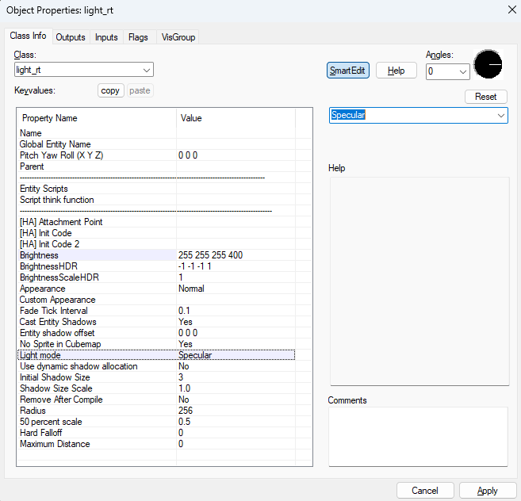
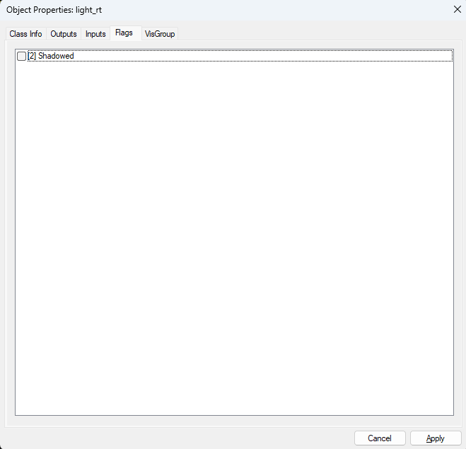
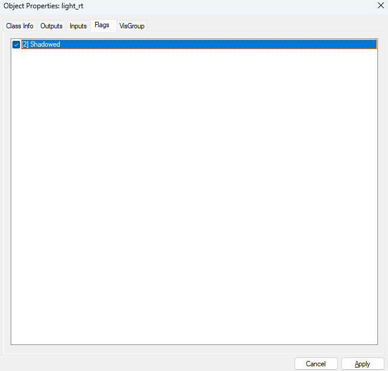
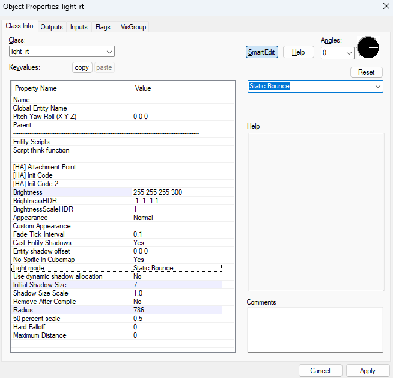

# Quick Start Guide

"I want an unmoving normal Source engine light, but better, and not slow"

1. Add a light or light_spot entity
2. Set "Light mode" to "Specular"
3. Make sure the "Shadowed" spawnflag is UNCHECKED
4. Used Raidus and 50 percent scale KeyValues
5. For best results, use PBR textures with appropriate MRAOs and normal maps

"I want an expensive light that has fancy shadows or moves around"

1. Add a light or light_spot entity
2. Set "Light mode" to "Static Bounce" (for mostly stationary) or "Fully Dynamic" (frequently moves)
3. Set "Initial Shadow Size" to somewhere around 5 to 7
4. Make sure the "Shadowed" spawnflag is CHECKED
5. Used Raidus and 50 percent scale KeyValues
6. For best results, use PBR textures with appropriate MRAOs and normal maps

