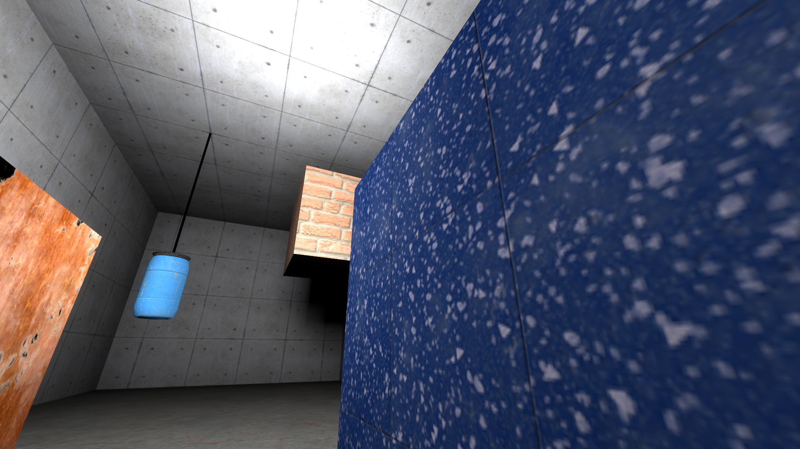
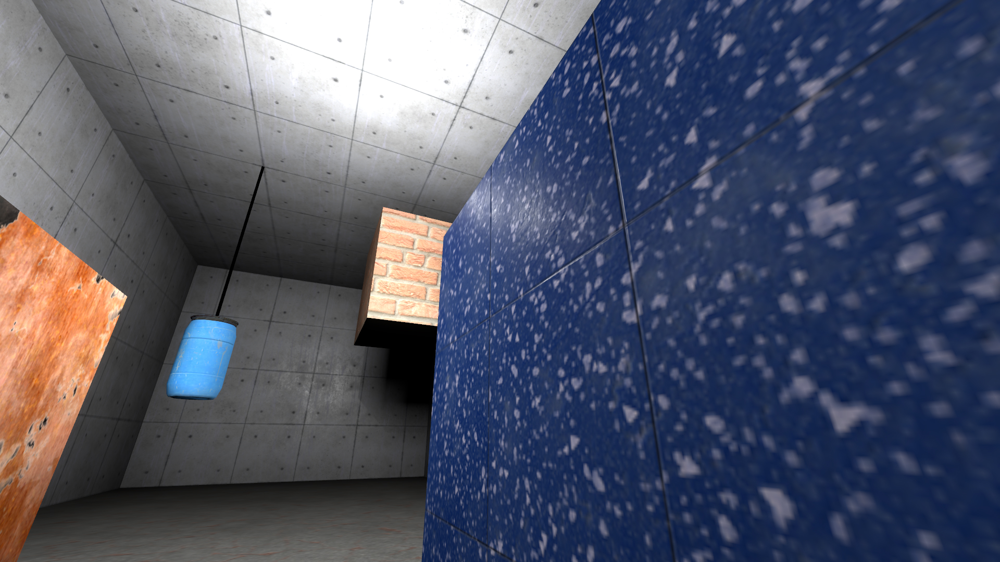
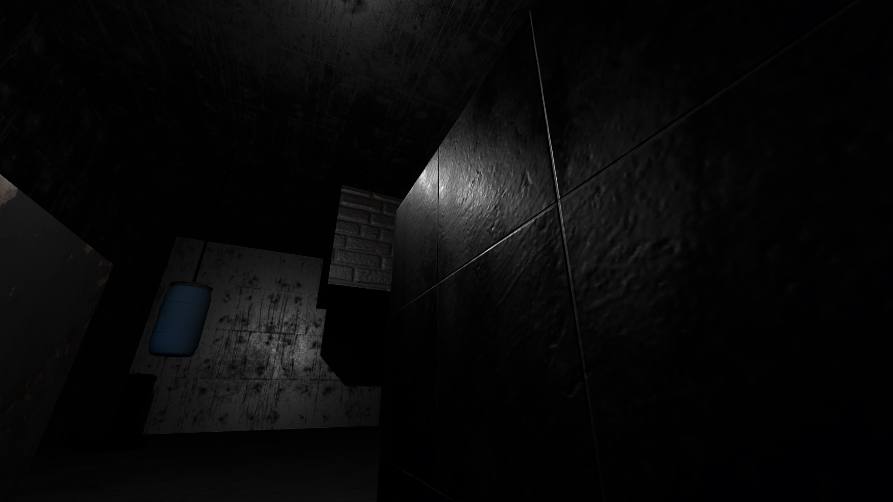
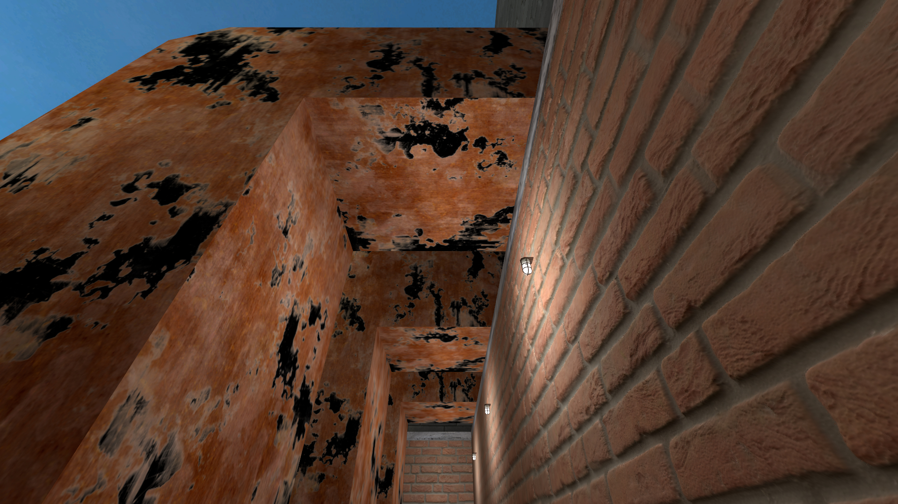
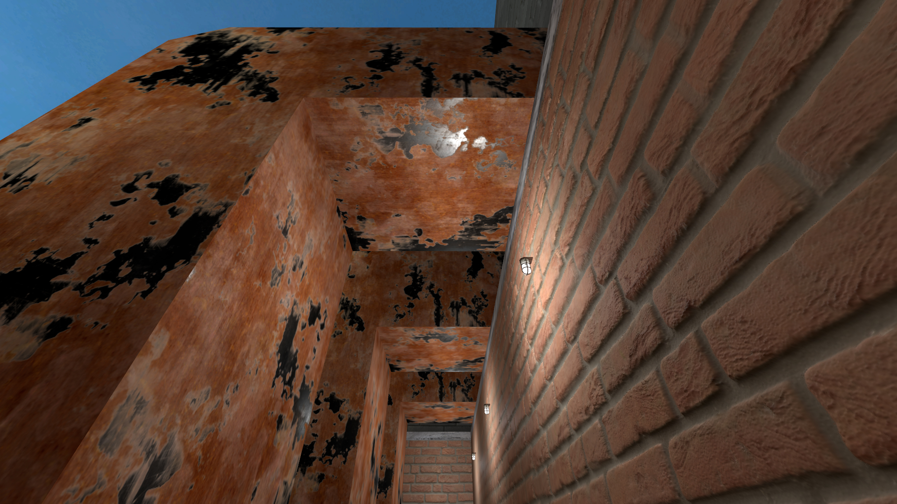
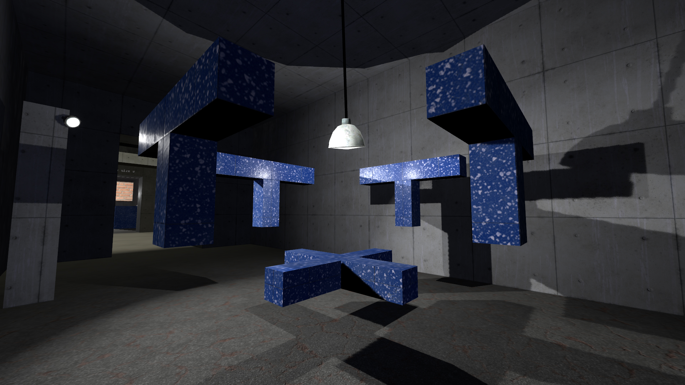
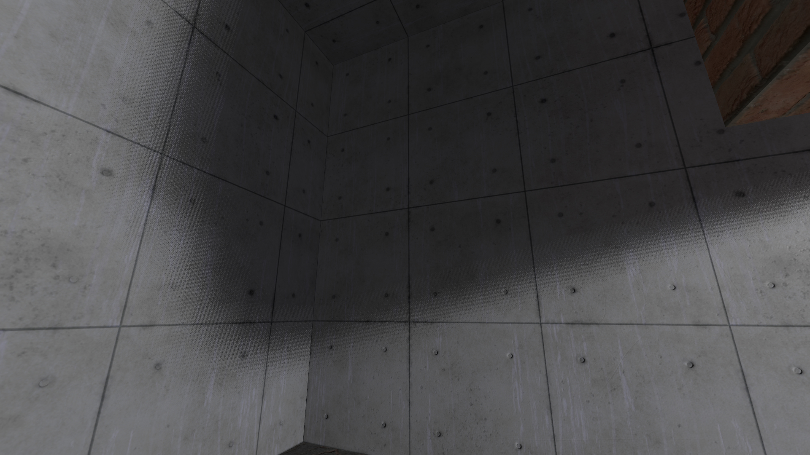
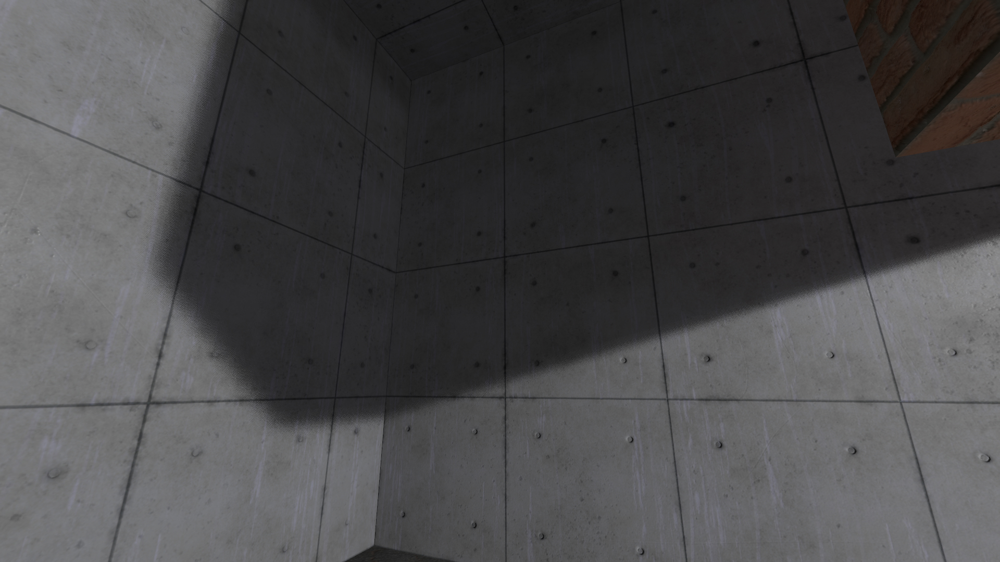
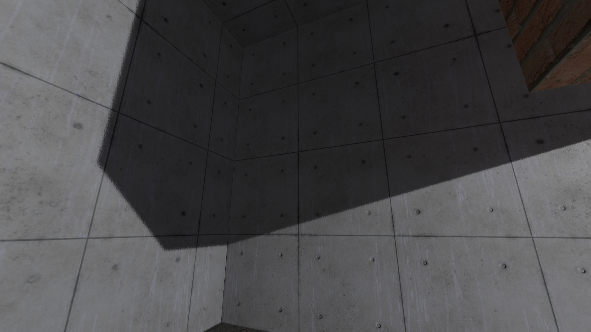

## What is "Clustered Shading"?

Clustered lighting adds a new dynamic lighting system to Strata, with the following major improvements:
* Specular lighting now works on all surfaces, brush or prop, indoors or outdoors.
* light_rt entities can now cast light and shadows dynamically.
    * Lights can move and their light and shadows will move with them.
    * Entities can move under lights and have their lighting updated. This includes brush entities.
* Hammer can now preview lighting and shadows in real time.

Currently, only Portal 2: Community Edition and Momentum Mod support Clustered Shading. There are currently no plans to add Clusterd Shading to Portal: Revolution.

> [!NOTE] 
> Clustered currently works for the PBR, LMG, VLG, Water, Paint, Gel Blobs, and Eyes shaders

## How Does it Work?

Traditionally in Source, light sources light up the map in two ways: by directly shining light onto a surface, and by indirectly bouncing light onto other surfaces. Both direct and indirect lighting are calculated by VRAD when the map is compiled, and "baked" into the map's lightmap.

* Top: Normal lighting.

* Middle: Direct lighting only. Notice how the backs of the cubes are now completely black, since no light is directly hitting them.

* Bottom: Indirect lighting only. The room is now only dimly lit by the reflected light, but the bright direct light is gone.

 

 

Two major limitations of this system are that it cannot easily support dynamic shadows, since shadows are also baked into the lightmap (shadows are just the areas where light isn't), and it cannot support specular lighting.

Specular lighting is the light that's reflected off of smooth, shiny surfaces, usually forming a bright highlight. Specular lighting is dependent on the player's view position relative to the surface and the light, so it can't easily be recorded into the lightmap. Both direct and indirect lighting are diffuse, which means they don't depend on the player's view position and don't produce highlights.

Clustered lighting improves these limitations by adding dynamic lighting that is calculated at runtime, not baked into the lightmap. Now, we can change the following three properties:
Direct lighting can be statically baked or dynamic
Indirect lighting can be statically baked or disabled
Specular lighting can be disabled or dynamic

Which technique is used is controlled by the light's "Light mode":

| | Direct | Indirect | Specular |
|---------|---------|---------|---------|
| "Static" | baked | baked | *disabled* |
| "Specular" | baked | baked | **dynamic** |
| "Static Bounce" | **dynamic** | baked | **dynamic** |
| "Dynamic" | **dynamic** | *disabled* | **dynamic** |

The "Static" light mode is identical to pre-clustered lighting, with no dynamic lighting at all. "Specular" enables dynamic specular lighting while keeping everything else baked into the lightmap. "Static bounce" also does direct lighting dynamically, and "Dynamic" removes indirect lighting, so it is 100% dynamic.

## Specular Lighting
All the new light modes except "Static" enable specular lighting, which can massively improve how textures look. PBR textures are especially improved.

* Top: No specular.

* Middle: Specular lighting enabled. Notice the highlight on the blue texture, and the bright spots on the back wall.

* Bottom: Specular lighting only. By removing the baked direct and indirect light, you can see exactly what specular lighting adds to the scene.

 

 

The addition of specular lighting also make metallic PBR textures look correct. Previously, without another specular-enabled source like outdoors CSM, metallic textures would simply appear black. This is because metals can only reflect specular lighting.

* Top: No specular. The metal parts of the texture are completely black.

* Bottom: Specular lighting enabled. The metal now reflects light correctly (mostly, some parts of the metal are still black because they aren't being lit by a dynamic light source.)

 

## Real Time Shadows
With real time light and shadows, normal light_rt and light_rt_spot entities can be parented to other entities and move, updating their surroundings in real time.

* A swinging point light_rt, casting shadows in all 6 directions, and a stationary directional light_rt_spot, casting shadows in one direction.

[!Warning] Point light_rts have 6 times the cost of `light_rt_spot` entities, as they are casting shadows in 6 different directions. Use these sparingly, and disable shadows if not needed!

## Shadow Map Size
To generate the shadows, the lights render to an internal texture called a "shadow map." You can control the resolution of this shadow map. Higher values create sharper, more accurate shadows, but cost much more to render. Sharp shadows may not be appropriate for all situations either, sometimes soft shadows look more accurate.

You can control the size of the shadow map by changing the "Initial Shadow Size" property.

* Top: "Initial Shadow Size" is 3

* Middle: "Initial Shadow Size" is 5

* Bottom: "Initial Shadow Size" is 7

 

 

## Other Clustered Changes
A few things are also affected by the new clustered renderer:
* env_projectedtexture now uses the clustered renderer.
* The flashlight now uses the clustered renderer.
