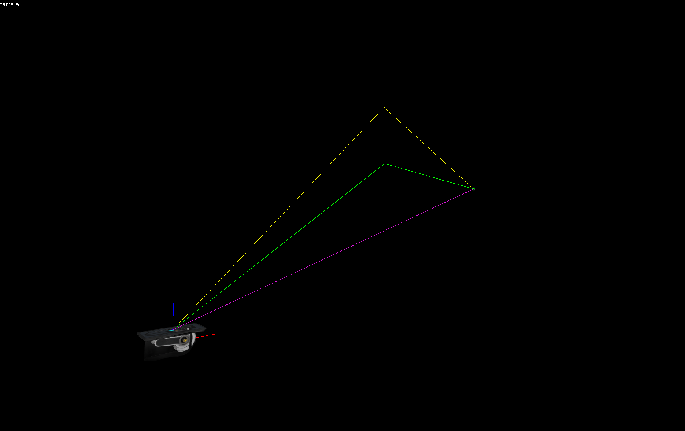
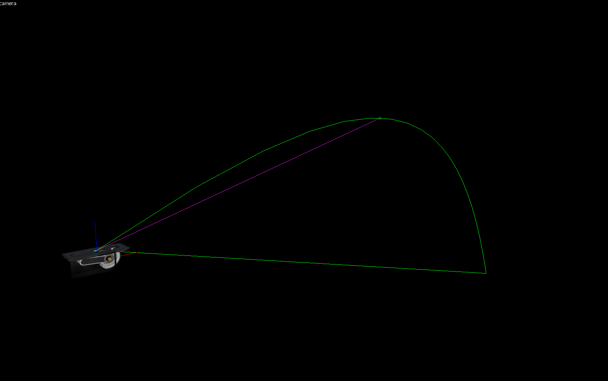
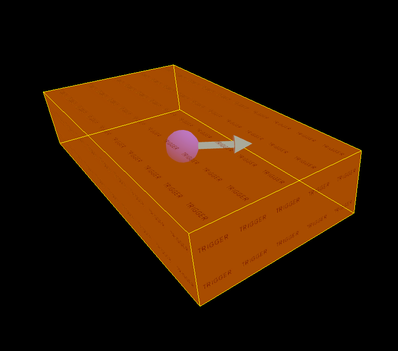
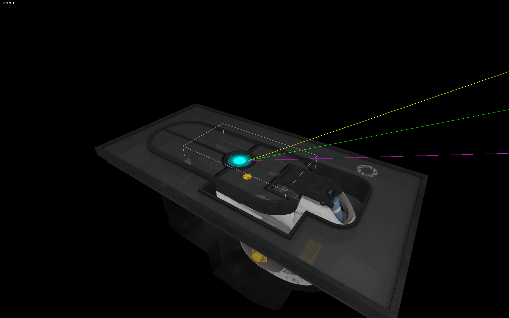
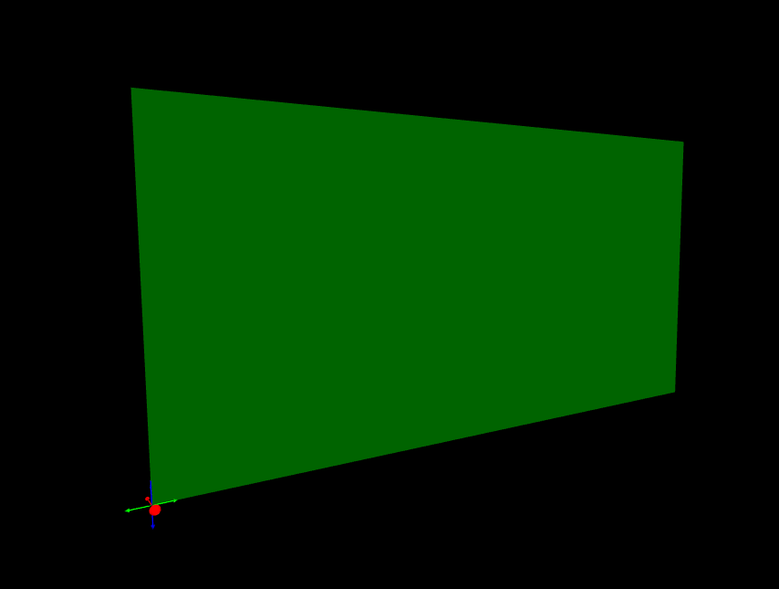
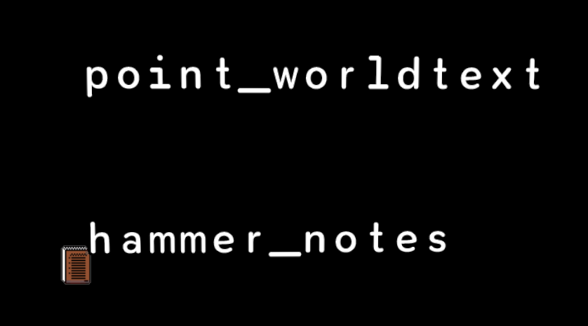

# New FGD Helpers

Strata Source provides new FGD helpers that can be used in FGD files to extend the functionality and visuals of entities when working with them in Hammer. Some helpers rely on parameter input by using an KeyValue (KV) entry to work or rely on various KVs existing so the helper can function.

> [!NOTE]
>
> FGD helpers need to be specified **before** the class name assignment for the entity.

## Strata FGD Helpers

* [`catapult()`](./fgd-helpers#catapult)
* [`direction(angle/vector)`](./fgd-helpers#directionanglevector)
* [`orientedboundingbox(width, height, depth)`](./fgd-helpers#orientedboundingboxwidth-height-depth)
* [`orientedboundingboxhalf(width, height, depth)`](./fgd-helpers#orientedboundingboxhalfwidth-height-depth)
* [`orientedwidthheight(width, height)`](./fgd-helpers#orientedwidthheightwidth-height)
* [`worldtext()`](./fgd-helpers#worldtext)

## catapult()

Typically used for `trigger_catapult`. Provides a preview of the launch arc of the launch by the trigger generated by other KVs. For the `catapult` FGD helper to properly render the launch preview, the KVs `playerspeed`, `physicsspeed`, `launchtarget`, `useExactVelocity`, and `exactvelocitychoicetype`, are needed whether that is from manually adding them to the entity class entry or inheriting the `trigger_catapult` class entry.

`catapult` produces three lines for the preview. `useExactVelocity` will change how these lines behave if set to `Yes`/`1`.

* Green: When `useExactVelocity` is `No`/`0` and `playerspeed` does not equal `physicsspeed` the green line will represent the predicted arc of the player as defined by `playerspeed`. When `useExactVelocity` is enabled, the green line represents the more exact launch arc. Another green line will go with this from the entity to the end of the arc.
* Yellow: The yellow line represents the predicted arc of physics objects as defined by `physicsspeed` as long as it doesn't equal `playerspeed`.

Preview when `useExactVelocity` is set to `Yes`/`1`.

## direction(angle/vector)

The `direction` helpers allows for adding a arrow which protrudes from the entities origin to visually show a direction based on a KV input. `angle` and `vector` KV types work for a parameter for `direction` but it's recommended to use `angle` so the arrow can be more easily set.

## orientedboundingbox(width, height, depth)

`orientedboundingbox` allows for displaying, as the name implies, an white Oriented Bounding Box at the entities origin that can be changed using KVs in the entity class entry. Using KVs named as `width`, `height`, and `depth` is not required but put here to represent what each parameter represents. The OBB will rotate with the entity.

Parameters:

* width: Defines the width size of the bounding box along the x-axis/red axis.
* depth: Defines the depth size of the bounding box along the y-axis/green axis.
* height: Defines the height size of the bounding box along the z-axis/blue axis.

## orientedboundingboxhalf(width, height, depth)

Exact same as `orientedboundingbox` but halves the sizes specified.

Parameters:

* width: Defines the width size of the bounding box along the x-axis/red axis.
* depth: Defines the depth size of the bounding box along the y-axis/green axis.
* height: Defines the height size of the bounding box along the z-axis/blue axis.

## orientedwidthheight(width, height)

Similar to `orientedboundingbox` but for representing flat quads. This preview uses a green plane to represent the width which extends its height based on the height parameter along the z-axis.

Parameters:

* width: Defines the depth size of the bounding box along the y-axis/green axis.
* height: Defines the height size of the bounding box along the z-axis/blue axis.

## worldtext()

`worldtext` is used to display visible text within Hammer's 3D viewport. Originally this was used for `point_worldtext` to display text in Hammer to get a visual on how it looks in game, but has also been used for `hammer_notes` to provide visible text in Hammer only. `worldtext` relies on the `message` KV to know what text to display in Hammer.

