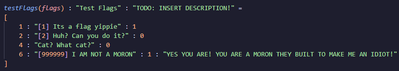
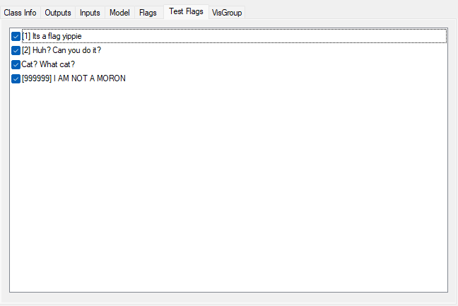
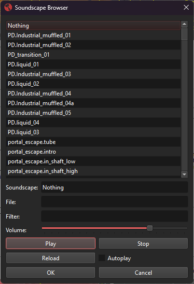
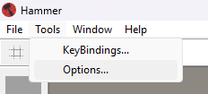
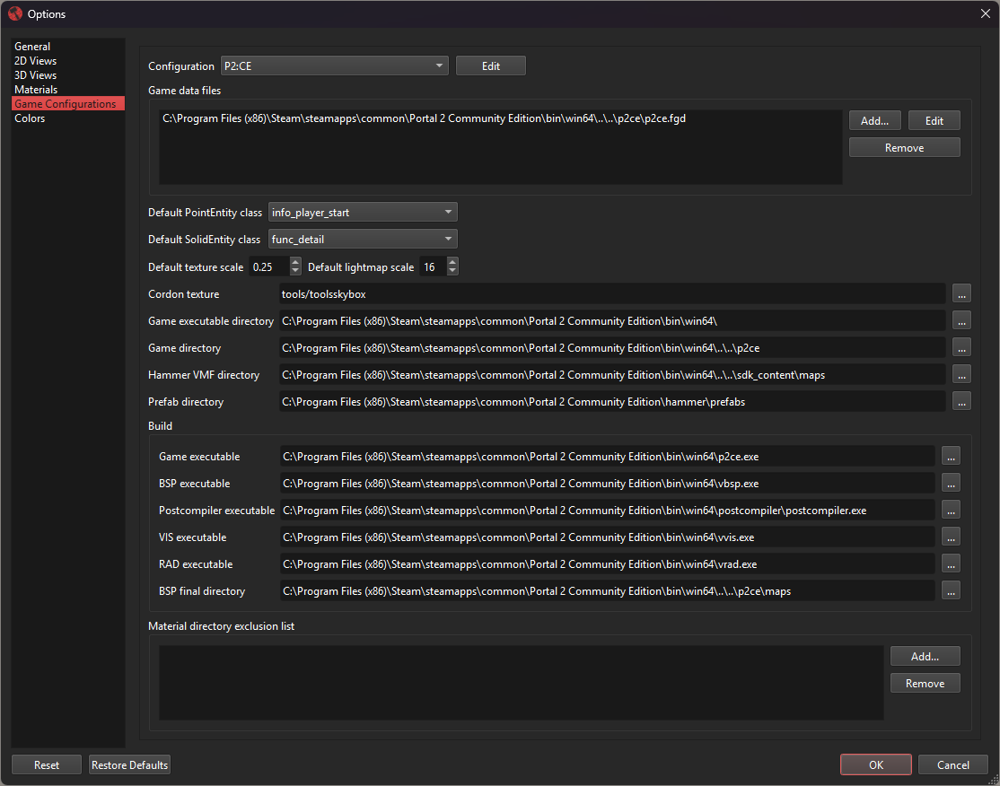

# Strata Forge Game Data (FGD)

## Introduction

**Valve's Hammer Editor**, starting from when it was the **Worldcraft** editor, uses plain text files to tell the editor what entities are available for the editor to provide. These are seen when using the **Entity Tool** or when in the **Object Properties** window, choosing classnames under the drop down for standard entities or brush entities.

These plain text files are named Forge Game Data or FGD for short. Every FGD file used by Hammer ends with the `.fgd` extension and are usually located (for Strata titles specifically) in their respective `GAME` folder (`p2ce`, `momentum`, etc). FGDs can be loaded from anywhere as long as they are formatted correctly for Hammer.

> [!CAUTION]
>
> A misconception with FGDs are that they tell the engine about what entities exist and their KeyValues and I/O. ***This is not true.***
>
> While FGDs tell Hammer what entities do exist in the engine, the reverse does not apply. Adding an entity entry does not add this entity to the engine, and changing existing entities KeyValues or I/O will not change what KeyValves and I/O the engine has defined. While custom FGD entities can get compiled (depending on the type) into a BSP if placed in a VMF, the engine dictates what entities do and don't exist and what KeyValues and I/O they have. If the engine sees an entity which doesn't exist in code, it will ignore it and print a error in the console stating the fact.
>
> This point also applies to custom AngelScript entities. While custom AngelScript entities are not programmed in at a engine level, the engine will still try to find any registered AngelScript entities in the BSP and add them into the map.

While the Strata Source Wiki will provide basic details on how to add a FGD to Strata's Hammer, it will not explain every single available FGD helper, entity class type or property, I/O type, or KV type. Only specific Strata features will be documented here. To get a full list of what is available for FGDs, the [FGD page on the Valve Developer Community site](https://developer.valvesoftware.com/wiki/FGD) can provide details on lots of other pieces that can be used. Note that not everything will work with Strata Source's Hammer.

## Specific Strata FGD Features

* Custom Entity Flags: The `flags` KV type can now be used on other KVs besides `spawnflags`. This is a good alternative to `choices` if there are various choices but also want to have multiple to be selected.

* `soundscape` KV type: A new KV type similar to `sound` or `studio` that will give the option to open the **Soundscape Browser** for choosing soundscapes. This is generally used with `env_soundscape`.

* `bool` and `boolean`: KV types `bool` and `boolean` are both valid and interchangeable for FGD KVs.

* Escape Sequences: Escape sequences `\n` `\t` `\"` `\\` are supported in FGD KV descriptions and don't cause issues with VMFs.

* Additional FGD Helpers: Strata Source adds several FGD helpers to aid with working with entities in Hammer. [Check this article out to find out more](./fgd-helpers).

* Custom AngelScript Entities: Custom FGDs allow for adding custom AngelScript entities that can be placed into Hammer. When the map is compiled, the AngelScript system will tie that entity to the scripted AngelScript entity.

## Adding An FGD to Hammer

While this process is very similar most other versions of Hammer, the UI has changed so details will still be supplied.

FGDs are added to Hammer game configurations, these are located in the Hammer options via the menu bar near the top of the Hammer window under `Tools > Options`.

From there, navigate using the side bar to `Game Configuration`. At the top is where used FGDs are listed under `Game data files`. To add an new FGD, simply click `Add...` on the right. To get to a existing FGD to edit, select an FGD in the list and click `Edit`. This will open the FGD file in the systems default text editor. To remove an FGD, select one in the list and click `Remove`, this will not remove the actual FGD file.

## Specifying FGD in a GameInfo

In a game's GameInfo file (`gameinfo.txt`), a FGD is specified as the "main" FGD that will be used by the VBSP for instance fixups.

> [!CAUTION]
>
> Any entity entries not in the "main" FGD that are placed into instances used in a map will be ignored by VBSP. Those entities will not be properly compiled into the map, and will be placed at the world origin potentially causing a leak.
>
> If using custom FGDs for AngelScript entities, any custom entity entries not in the GameInfo FGD, and custom entities in instances, they will also be ignored.

## Additional Resources

* [FGD Helpers](./fgd-helpers)
