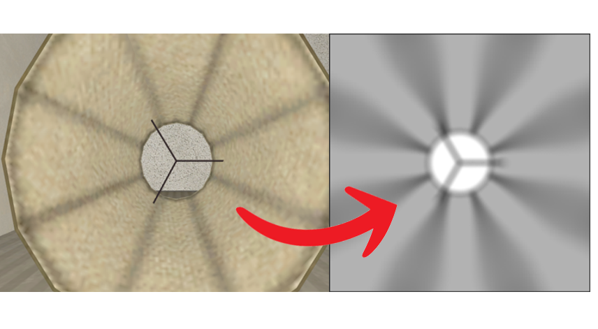
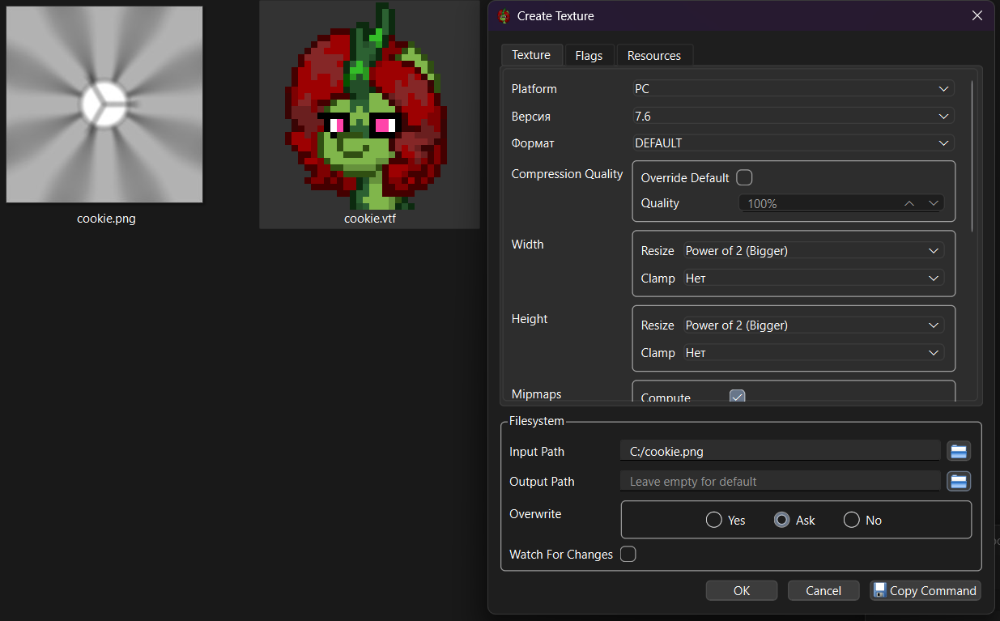
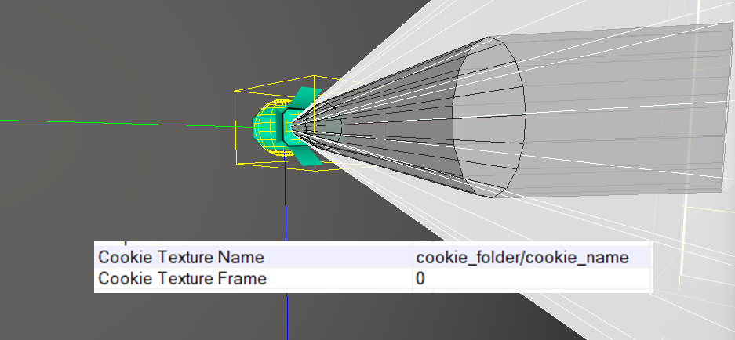
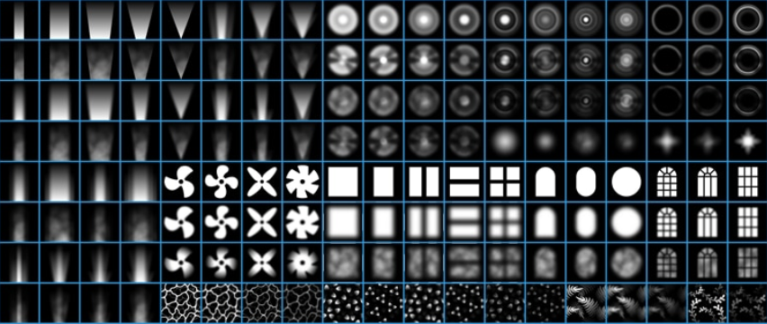

# Light Cookies

Light cookies, also known as cookie textures, are supported by clustered lights (`light_rt`, `light_rt_spot` and `env_projectedtexture`). They can be used to apply a pattern to a light, controlling its shape and brightness. If you're not familiar with the concept of light cookies, imagine them like putting a piece of paper over a flashlight. If you were to cut out a shape from the paper, it would allow light to pass through, projecting a specific shape.

In Hammer, light cookies can be added to a light using the "Cookie Texture Name" and "Cookie Texture Frame" properties. When looking at lights through the Light Inspector, the texture can be set under "Pattern". For `env_projectedtexture`, the KeyValue is "Texture Name".

Volumetric lighting also works with light cookies.

## How to use

Light cookies are textures that imitate shadows, and setting up cookie textures is as easy as setting up a texture for `env_projectedtexture` in vanilla Portal 2.

There are two main usages of light cookies - changing the shape of the clustered light, or replacing the dynamic shadows with an identical static image to save space in the shadow atlas.

## How to make

This is a small guide that covers creation of light cookies.

#### Preparing the image

As mentioned above, light cookies imitate shadows. Thus, the image must contain shapes that this specific light imitates. Two easy ways to create images for light cookies are to either take a screenshot when viewing from the light itself and then heavily edit the image, or to copy the depth texture from the [Clustered Light Stats](/modding/devui/categories/graphics#clustered-light-state) and convert it to `.vtf` format.

Usually, light cookies are made for each light individually, but it is possible to make a commonly-shaped texture to use on multiple lights.

#### Converting to VTF format

After the image is created, it needs to be converted to VTF format.

Portal 2: Community Edition comes with MareTF - an open-source VTF editor. It is located in `bin/win64`. To convert an image into VTF, double-click `maretf_gui.exe`, press `Create`, select the cookie image, and press `OK`. The texture will be generated next to the original image (or in the specified output path). Copy the generated texture into a desired folder in `materials` (i.e. `p2ce/materials/light_cookies/cookie.vtf`)

#### Inserting into a clustered light

The last step is to put the texture into the light. There are 2 KeyValues related to light cookies - `Cookie Texture Name`, which is the path to the texture, and `Cookie Texture Frame`, which is the frame of the texture if it is animated. Simply put the path to the cookie texture in `Cookie Texture Name`, then recompile the map to see the changes. The cookie texture will appear for that light.

> [!NOTE]
> .vtf extension is not needed. The path should look like this: `cookies_folder/cookie_name`

> [!TIP]
> `env_projectedtexture` entities can have .webm videos as "cookies"!
> To convert .bik video format into a .webm, simply use `convert_bik_to_webm.ps1` located in `sdk_tools/converter`.

## Where to find

Officially, there are no pre-made cookies.

On the workshop, there is an [addon](https://steamcommunity.com/sharedfiles/filedetails/?id=3753568885) that includes ~150 ready-to-use light cookies made by Kenney.NL and ported by Mae.

