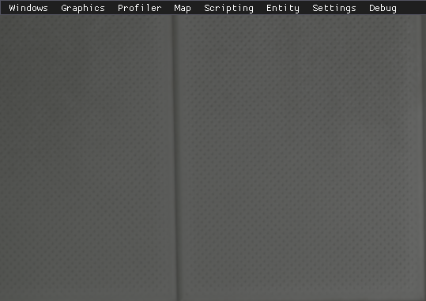
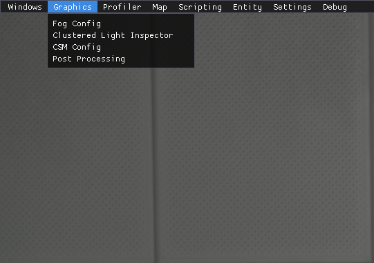
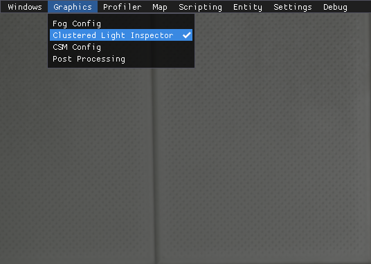
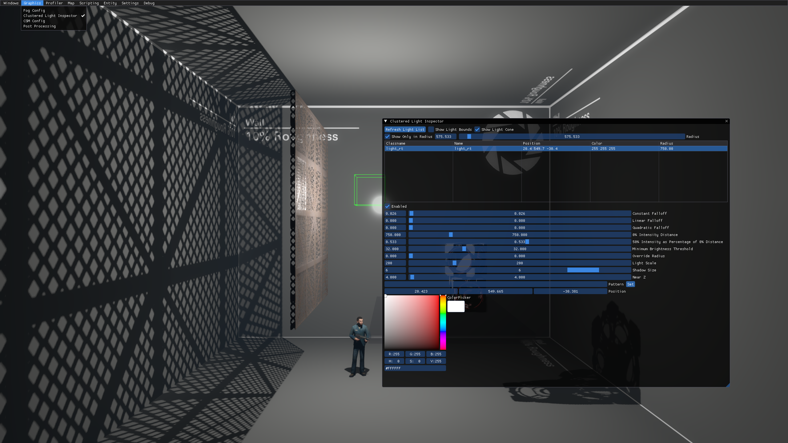
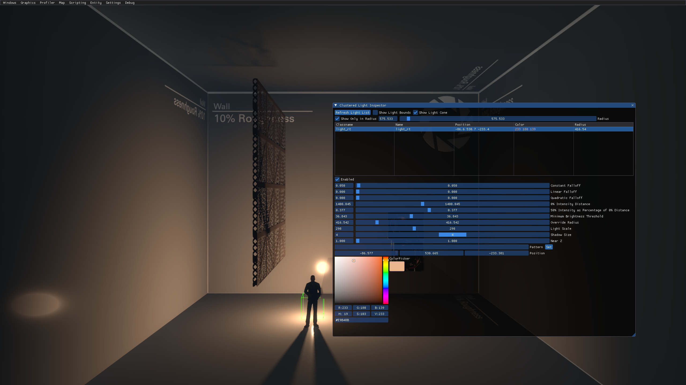

# Developer UI

In P2CE, you can enable the developer UI    using the `devui_toggle_menu` console command (with `developer 1` enabled as well). Currently, it consists of 8 menus: Windows, Graphics, Profiler, Map, Scripting, Entity, Settings and Debug.

Graphics menu is the one needed. Upon pressing, four more buttons appear: Fog Config, Clustered Light Inspector, CSM Config and Post Processing. You need to choose the **Clustered Light Inspector**.

* Top: The developer UI.
* Middle: Same, but with Graphics menu shown.
* Bottom: Same, but with Graphics menu shown and Clustered Light Inspector selected.

## Clustered Light Inspector

Clustered Light Inspector is a menu where you can control `light_rt` entities in real time in-game. There are various options that give almost a full control over the entity. You can control all the default light options, such as Constant, Linear, Quadratic, 0% Intencity Falloff, 50% Intencity Falloff, Minimum Brightness Threshold, Override Radius and Light Scale, as well as the Color using the color palette, Shadow Scale, Near Z, light's pattern and entity's position in the map.

> [!TIP]
> Position bars are scrollable!

There are additional debugging and finding options. "Show Light Bounds" is relevant for `light_rt` and shows bounds of the light as a sphere. "Show Light Cone" is relevant for `light_rt_spot` and shows bounds of the light spot. "Show Only in Radius" will only display clustered lights in a specified radius.

* Top: Clustered Light Inspector
* Middle: Clustered Light Inspector with the selected light's properties tweaked
* Bottom: Clustered Light Inspector with the selected light's position edited using XYZ bars

