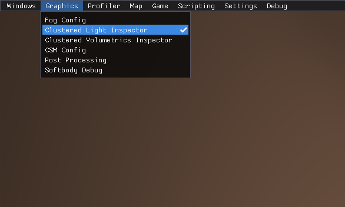
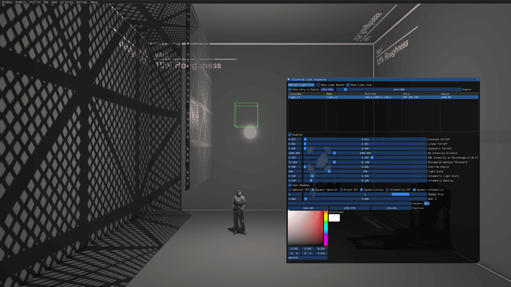
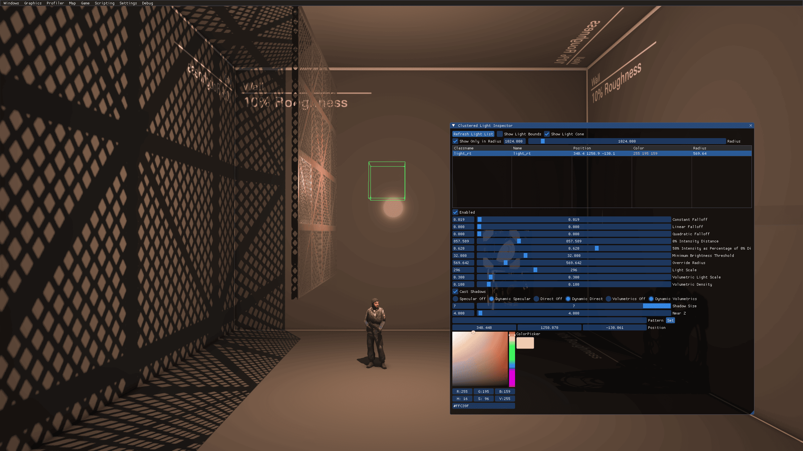
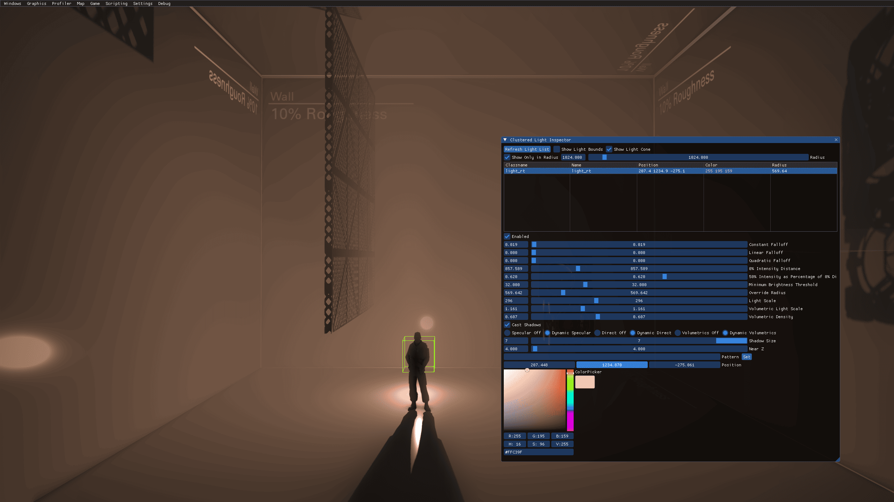

# Clustered Light Inspector

Clustered Light Inspector is a menu where you can control `light_rt` entities in real time in-game. There are various options that give almost a full control over the entity. You can control all the default light options, such as `Constant`, `Linear`, `Quadratic`, `0% Intensity Falloff`, `50% Intensity Falloff`, `Minimum Brightness Threshold`, `Override Radius`, `Light Scale`, `Volumetric Light Scale` and `Volumetric Density`, as well as `Color` using the color palette, `Shadow Scale`, `Near Z`, light's `Pattern` and entity's position in the map.

There are additional debugging and finding options. "Show Light Bounds" is relevant for `light_rt` and shows bounds of the light as a sphere. "Show Light Cone" is relevant for `light_rt_spot` and shows bounds of the light spot. "Show Only in Radius" will only display clustered lights in a specified radius. Additionally, you can toggle the specular reflection, the direct dynamic lighting, volumetrics coming from the light and this light's shadows.

## Enabling The Inspector

In P2:CE, you can enable the Clustered Lighting Inspector UI using the `devui_show light_editor` console command, or by pressing `shift + f1`, opening the Graphics tab in the top-left corner and selecting the `Clustered Light Inspector` menu.

* Top: Clustered Light Inspector
* Middle: Clustered Light Inspector with the selected light's properties tweaked
* Bottom: Clustered Light Inspector with the selected light's position edited using XYZ bars

> [!TIP]
> Position and angle bars are scrollable!

