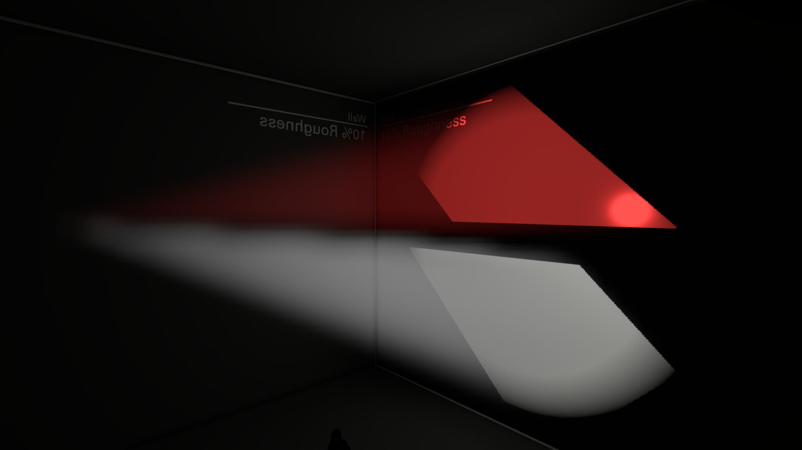

# Light Cookies

Light cookies, also known as cookie textures, are supported by clustered lights (`light_rt` and `light_rt_spot`). They can be used to apply a pattern to a light, controlling its shape and brightness. If you're not familiar with the concept of light cookies, imagine them like putting a piece of paper over a flashlight. If you were to cut out a shape from the paper, it would allow light to pass through, projecting a specific shape. Light cookies also have a similar effect to projected textures (`env_projectedtexture`).

In Hammer, light cookies can be added to a light using the "Cookie Texture Name" and "Cookie Texture Frame" properties. When looking at lights through the Light Inspector, the texture can be set under "Pattern".

Volumetric lighting also works with light cookies.

## Setup

TODO: texture setup -> converting into vtf -> using the KV
