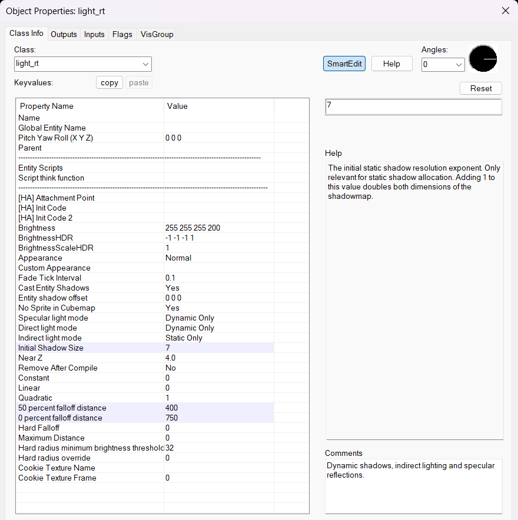
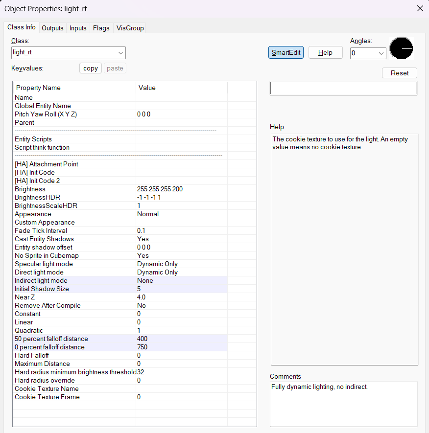
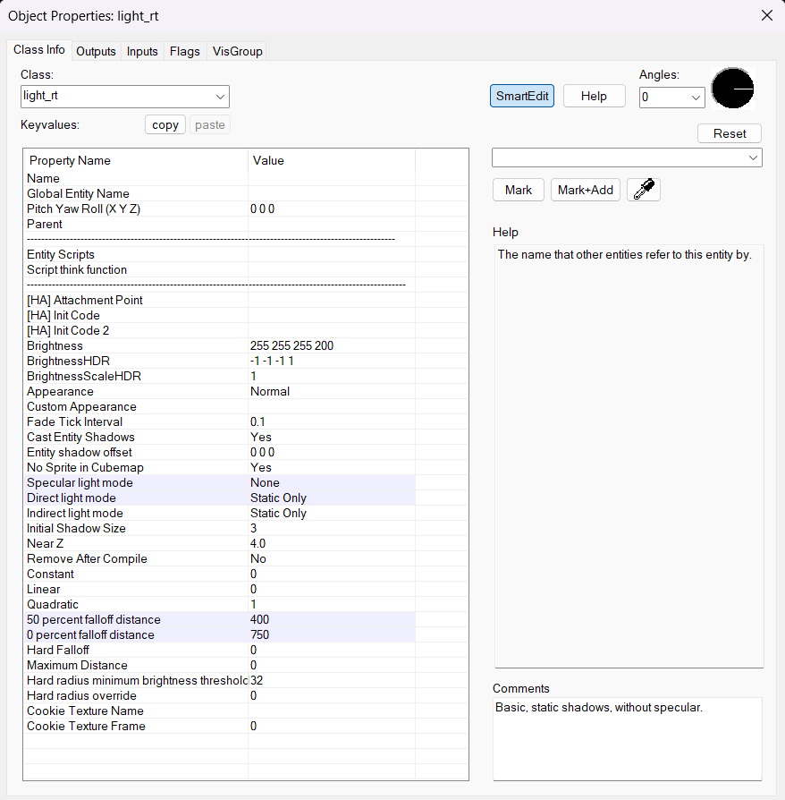
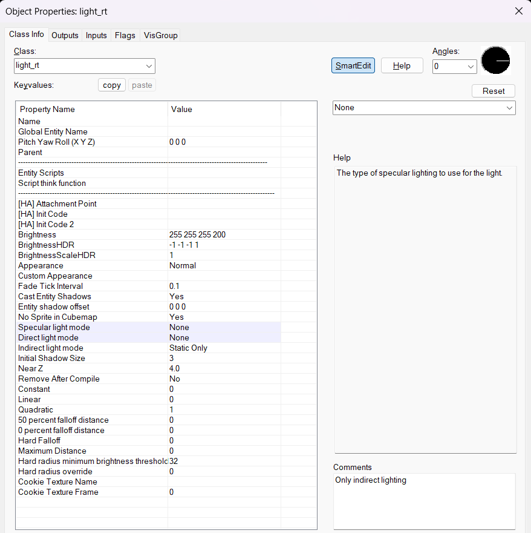
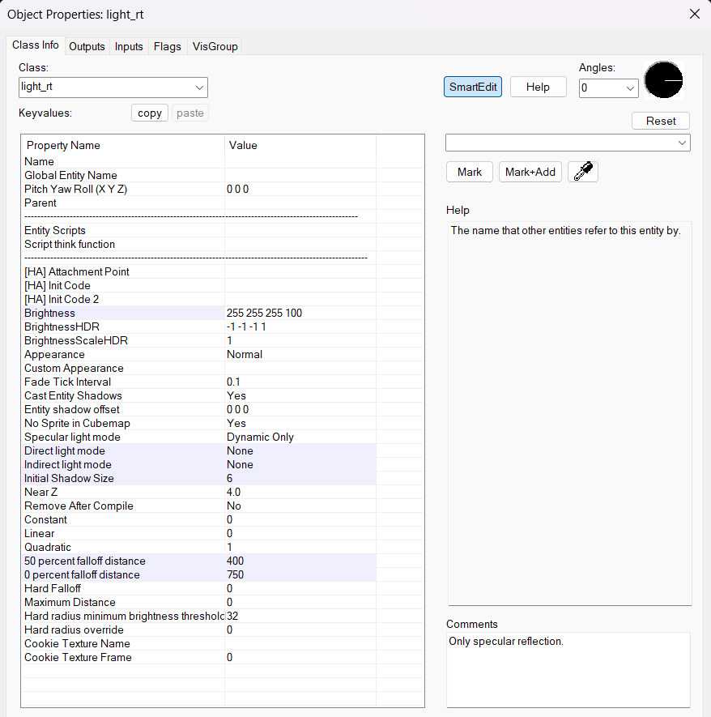

# Quick Start Guide

### "I want an expensive light that has fancy shadows and isn't supposed to move"

1. Add a light_rt or light_rt_spot entity
2. Set "Specular Light Mode" to "Dynamic Only"
3. Set "Direct Light Mode" to "Dynamic Only"
4. Set "Indirect Light Mode" to "Static Only
5. Set "Initial Shadow Size" to 6 or 7
6. Make sure the "Shadowed" flag is **checked**
7. Set "50 percent falloff distance" and "0 percent falloff distance" KeyValues to adjust the look and feel
8. For best results, use PBR textures with appropriate MRAOs and normal maps

### "I want a fully dynamic light that is supposed to move and interact with other dynamic lights"

1. Add a light_rt or light_rt_spot entity
2. Set "Specular Light Mode" to "Dynamic Only"
3. Set "Direct Light Mode" to "Dynamic Only"
4. Set "Indirect Light Mode" to "None"
5. Set "Initial Shadow Size" to something around 5
6. Make sure the "Shadowed" flag is **checked**
7. Set "50 percent falloff distance" and "0 percent falloff distance" KeyValues to adjust the look and feel
8. For best results, use PBR textures with appropriate MRAOs and normal maps

### "I want a regular, cheap static light"

1. Add a light_rt or light_rt_spot entity
2. Set "Specular Light Mode" to "None"
3. Set "Direct Light Mode" to "Static Only"
4. Set "Indirect Light Mode" to "Static Only"
5. Set "50 percent falloff distance" and "0 percent falloff distance" KeyValues to adjust the look and feel
6. For best results, use PBR textures with appropriate MRAOs and normal maps

### "I only want indirect lighting"

1. Add a light_rt or light_rt_spot entity
2. Set "Specular Light Mode" to "None"
3. Set "Direct Light Mode" to "None"
4. Set "Indirect Light Mode" to "Static Only"
5. Set "50 percent falloff distance" and "0 percent falloff distance" KeyValues to adjust the look and feel
6. For best results, use PBR textures with appropriate MRAOs and normal maps

### "I only want a specular reflection"

1. Add a light_rt or light_rt_spot entity
2. Set "Specular Light Mode" to "None"
3. Set "Direct Light Mode" to "None"
4. Set "Indirect Light Mode" to "Static Only"
5. Make sure the "Shadowed" flag is **checked**
6. Set "50 percent falloff distance" and "0 percent falloff distance" KeyValues to adjust the look and feel
7. For best results, use PBR textures with appropriate MRAOs and normal maps

