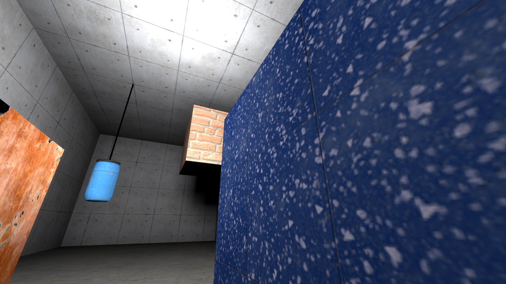
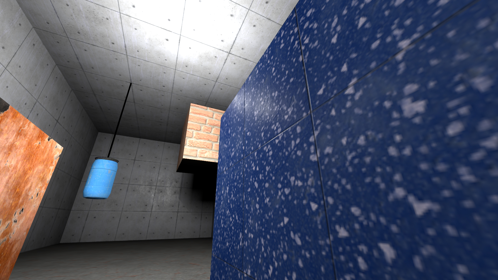
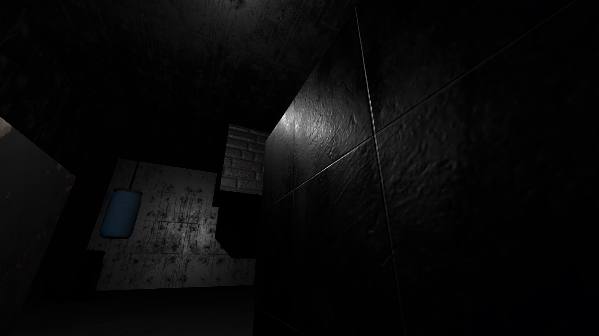
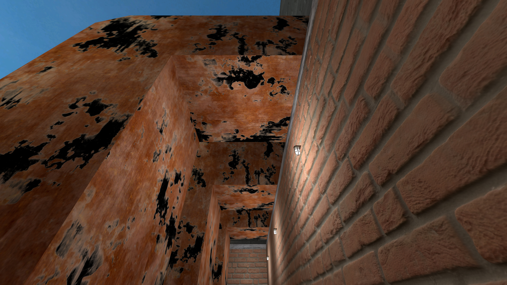
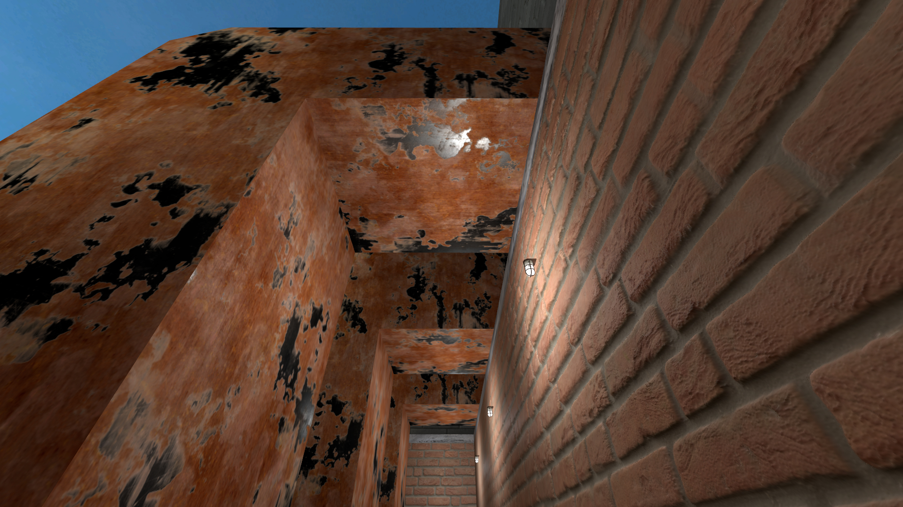
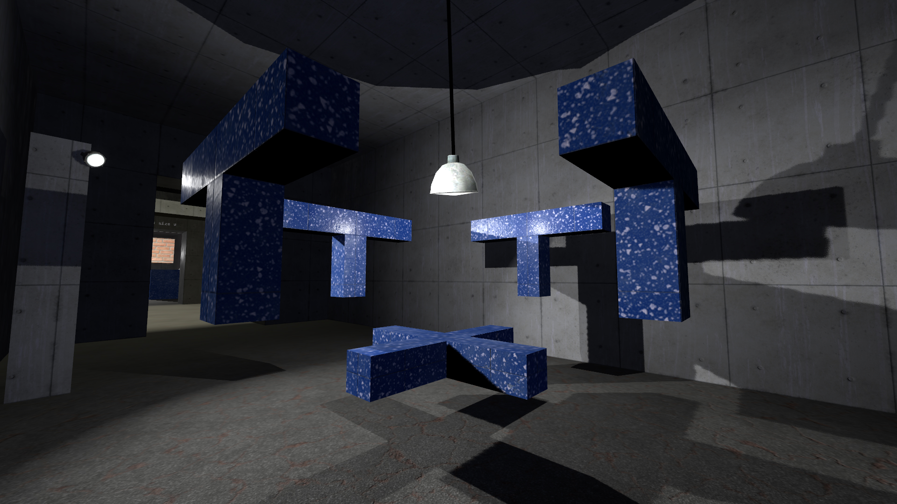
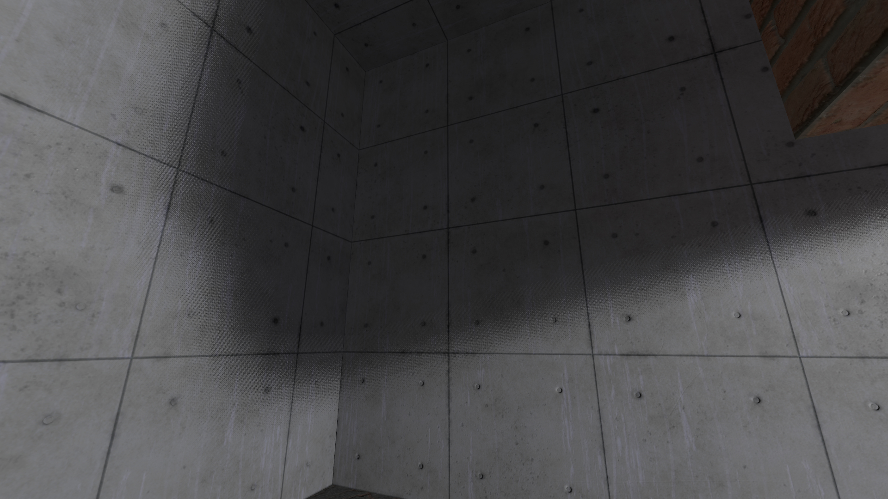
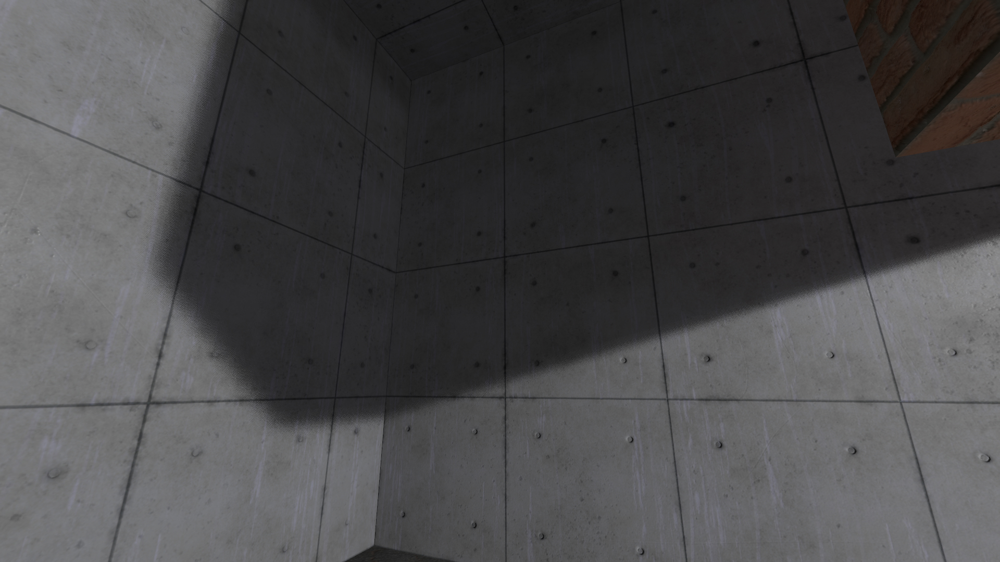
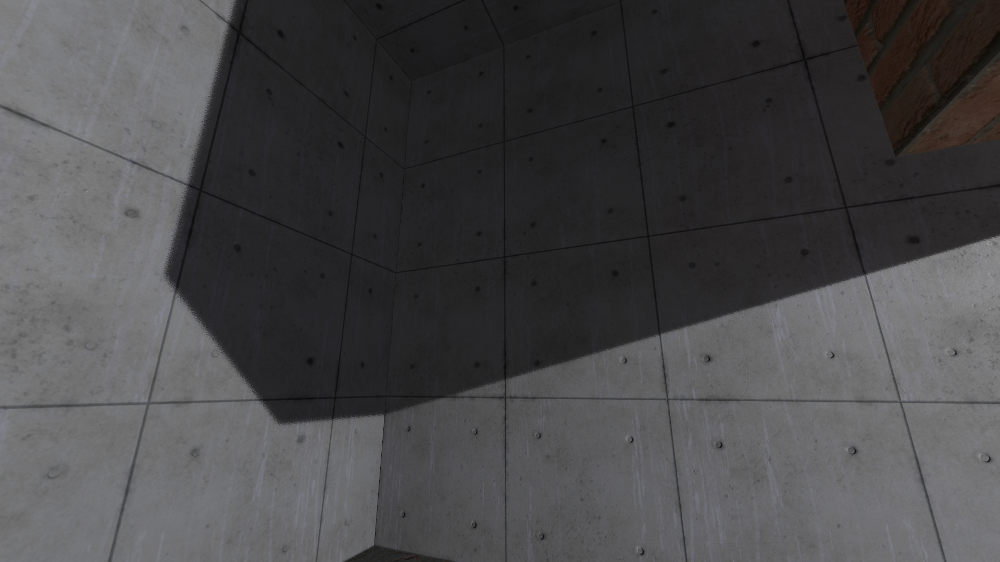

# Clustered Lighting: How Does It Work?

Clustered Lighting adds a new dynamic lighting system to Strata, with the following major improvements:

* Specular lighting now works on all surfaces, brush or prop, indoors or outdoors.
* light_rt entities can now cast light and shadows dynamically.
  * Lights can move and their light and shadows will move with them.
  * Entities can move under lights and have their lighting updated. This includes brush entities.
* Hammer can now preview lighting and shadows in real time.

Currently, only Portal 2: Community Edition and Momentum Mod support Clustered Lighting. There are currently no plans to add Clustered Lighting to Portal: Revolution.

> [!NOTE]
> Clustered currently works for the PBR, LMG, VLG, Water, Paint, Gel Blobs, and Eyes shaders

## How Does it Work?

Traditionally in Source, light sources light up the map in two ways: by directly shining light onto a surface, and indirectly, by having their light bounce onto other surfaces. Both direct and indirect lighting are calculated by VRAD when the map is compiled, and "baked" into the map's lightmap, which can generally be thought of as an unmoving texture that is painted onto all the "lit" surfaces of the map.

* Top: Normal lighting.
* Middle: Direct lighting only. Notice how the backs of the cubes are now completely black, since no light is directly hitting them.
* Bottom: Indirect lighting only. The room is now only dimly lit by the reflected light, but the bright direct light is gone.

Two major limitations of this system are that it cannot easily support dynamic light and shadows, since both are baked into the lightmap which can only change in very limited ways at runtime, and that it does not support specular lighting.

Specular lighting is the light that's reflected off of smooth, shiny surfaces, usually forming a bright highlight. Specular lighting is unique in that it can change drastically depending on the player's view position relative to the surface and the light, so it can't easily be recorded into the lightmap. This is not true for direct and indirect lighting, as these are diffuse types of lighting, which means they don't depend on the player's view position.

Clustered lighting improves these limitations by adding dynamic lighting that is calculated at runtime, and not exclusively baked into the lightmap. Now, we can change the following three properties:
* Direct lighting can be statically baked into the lightmap or dynamic
* Indirect lighting can be statically baked into the lightmap or disabled
* Specular lighting can be disabled or dynamic

Which technique is used is controlled by the light's "Light mode":

|                 | Direct            | Indirect     | Specular          |
| --------------- | ----------------- | ------------ | ----------------- |
| "Static"        | baked             | baked        | *disabled*      |
| "Specular"      | baked             | baked        | **dynamic** |
| "Static Bounce" | **dynamic** | baked        | **dynamic** |
| "Dynamic"       | **dynamic** | *disabled* | **dynamic** |

The "Static" light mode is identical to pre-clustered lighting, with no dynamic lighting at all. "Specular" enables dynamic specular lighting while keeping everything else baked into the lightmap. "Static bounce" also does direct lighting dynamically, and "Dynamic" removes indirect lighting, so it is 100% dynamic.

## Specular Lighting

All the new light modes except "Static" enable specular lighting, which can massively improve how materials look, especially PBR materials.

* Top: No specular.
* Middle: Specular lighting enabled. Notice the highlight on the blue material, and the bright spots on the back wall.
* Bottom: Specular lighting only. By removing the baked direct and indirect light, you can see exactly what specular lighting adds to the scene.

The addition of specular lighting also make metallic PBR materials look much more correct. Previously, without another specular-enabled source like outdoors CSM, metallic materials would simply appear black. This is because metals really only reflect specular lighting, and have little to no diffuse lighting.

* Top: No specular. The metal parts of the material are completely black.
* Bottom: Specular lighting enabled. The metal now reacts to the nearby light source correctly (some parts of the metal are still black because they aren't being lit by a dynamic light source.)

## Real Time Shadows

With real time light and shadows, normal `light_rt` and `light_rt_spot` entities move, updating the light of their surroundings in real time. They can also be parented to other entities.

* A swinging point `light_rt`, casting shadows in all 6 directions, and a stationary directional `light_rt_spot`, casting shadows in one direction.

> [!WARNING]
> Shadowed point `light_rt`s take up 6 times the shadow memory that shadowed `light_rt_spot` entities take, as they are casting in 6 different directions. Use these sparingly, and disable shadows if not needed!

## Shadow Map Size

To store the shadows without generating them every frame, the lights render to an internal texture called a "shadow map." You can control the resolution of this shadow map. Higher values create sharper, more accurate shadows, but cost more to render. Sharp shadows may not be appropriate for all situations either, sometimes soft shadows look more accurate.

You can control the size of the shadow map by changing the "Initial Shadow Size" property.

* Top: "Initial Shadow Size" is 3
* Middle: "Initial Shadow Size" is 5
* Bottom: "Initial Shadow Size" is 7

> [!NOTE]
> In the clustered renderer, shadowmaps for all lights are stored in a single, larger texture, called the 'shadow atlas', which has space for a limited amount of shadow data. Each time you increase the 'size' of a shadow by 1, you increase its shadow size by a factor of 4. For example, a shadow of size 2 takes up only a quarter of the space that a shadow of size 3 takes up. If shadows in your map stop appearing suddenly, consider reducing the shadow size of a few less important shadows.

## Other Clustered Changes

A few things are also affected by the new clustered renderer:

* env_projectedtexture now uses the clustered renderer.
* The flashlight now uses the clustered renderer.
