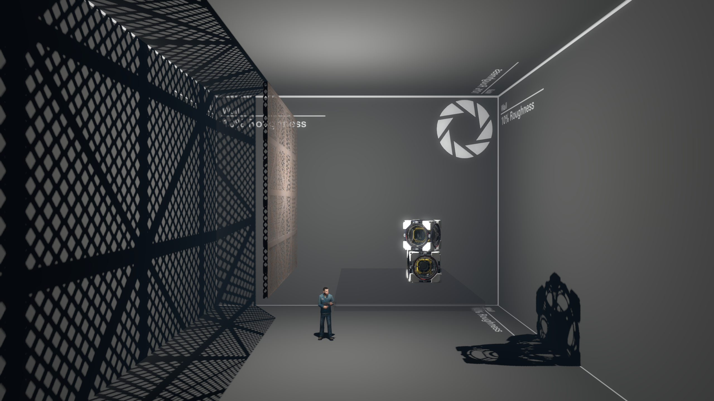
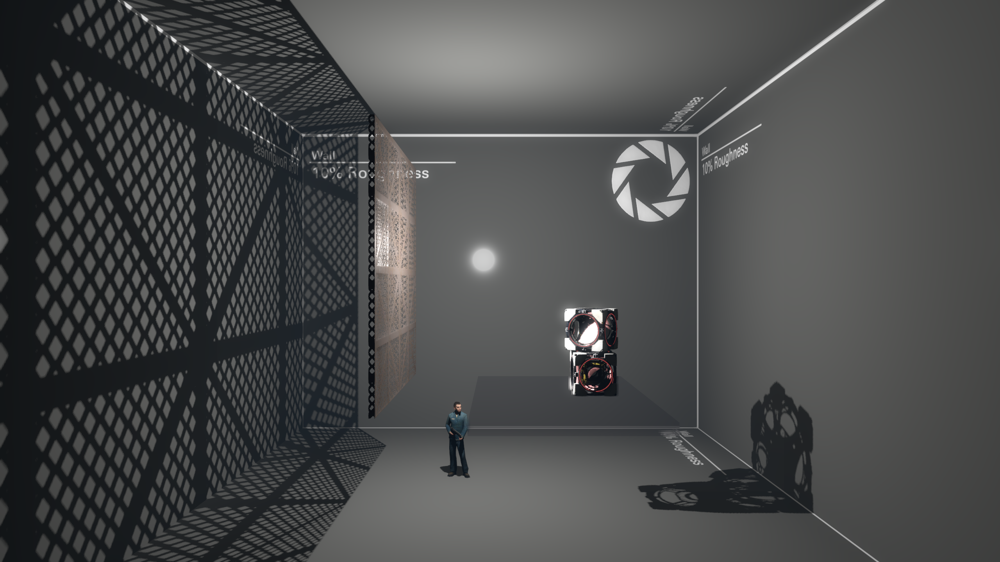
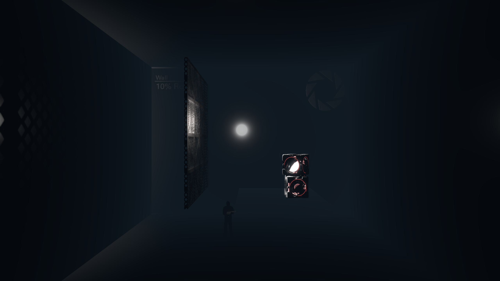
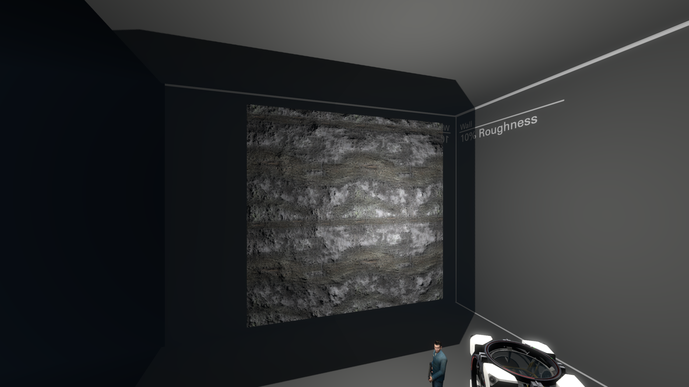
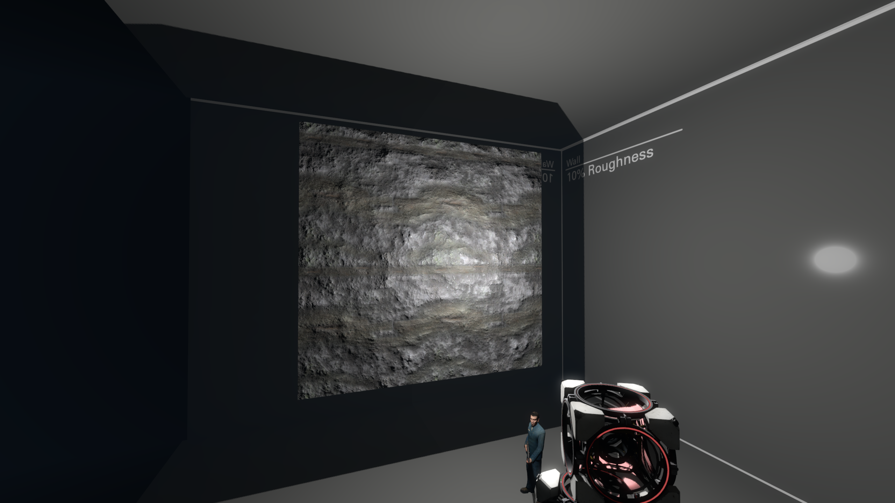
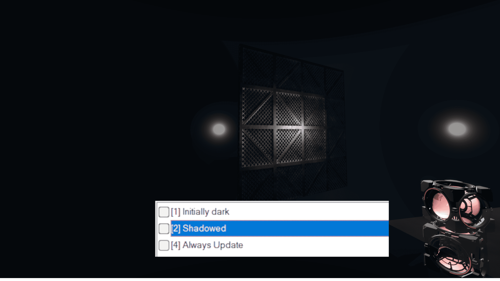
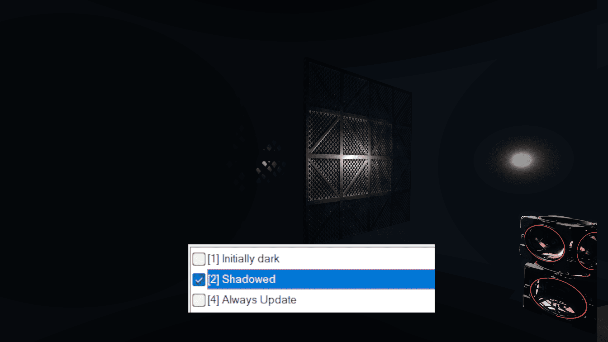
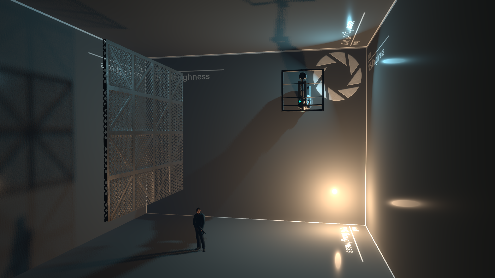
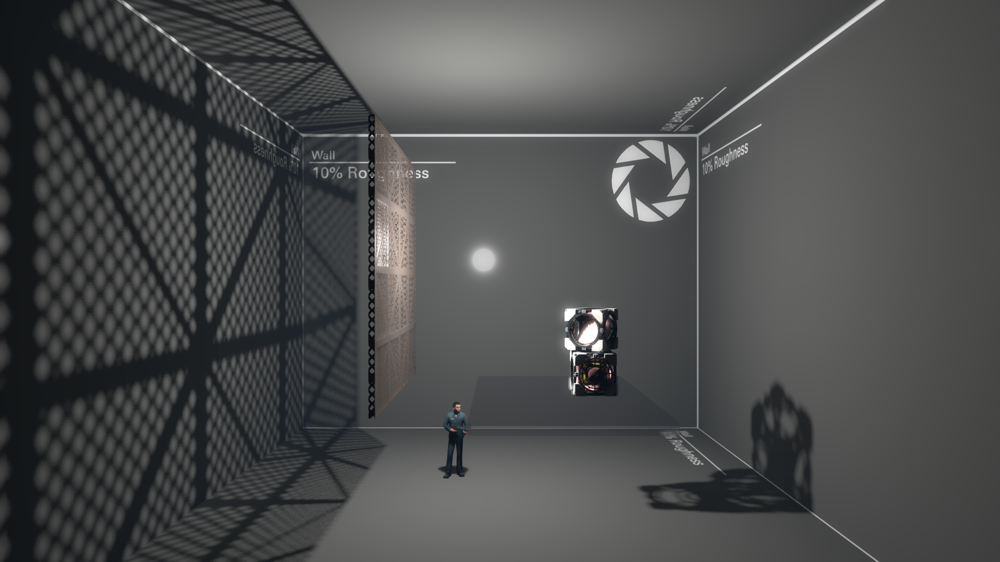
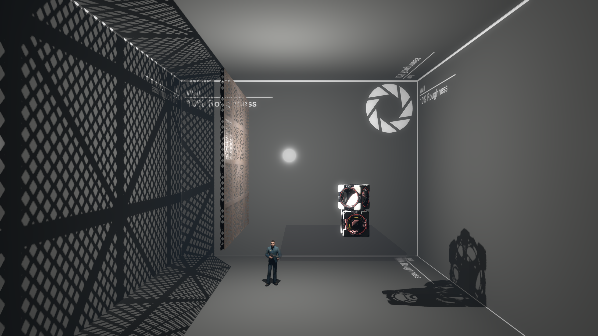

# Clustered Lighting: How Does It Work?

Clustered Lighting adds a new dynamic lighting system to Strata, with the following major improvements:

* Specular lighting now works on all surfaces, brush or prop, indoors or outdoors.
* `light_rt` entities can now cast light and shadows dynamically.
  * Lights can move and their light and shadows will move with them.
  * Entities can move under lights and have their lighting updated. This includes brush entities.
* `light_rt` can be configured to use static shadows or no shadows at all, making the regular light entity obsolete.

Currently, only Portal 2: Community Edition and Momentum Mod support Clustered Lighting. There are currently no plans to add Clustered Lighting to Portal: Revolution.

> [!NOTE]
> Clustered currently works with the following shaders: PBR, LightMappedGeneric, VertexLitGeneric, Water, Paint, Gel Blobs and Eyes.

## How Does It Work?

Traditionally in Source, light sources light up the map in two ways: by directly shining light onto a surface, and indirectly, by having their light bounce onto other surfaces. Both direct and indirect lighting are calculated by VRAD when the map is compiled, and "baked" into the map's lightmap, which can generally be thought of as an unmoving texture that is painted onto all the "lit" surfaces of the map.

* Top: Normal lighting.
* Middle: Direct lighting only. Notice how the room became darker.
* Bottom: Indirect lighting only. The room is now dimly lit, with only NPC and cubes neing bright.

Two major limitations of this system are that it cannot easily support dynamic light and shadows, since both are baked into the lightmap which can only change in very limited ways at runtime, and that it does not support specular lighting.

##
#### Clustered lighting improves these limitations,
by adding efficient dynamic lighting for all light types, instead of just projected textures.
Clustered uses traditional shadow-mapping techniques and renders to a single shadow atlas instead of a separate depth texture like projected textures do. The shadow atlas contains the depth values for all lights in the scene.
Shadowmaps update only in certain scenarios: when the light source moves and when an object moves inside the light. 

Now, there are three properties of a clustered light entity:
* Direct lighting, that can be statically baked into the lightmap or dynamically use the clustered lighting
* Indirect lighting, that can be baked or disabled
* Specular lighting, which is a realistic reflection of the light, can be disabled as well

There are three keyvalues that control these properties: **Direct light mode**, **Indirect light mode.** and **Specular light mode**.

|                 |  Direct           |  Indirect    |    Specular       |
| --------------- | ----------------- | ------------ | ----------------- |
| None            | "None"            | "Static Only"| "Dynamic Only"    |
| Static          | "None"            | "Static Only"| -                 |
| Dynamic         | "None"            | -            | "Dynamic Only"    |

## Specular Lighting

All the new light modes except "Static" enable specular lighting, which can massively improve how PBR materials look.

Specular lighting is not an actual lighting, but rather a reflection off of smooth, shiny surfaces, usually forming a bright highlight. Specular lighting is unique in that it can change drastically depending on the player's view position relative to the surface and the light, so it can't be baked into the lightmap. This is not true for direct and indirect lighting, as these are diffuse types of lighting, which means they don't depend on the player's view position.

> [!NOTE]
> Specular reflections are baked into cubemaps. Keep this in mind when making high-quality parallax reflections.

* Top: No specular.
* Middle: Specular lighting enabled. Notice a white circle appearing on the wall, as well as reflection on the grate.
* Bottom: Specular lighting only. By removing the baked direct and indirect light, you can see exactly what specular lighting adds to the scene.

The addition of specular lighting also make metallic PBR materials look much more correct. Previously, without another specular-enabled source like outdoors CSM, metallic materials would simply appear black. This is because metals really only reflect specular lighting, and have little to no diffuse lighting.

* Top: No specular. The metal parts of the material are completely black.
* Bottom: Specular lighting enabled. The metal now reacts to the nearby light source correctly (some parts of the metal are still black because they aren't being lit by a dynamic light source).

> [!NOTE]
> Specular reflections are shadow dependant. So if the "Shadowed" flag is checked, the reflection will be displayed where the shadow from this light source would fall.

## Real Time Shadows

With real time light and shadows, normal `light_rt` and `light_rt_spot` entities move, updating the light of their surroundings in real time. They can also be parented to other entities.

> [!NOTE]
> Clustered lights don't update their shadows when the object isn't moving (eg. when animation is played) unless a physics object updates its shadow around that object or if `Always Update` flag is set. 

There are 2 entities that can produce real time shadows.

* `light_rt` on the top, casting shadows in all 6 directions, and a directional `light_rt_spot` on the bottom, casting shadows in one direction.

> [!WARNING]
> Shadowed point `light_rt`s take up 6 times the shadow memory that shadowed `light_rt_spot` entities take, as they are casting in 6 different directions. Use these sparingly, no need to make every light source dynamic!

## Shadow Map Size

To store the shadows without generating them every frame, the lights render to an internal texture called a "shadow map." You can control the resolution of this shadow map. Higher values create sharper, more accurate shadows, but cost more to render. Sharp shadows may not be appropriate for all situations either, sometimes soft shadows look more accurate.

You can control the size of the shadow map by changing the "Initial Shadow Size" property.

* Top: "Initial Shadow Size" is 3
* Middle: "Initial Shadow Size" is 5
* Bottom: "Initial Shadow Size" is 7

> [!NOTE]
> In the clustered renderer, shadowmaps for all lights are stored in a single, larger texture, called the 'Shadow Atlas', which has space for a limited amount of shadow data. Each time you increase the size of a shadow by 1, you increase the atlas' shadow size by a factor of 4. For example, a shadow of size 2 takes up only a quarter of the space that a shadow of size 3 takes up. If shadows in your map stop appearing suddenly, consider reducing the shadow size of a few less important shadows.

> [!WARNING]
> When increasing the outer angle of `light_rt_spot`, note that the edges of the spot will have sharper shadows than the center. This is importams since setting up a `light_rt_spot` with a high shadow size and a high outer angle will produce low-quality shadows in the center while still taking up a huge piece of shadow atlas. Consder using `env_projectedtexture` or `env_cascade_light` (when imitating sunlight) in scenarios like these.

## Console commands

There are some clustered-related console commands that give a more precise control over clustered shadows.

| Command                                   | Purpose           |
|-------------------------------------------|-------------------|
|`r_clustered_lighting_enable`              | Toggles clustered lights. Default is 1 |
|`r_clustered_shadowframebudget`            | Determines how many shadow faces can be rendered per frame. Default is 6. High values (like 50) may impact perfomance.|
|`r_clustered_shadow_depthbias`             | Controls shadow ance and peter panning. High values (like 0.1) break shadows completely, lower values make shadows appear on edges of shadowmaps. Default is 0.00005 |
|`r_clustered_shadow_slopescale`            | Similar to depthbias, but applied depending on how glancing the angle to the surface being rendered in the shadowmap, since more glancing angles will need higher depth bias. High values make shadows leak through world. Default is 5 |
|`r_clustered_static_lightcull`             | Experimental. Allows more lights to be rendered on AMD GPUs, but makes it way slower to render on NVidia GPUs. It is recommended not to touch if you don't use AMD GPU. |
|`r_clustered_static_shadow_exponent_scale` | Scales the atlas size of shadows so they take up more space, doesn't seem to be useful since increasing the atlas's size itself is almost always a better solution. Default is 1, higher values make some shadows appear sharper |

## Other Clustered Changes

A few things are also affected by the new clustered renderer:

* env_projectedtexture now uses the clustered renderer.
* The flashlight now uses the clustered renderer.
