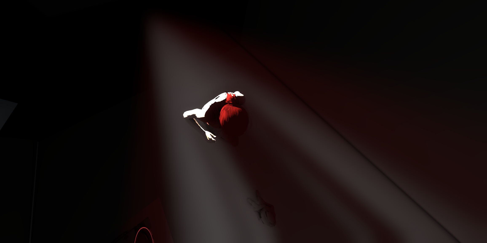
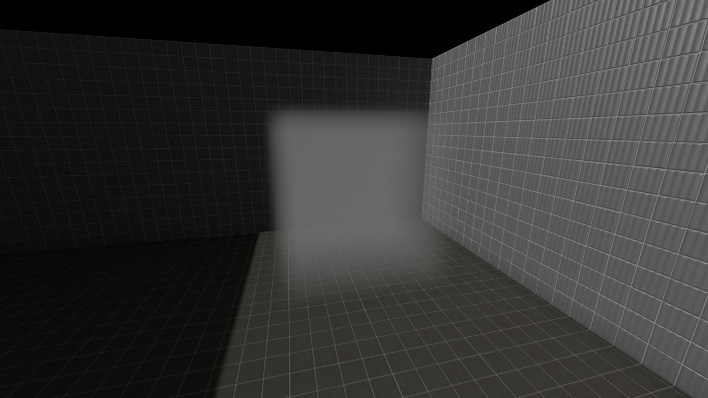
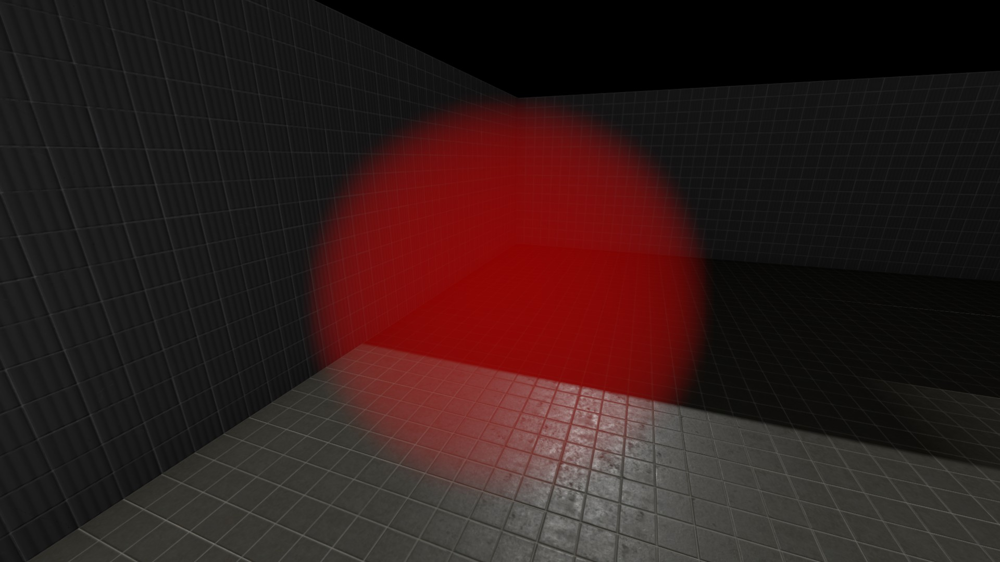
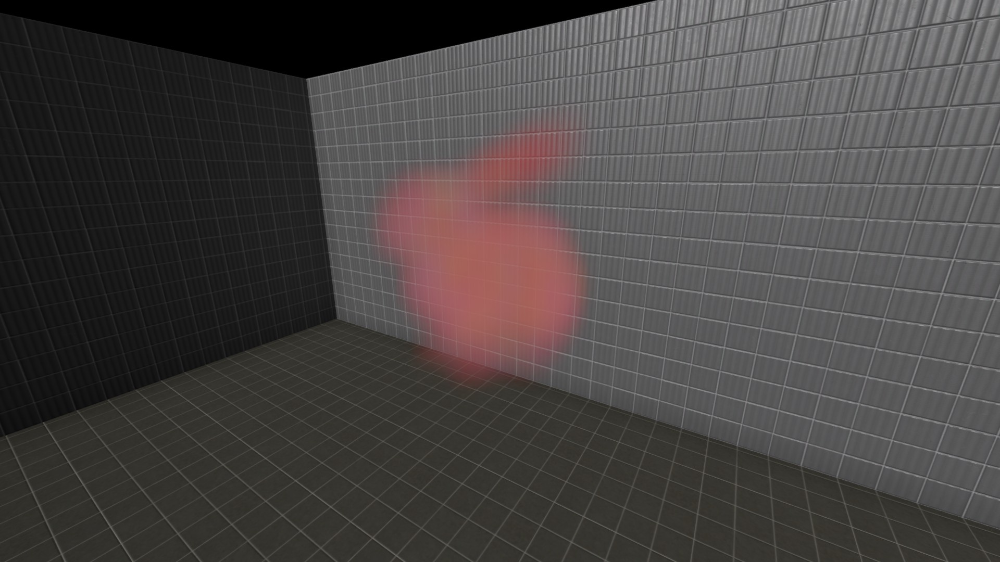
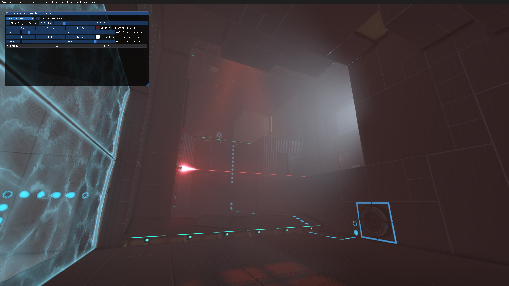

# Volumetric Lighting

Volumetric Lighting is a rendering effect that simulates light rays scattering in the air.
It allows light to produce a visual occlusion effect, meaning that any object blocking the light will cast realistic shadows and block any volumetrics from passing through.

Shadows cast by the player model also interact with volumetric lighting.

## The Setup

There are 3 KeyValues in `light_rt` and `light_rt_spot` entities: `Volumetric Light Mode` **`Volumetric Density`** and **`Volumetric Light Scale`**:

* `Volumetric Light Mode` toggles the volumetric lighting for this entity, can be set to either *None* or *Dynamic Only*.
* `Volumetric Density` is a floating number between 0 and 1, where 1 is fully opaque and 0 is completely invisible.
* `Volumetric Light Scale` is a floating number that scales the color of the volumetric lighting casted by this entity, it is not recommended to set higher than 1.

`env_projectexture`, has only two volumetric-related KeyValues - `Volumetric Intensity`, which is identical to `Volumetric Density`, and `Enable Volumetrics`. But unlike all the other entities that produce volumetrics, projected texture volumetrics also support projecting .webm videos.

More about setting up volumetrics for each entity in [Quick Start](/lighting/volumetrics/quick_setup)

## Light Cookies and WebM support

Volumetrics support light cookies from `light_rt`, `light_rt_spot` and `env_projectedtexture`, as well as WebM videos from `env_projectedtexture` entity. The volumetrics casted by the lights that use light cookies and WebM videos will update and show up correctly.

## Volumetrical Fog

In addition to individual volumetrics for the Clustered lights, there is a point entity called `obb_fogvolume`. It allows placing a visually simulated 3 dimensional fog volume constrained to its oriented bounding box. This fog volume can be altered through both pre-defined keyvalues user-defined 3d textures, allowing custom shapes, colors, and density. Most importantly, **it displays the light sources passing through the volume, giving them a visualized depth beyond just light projected onto adjacent surfaces**. Volumetrics can also be directly emitted from light sources independently of the entity, allowing a direct 3d visualization of the light in an area.

#### KeyValues:
* `Half-Width` of the fog on the Y axis;
* `Half-Width` of the fog on the Z axis;
* `Half-Width` of the fog on the X axis;
* `Emissive Color`, which is the color of the fog;
* `Scattering Color`, which is the color multiplier for the rays that pass through the fog;
* `Phase` is the angular distribution of scattered light, more about it [here](https://en.wikipedia.org/wiki/Henyey–Greenstein_phase_function);
* `Spheroid` checkmark, determining the general shape of the fog;
* `Texture Name` determines a 2D-to-3D texture forming the shape of the fog;
* `Texture Slices` determines the amount of slices of the 2D-to-3D texture (default is 16, which is 4x4 grid of textures)

`obb_volumefog` is cubic by default. There are 2 ways to give it a different shape - using `Spheroid` or `Texture Name` keyvalues.

`Texture Name` only parses 2D-to-3D textures.

All `obb_fogvolume`'s KeyValues can be changed in realtime in-game using the Clustered Volumetrics Inspector.

## Global Volumetrical Fog

To set up the volumetric fog for the whole map, you can use the **Clustered Volumetrics Inspector** in the Developer UI menu. You can enable the Clustered Volumetrics Inspector UI using the  `devui_show vol_editor` console command, or by pressing `shift + f1` and selecting `Clustered Volumetrics Inspector` menu in the `Graphics` tab on the top left.

Clustered Volumetrics Inspector allows setting the global volumetric properties (e.g. density) to be interacted with by volumetric lights, allowing to one to preview the volumetric lighting on maps that were compiled before the update. It does that by applying a pseudo-`obb_fogvolume` that covers the entire map, values of which are controlled by this menu.

**Clustered Volumetrics Inspector has the following list of values:**

* `Show Volume Bounds` - if an `obb_fogvolume` entity is present, it will show its bounds as a white box.
* `Show Only in Radius` will only show `obb_fogvolume` entities in a specified radius. This only affects the `obb_fogvolume` list below.
* `Default Fog Emissive Color` sets the emissive fog color for the whole map. Appears on top of the regular fog created by `env_fog_controller`, works similarly.
* `Default Fog Density` sets the density of the fog for the whole map, similarly to the `env_fog_controller`'s fog density.
* `Default Fog Scattering Color` sets the color for the volumetric rays that are casted by CSM and Clustered lighting. Useful only in maps that were compiled before the update.
* `Default Fog Phase` is the Henyey–Greenstein phase mathematical function. Simply put, it changes the starting / ending point of the volumetric rays in a specific way. Only values from -1 to 1 are accepted. Default is 0 - the whole ray is visible.

If you specify an `obb_fogvolume` entity in the fogvolume list, the following properties will be able to be changed:
* `Position` of the fog entity, with the value being the center of the fog;
* `Angles` of the fog entity;
* `Half Size` of the fog, which is split into width, length and height;
* `Spheroid Volume`, which determines whether the fog should be drawn as a cube or as a sphere;
* `Fog Density`;
* `Emissive Color`, which is the color of the fog itself;
* `Scattering color`, which is the color of the volumetric rays that go through the fog's volume;
* `Fog Phase`, which is similar to the `Default Fog Phase` except it is applied individually to this `obb_fogvolume`.

