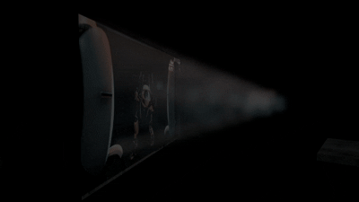

> [!NOTE]
> This page is work in progress. Please be patient!
> TODO fill me.

# Volumetric Lighting

Volumetric Lighting is ... 
It allows light to ...

Player model also interacts with volumetric lighting, even in the firstperson.

## The Setup

There are 3 KeyValues in `light_rt` and `light_rt_spot` entities: `Volumetric Light Mode` **`Volumetric Density`** and **`Volumetric Light Scale`**:

* `Volumetric Light Mode` toggles the volumetric lighting for this entity, can be set to either *None* or *Dynamic Only*.
* `Volumetric density` is a floating number between 0 and 1, where 1 is fully opaque and 0 is completely invisible.
* `Volumetric Light Scale` is a floating number that scales the color of the volumetric lighting casted by this entity, it is not recommended to set higher than 1.

`env_projectexture`, except for `Enable Volumetrics`, have only volumetric-related KeyValue - `Volumetric Intensity`, which is identical to `Volumetric Density`. But unlike all the other entities that produce volumetrics, projected texture volumetrics work with WebM videos.

## Light Cookies and WebM support

Volumetrics support light cookies from `light_rt` and `light_rt_spot`, as well as WebM videos from `env_projectedtexture` entity. The volumetrics casted by the lights that use light cookies and WebM videos will update and show up correctly.

****

## Volumetrical Fog

In addition to individual volumetrics for the Clustered lights, there is a fog entity called `obb_fogvolume`. It allows you to place a volumetric fog in your map. It can have a different shape, color and density, but most importantly, **it projects volumetrical rays of the lights that intercept it**. Simply put, this 

You change the width, the height and the depth of the fog.

`obb_volumefog` is cubic by default. There is a `Spheroid` KeyValue to make the fog spherical.

Obb_fogvolume allows to change the shape of the volumetric fog by  the KeyValues "Texture Name"

You can change the X and Y axes of the custom texture slices

(images/obb_volume_changetexture.jpg)

You change the color of the "emissive" and "scaterring" of the volumetric fog

## Setup for Global Volumetrical Fog

To set up the volumetric fog for the whole map, you can use the 'Clustered Volumetrics Inspector' in the Developer UI menu.

Clustered Volumetrics Inspector allows setting the volumetrical value for all clustered lights globally, allowing to preview the new volumetric lighting on the maps that were compiled before the update. It does that by applying a pseudo-`obb_fogvolume` that covers the whole map, values of which are controlled by this menu.

**Clustered Volumetrics Inspector has the following list of values:**

* `Show Volume Bounds` - if an `obb_fogvolume` entity is present, it will show its bounds as a white box.
* `Show Only in Radius` will only show `obb_fogvolume` entities in a specified radius. This only affects the `obb_fogvolume` list below.
* `Default Fog Emissive Color` sets the emissive fog color for the whole map. Appears on top of the regular fog created by `env_fog_controller`, works similarly.
* `Default Fog Density` sets the density of the fog for the whole map, similarly to the `env_fog_controller`'s fog density.
* `Default Fog Scattering Color` sets the color for the volumetric rays that are casted by CSM and Clustered lighting. Useful only in maps that were compiled before the update.
* `Default Fog Phase` changes the starting / ending point of the volumetric rays. Only values from -1 to 1 are accepted. Default is 0 - no changes. Value of 0.5 cuts the volumetric rays in half, value of -0.5 makes only the ending half of the rays appear.

If you specify an `obb_fogvolume` entity in the fogvolume list, the following properties will be able to be changed:
* `Position` of the fog entity, with the value being the center of the fog;
* `Angles` of the fog entity;
* `Half Size` of the fog, which is split into width, length and height;
* `Spheroid Volume`, which determines whether the fog should be drawn as a cube or as a sphere;
* `Fog Density`;
* `Emissive Color`, which is the color of the fog itself;
* `Scattering color`, which is the color of the volumetric rays that go through the fog's volume;
* `Fog Phase`, which is similar to the `Default Fog Phase` except it is applied individually to this `obb_fogvolume`.

