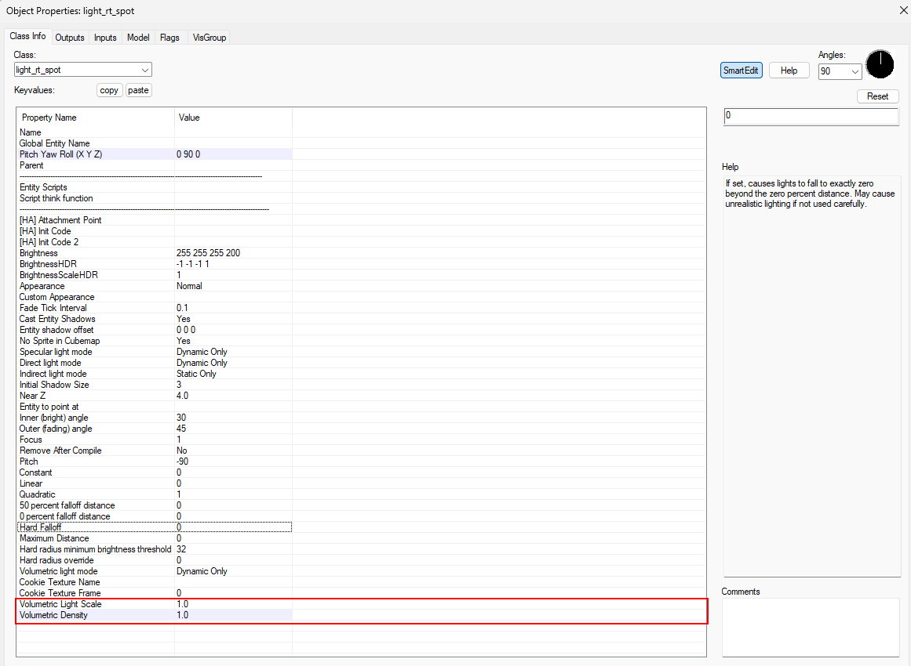
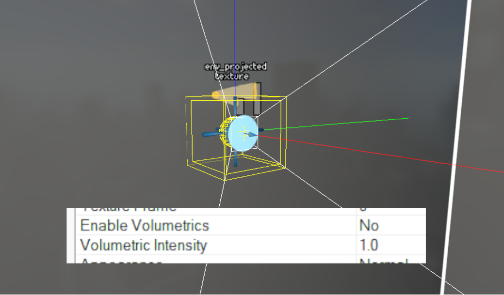
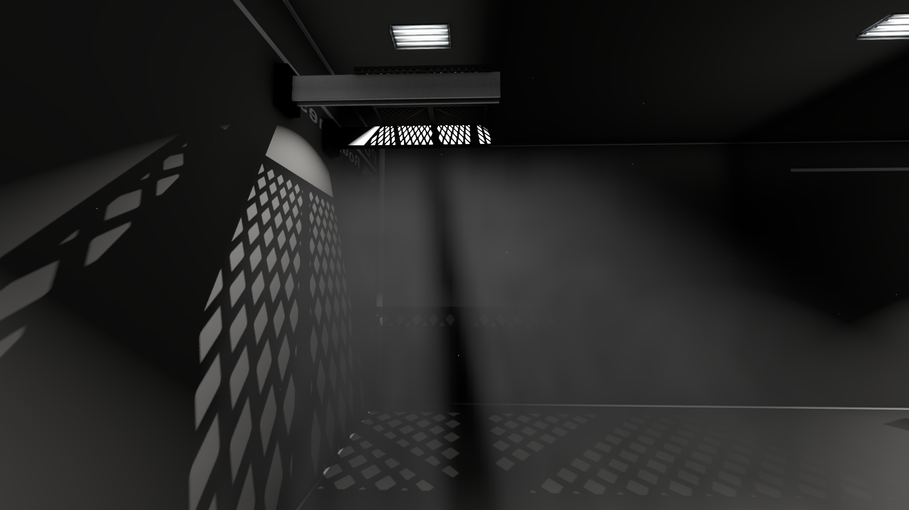
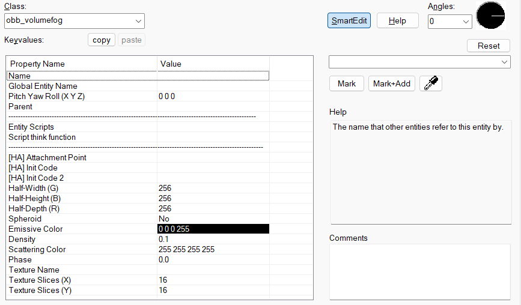
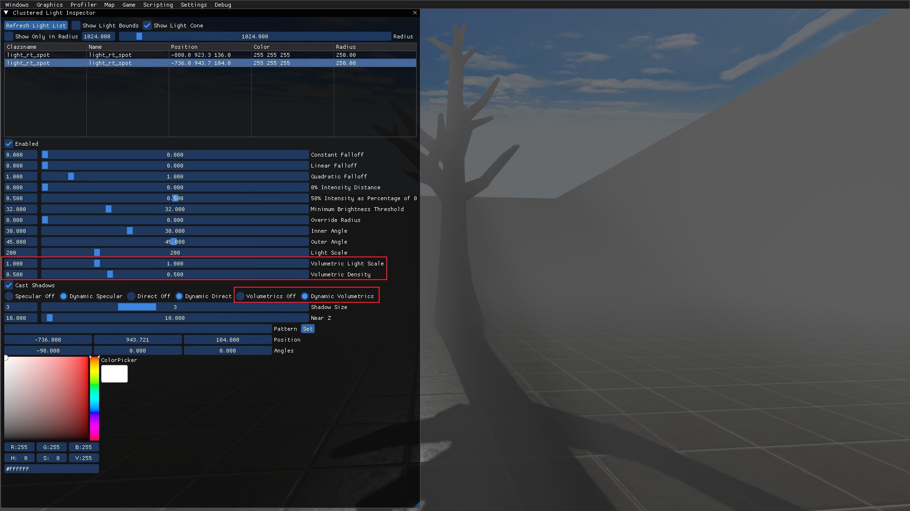
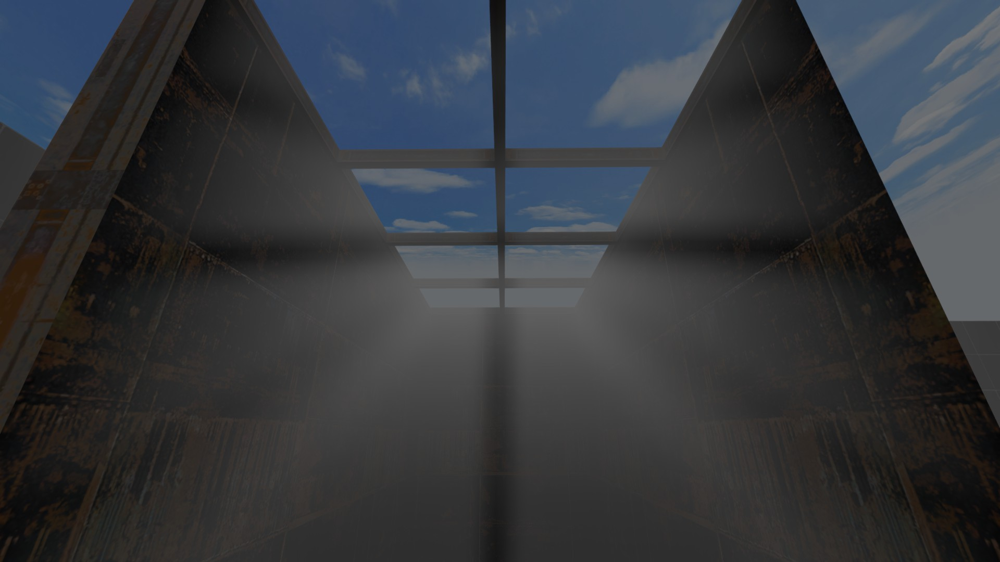

# Quick Setup

You can set up volumetrics in 3 different ways: 
1. By using the corresponding KeyValues in `light_rt`, `light_rt_spot` and `env_projectedtexture`;
2. By using `obb_fogvolume` that defines volumetric rays specifically for the fog volume it produces;
3. Through the [Clustered Volumetric Inspector](/misc/devui/categories/graphics#clustered-volumetrics-inspector) in the Developer UI menu.

## Using KeyValues:

**For light_rt and light_rt_spot**
1. Add a light_rt or light_rt_spot entity
2. Set the `Volumetric Light Scale` KeyValue to some value between 0.1 and 1.0
3. Set the `Volumetric Density` KeyValue to some value between 0.1 and 1.0
4. Make sure the `Shadowed` flag is **checked**
5. Compile the map. The volumetrics should appear.

> [!NOTE]
> It is *not* necessary to have the "Shadowed" flag enabled for the volumetrics to appear.

**For env_projectexture**
 
1. Add an env_projectexture entity
2. Set the `Enable Volumetrics` KeyValue to Yes
3. Set the `Volumetric Intensity` KeyValue to some value between 0.1 and 1.0
4. Compile the map. The volumetrics should appear.

## Using `obb_fogvolume`:

1. Add an `obb_fogvolume` entity
2. Set the `Emissive Color` KeyValue to `1 1 1 1`
3. Set the `Scattering Color` KeyValue to `255 255 255 255` or a similar value.
3. Set the `Density` KeyValue to something around 0.7
3. If setting up a specific shape, toggle the `Spheroid` KeyValue or define a proper texture in `Texture Name`
3. Add `light_rt`, `light_rt_spot` or any other light enity that works with volumetric lighting
3. For better results, add obstacles between the light entity and the fog
3. Compile the map. The volumetric cloud should appear and interact with volumetric lighting

## Using Clustered Volumetric Inspector:

It is possible to set up volumetrics for `light_rt` and `light_rt_spot` in Clustered Light Inspector.

There are 4 volumetrics-related options:
* `Volumetric Light Scale`,
* `Volumetric Density`,
* and two checkboxes (`Dynamic Volumetrics` and `Volumetrics Off`) that enable / disable volumetric lighting for that specific light.

# Volumetrics for Cascade Shadow Mapping

Currently, there are no KeyValues that enable the volumetric fog for `env_cascade_light` entity. However, there are two ways to make them appear - through the [Clustered Volumetric Inspector](/misc/devui/categories/graphics#clustered-volumetrics-inspector), or by using `obb_fogvolume` entity, since cascade shadows are marked as volumetrical.

