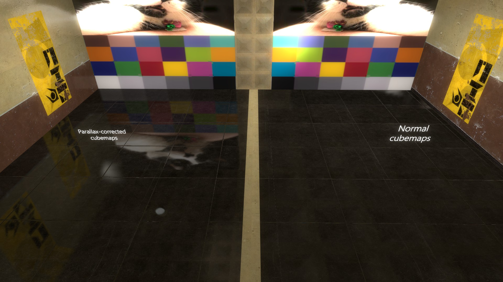
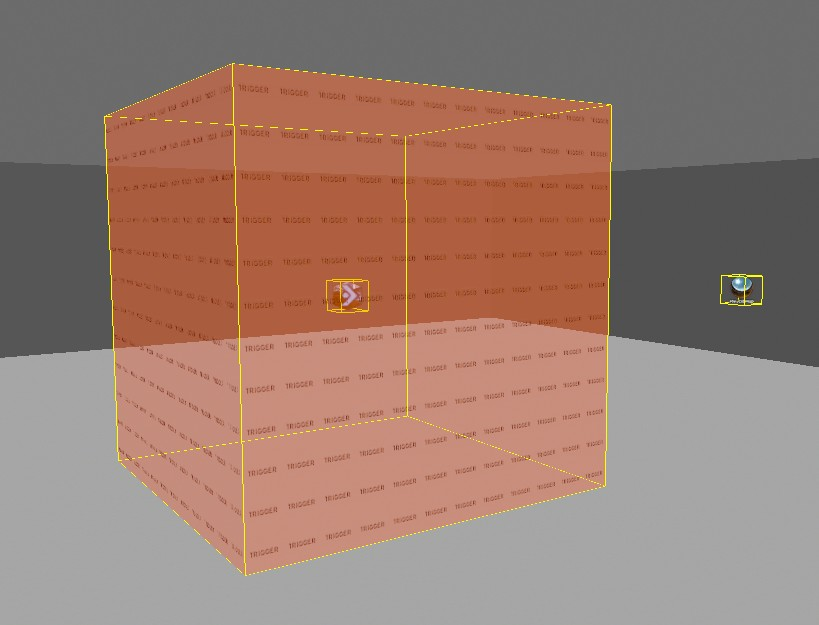
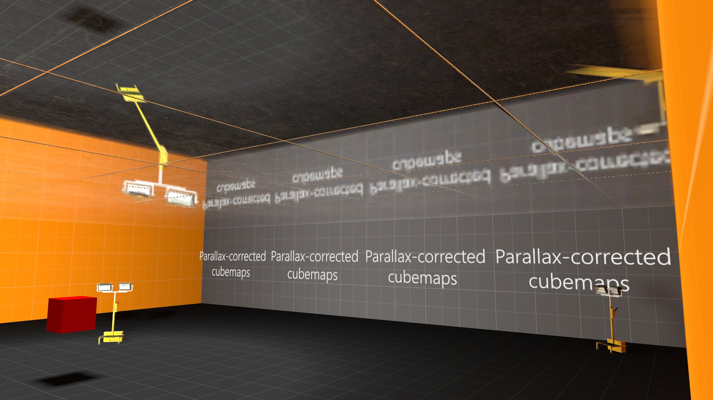
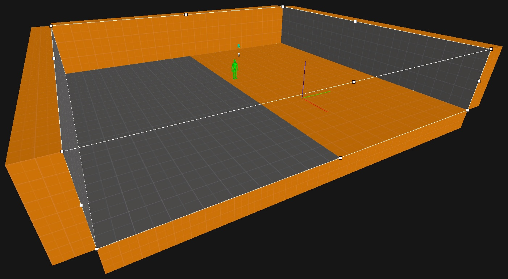
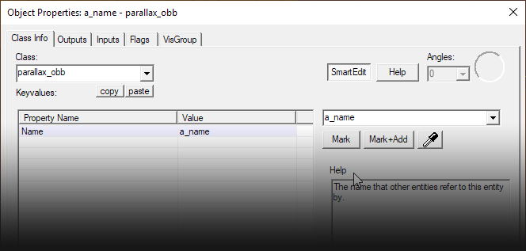

# Parallax Corrected Cubemaps

This page covers Strata implementation of Parallax-Corrected Cubemaps, created with a combination of custom entities and materials.

## Overview
https://docs.momentum-mod.org/shaders/parallax_corrected_cubemaps/ it's came from momentum mod

> [!NOTE]
> Thanks to Brian Charles for his work on this feature.
> More technical information can be found on the [Valve Developer Wiki Page.](https://developer.valvesoftware.com/wiki/Parallax_Corrected_Cubemaps)

## Prerequisites 
* Be proficient in using the Hammer Editor
* Have the momentum/p2ce/revolution.fgd in your Hammer configuration
* Know how to use the developer console
## Components of a Parallax-Corrected Cubemap

In Hammer, Parallax-Corrected Cubemaps need two entities to function correctly:

* A trigger brush tied to a parallax_obb entity - must be named

* An env_cubemap with “Cubemap Bounds” set to the name of the parallax_obb

> [!NOTE]
> You may notice a box appear in the centre of the brush when you tie it to a parallax_obb entity like shown above.
> This is normal and allows you to more easily select the brush if you have made it match the shape of the room.

Any regular LightmappedGeneric materials will still be able to use the cubemap as normal, this feature simply adds functionality on top of the existing env_cubemap in conjunction with an extra entity and shader to use inside .VMT files.

> [!TIP]
> There are some important things to take note of:
> The parallax_obb entity must be a single box brush
> The Parallax-Corrected cubemap is still built the same way regular cubemaps are.
> This means that you may have distortion in the reflections depending on where you place the env_cubemap and the shape of the parallax_obb brush.
> This example has a wide room with a low ceiling as well as the cubemap entity not quite in the centre:

## Hammer 
Here is the process of creating the necessary entities in Hammer for this feature to work in a room you’ve already made.

The first thing you should do is to create the “bounding box” of the cubemap with a trigger brush. Make it so that it fits the room as closely as possible.

Once you’ve made the trigger brush, tie it to a parallax_obb entity and give it a name:

That’s all that is needed for the brush, onto the cubemap entity itself.

When creating an env_cubemap you should see an extra option called “Cubemap Bounds”. Set it to the name of the parallax_obb you just created.

This should be all the setup that is required in Hammer.

You should be able to compile your map as normal and build the cubemaps in game to see the effects if you have any supported materials in the map.

