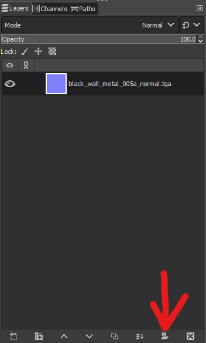

# Parallax Mapping
## Overview
[Parallax Mapping](https://learnopengl.com/Advanced-Lighting/Parallax-Mapping) is a shading technique used to add perceived depth to a material, which would be too complex and unrealistic to create with displacements or models. Valve experimented with Parallax Mapping during the development of Half-Life 2, however it was dropped before being shipped. Using the [PBR shader](/material/pbr/pbrshader), parallax mapping can be used again to add perceived depth to your materials.
## Requirements
* A functioning PBR material (steps for creation can be found [here](/material/pbr/materialcreation).)
* A [Bumpmap](https://developer.valvesoftware.com/wiki/Bump_map)
* A [Heightmap](https://developer.valvesoftware.com/wiki/Heightmap)
* [GIMP](https://www.gimp.org/)
## Embedding the Heightmap
Open both your Heightmap and Bumpmap separately in GIMP. Copy your Heightmap, then navigate to the layers window of your bumpmap and click on the Layer Mask button.



A small window asking about what to fill the mask with should pop up. Select White, then click ok. Now, paste your Heightmap into the layer mask. Your layer should now look like this:
 


The main image should now appear transparent, as GIMP always interprets alpha masks as transparency masks. This is can be ignored, as the engine will interpret this correctly. Now, export your image and convert it to a VTF. 
## Adjusting the VMT
Change the `$bumpmap` parameter in your VMT to the new Bumpmap, then put the following into your VMT:
```
   $parallax "1"
   $parallaxcenter "0.5"
   $parallaxdepth "0.1"
```
`$parallaxcenter` essentially defines the distance of the highest point of the material from the plane it is applied to, or how far away the highest point is, on a scale from 0-1; the higher the number the closer to the plane it is. It is recommended adjust this parameter with Hammer open, as materials reload instantly and you can move your camera around freely. 

`$parallaxdepth` defines the intensity of the effect, on a scale of 0-1; the higher the number the greater the intensity. "0.1" is a good starting point, but you may need to increase/decrease it to get the desired effect. Values to the hundredths place are accepted.