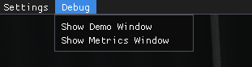
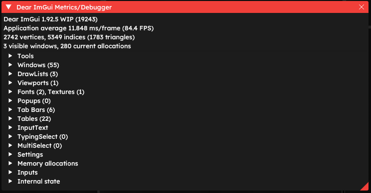
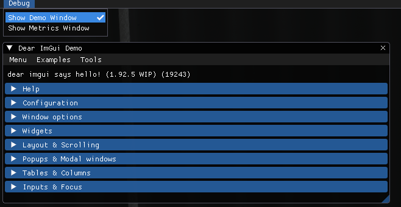

# Debug

The last, eighth tab, is the default ImGUI debugging window. General users shouldn't need this window, since it is meant for internal use with styling and debug with ImGui. However, people would be interested in this menu when developing DevUI themes. If they are interested in what ImGui is itself, the [ImGui repository](https://github.com/ocornut/imgui/) would be more useful.

It consists of two windows: **Demo Window** and **Metrics Window**

****

## Metrics Window

Metrics Window displays information about ImGUI, its usage and some other additional information.

## Demo Window

This window is a default ImGUI debugging menu.

****
