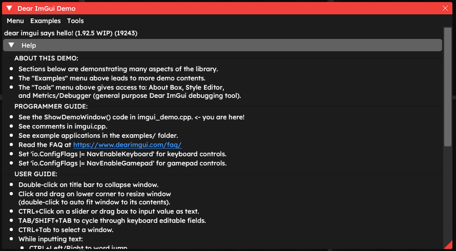
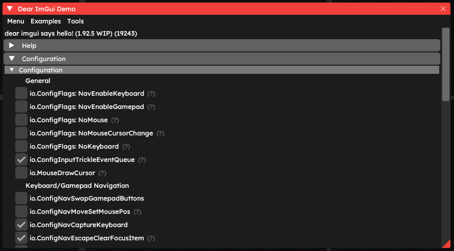
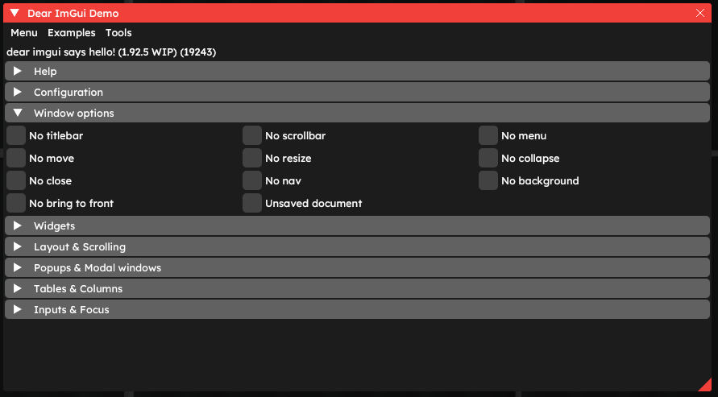

# \*deep breath\*

The last, eighth tab, is the default ImGUI debugging window. TBF I shouldn't be covering it, it's a default debugging menu after all. But hey, someone's gotta do it, otherwise there will be a whole undocumented tab and some random kid is gonna complain about that.

It consists of... quite a lot of things. I'd say, *too many* things to cover for an unpaid volunteer like me.

> There is also a metrics menu that wasn't there before. I made a screenshot but it's on you to document it.

So there are 8 dropdown menus: **Help**, **Configuration**, **Window options**, and other dropdowns that are related to ImGUI debugging.

****

# Help

This dropdown menu is a README about the debugging window. It explains what it contains, where each stuff is and how to work with it.

****

# Configuration

Flags that can be toggled, manually or when setting up ImGUI.

****

# Window options

Window options. They do not extend to other windows and are not saved when closing the menu. Most of them are purely visual.

****
