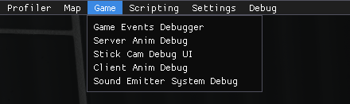
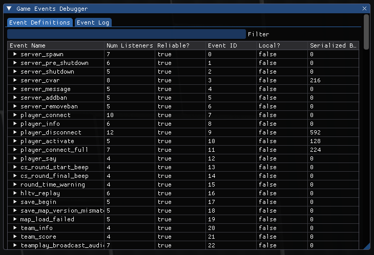
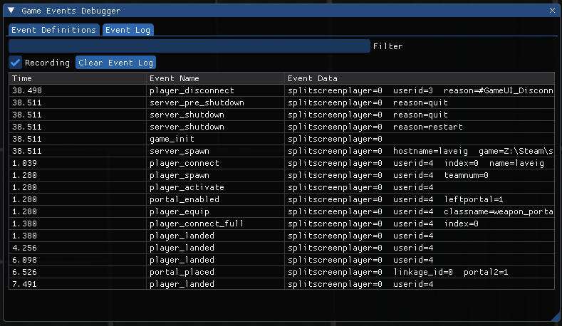
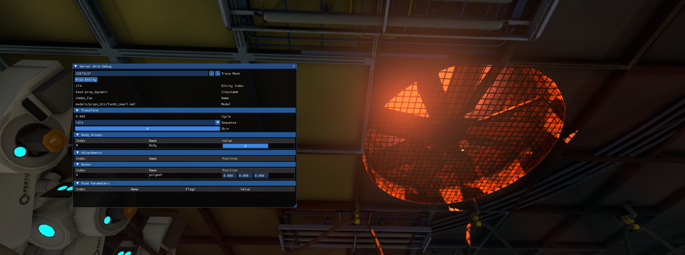
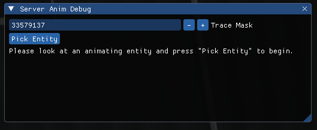
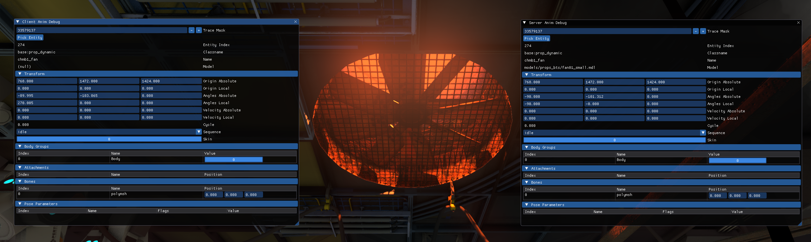
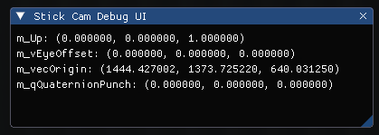
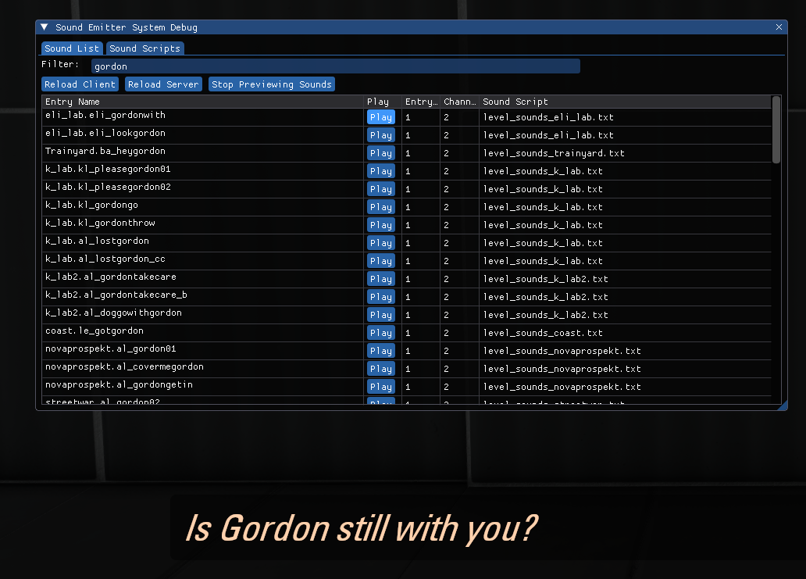
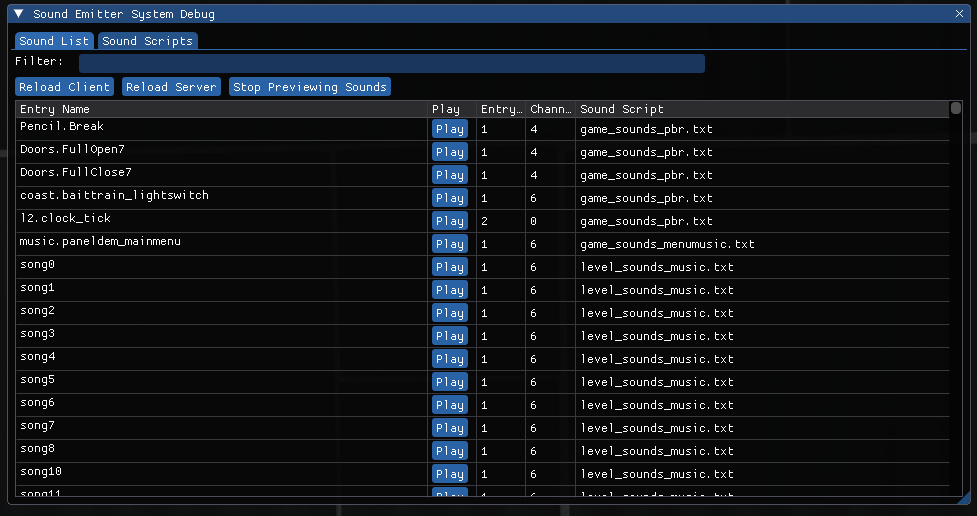
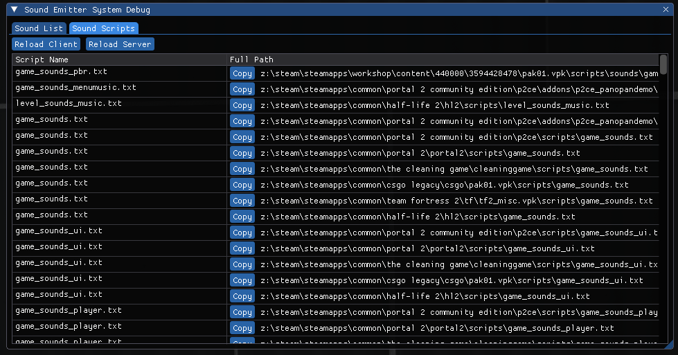

# Game

The Game tab is the fifth tab in the Developer UI menu. It contains windows that cover game events, animations, player camera and sounds.

It consists of 5 windows - **Game Events Debugger**, **Server Anim Debug**, **Stick Cam Debug UI**, **Client Anim Debug** and **Sound Emitter System Debug**.

****

## Game Events Debugger

Game Events Debugger shows the list of all the events that exist in the engine, as well as records and logs the events that happened in a specified period of time.

There are 2 submenus - **Event Definitions** and **Event Log**.

### Event Definitions

Shows the list of all the events that exist in the engine, as well as additional information about them and their groups.

The menu is a table of events, it has the following columns:
* `Event Name` is the name of an event / group of events.
* `Num Listeners` shows the amount of event listeners of this group.
* `Reliable?` shows if this event is reliable to use. Should always be true.
* `Event ID` shows the ID of the event. The events table shows events with low IDs higher up in the table.
* `Local?` shows is the event local or global.
* `Serialized Bits` shows serialized bits of the event.

### Event Log

Shows all the events that have been executed during the recording.

This menu has the following functionality:
* `Filter` is a text entry to filter entities by the text put in it.
* `Recording` is a checkbar that toggles the recording.
* `Clear Event Log` is a button that clears the log below.
* Event log table is a table that contains the events that happened in a period of time. Can be sorted by `Time`, `Event Name` or `Event Data`.

****

## Server Anim Debug

Server Anim Debug shows information about an entity that is currently playing its animation or is able to be animated. Note that this menu is server-sided.

The menu has the following functionality:
* `Trace Mask` is a filter for the trace function that looks for the dynamic prop. Must be defined as a mask, in numbers.
* `Pick Entity` is a button that builds the trace. If it fails to find a dynamic prop, nothing happens.
* `Entity Index` is the ID of the entity.
* `Classname` is the classname of the entity.
* `Name` is the targetname of the entity.
* `Model` is the model of the entity.
* `Cycle` is the amount of times any animations of this entity are played.
* `Sequence` is the animation that is currently playing on this entity. Can be changed at a runtime.
* `Skin` is this entity's texture skin.

After a dynamic prop is selected, 5 submenus appear:

### Transform
* `Origin Absolute` is the position of this entity relative to the center of the map.
* `Origin Local` is the position of this entity relative to the owner of this entity (if it has an owner).
* `Angles Absolute` are the angles of this entity relative to the center of the map.
* `Angles Local` are the angles of this entity relative to the owner of this entity (if any is specified).
* `Velocity Absolute` is this entity's velocity.
* `Velocity Local` is this entity's velocity relatively to the owner of this entity (if this entity has an owner).

### Attachments
Shows attachments of the model used by this entity, as a table.

The columns are divided by `Index` of the attachment, `Name` of the attachment, and `Position` of the attachment.

### Bones
Shows this entity's bones, as a table.

The columns are divided by `Index` of the bone, `Name` of the bone, and `Position` of the bone.

### Pose Parameters
Shows pose parameters, if the entity uses animations made in Faceposer or generally uses bones to animate.

The parameters are shown as a table, columns of which contain `Index`, `Name`, `Flags` and `Value` of the parameter.

****

## Client Anim Debug

Client Anim Debug is identical to the Server Anim Debug menu, except it hooks up on the client side.

****

## Stick Cam Debug UI

Stick Cam Debug UI is debugging window for the adhesion gel.

There are 4 values in this menu:
* `m_Up` is the up vector.
* `m_vEyeOffset` is a vector showing the eye offset from the view.
* `m_vecOrigin` is a vector showing the origin of player's eyes.
* `m_qQuaternionPunch` is a vector showing the quaternion punch of the view.

****

## Sound Emitter System Debug

Sound Emitter System Debug is a window that allows users to play any sound available in the engine. Sounds should be defined in soundscripts in order for them to be player, no raw sounds allowed.

### Sound List

The list of all the sounds available.

There are the following buttons:
* `Reload Client` reloads all the sounds on the client side.
* `Reload Server` reloads all the sounds on the server side.
* `Stop Previewing Sounds` stops any sounds that are played by this menu.
* The list of all the sound, with the button to play a specific sound, the amount of sounds that will be played by pressing the play button, the sound's channel and the soundscript this sound is from.

### Sound Scripts

The list of all the soundscript registered in the engine.

* `Reload Client` reloads the soundscripts client-side.
* `Reload Server` reloads the soundscripts client-side.

****
