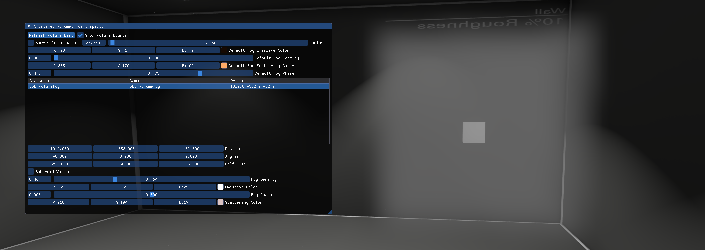

# Graphics

The graphics tab is the most popular among all the other tab in the Developer UI, mainly because of its functionality. It contains everything needed to debug lighting, post processing effects and graphics in general.

It consists of six menus - **Fog Config**, **[Clustered Light Inspector](/lighting/clustered/clustered_light_inspector)**, **Clustered Volumetrics Inspector**, **CSM Config**, **Post Processing** and **SoftBody Debug**.

****

## Fog Config

Fog Config allows to override the fog (if enabled) and set the custom fog values. Each value is presented as a slider, so changing, for example, fog radius is easy and visually convinient. Both general and skybox fogs can be overriden and changed. This menu is great for setting up fogs, as you can tweak it in realtime in-game easily.

**Fog Config has the following list of values:**

* `Fog Override` overrides the existing fog. Without this enabled, you will not be able to change the fog using the Fog Config.
* `Enable Fog` enables the overriden fog. Unchecking this will turn off the fog, even if there is an active `env_fog_controller` in the map.
* `Enable Skybox` enables the skybox fog.
* `Max Density` is the density of the fog, from 0.0 to 100.0 (not 0.0 to 1.0 like in Hammer Editor!)
* `Far Z` changes the distance after which nothing will be rendered (player will not see anything further). It is recommended not to touch this slider.

There are 3 values that are duplicated for the regular fog and the skybox fog:
* `Start` is a slider which sets the distance where the fog starts.
* `End` is a slider which sets the distance where the fog becomes completely opaque.
* `Color` is an RGB value which sets the color of the fog.

## Clustered Volumetrics Inspector

Clustered Volumetrics Inspector allows setting the volumetrical value for all clustered lights globally, allowing to preview the new volumetric lighting on the maps that were compiled before the update. It does that by applying a pseudo-`obb_fogvolume` that covers the whole map, values of which are controlled by this menu.

**Clustered Volumetrics Inspector has the following list of values:**

* `Show Volume Bounds` - if an `obb_fogvolume` entity is present, it will show its bounds as a white box.
* `Show Only in Radius` will only show `obb_fogvolume` entities in a specified radius. This only affects the `obb_fogvolume` list below.
* `Default Fog Emissive Color` sets the emissive fog color for the whole map. Appears on top of the regular fog created by `env_fog_controller`, works similarly.
* `Default Fog Density` sets the density of the fog for the whole map, similarly to the `env_fog_controller`'s fog density.
* `Default Fog Scattering Color` sets the color for the volumetric rays that are casted by CSM and Clustered lighting. Useful only in maps that were compiled before the update.
* `Default Fog Phase` changes the starting / ending point of the volumetric rays. Only values from -1 to 1 are accepted. Default is 0 - no changes. Value of 0.5 cuts the volumetric rays in half, value of -0.5 makes only the ending half of the rays appear.

If you specify an `obb_fogvolume` entity in the fogvolume list, the following properties will be able to be changed:
* `Position` of the fog entity, with the value being the center of the fog;
* `Angles` of the fog entity;
* `Half Size` of the fog, which is split into width, length and height;
* `Spheroid Volume`, which determines whether the fog should be drawn as a cube or as a sphere;
* `Fog Density`;
* `Emissive Color`, which is the color of the fog itself;
* `Scattering color`, which is the color of the volumetric rays that go through the fog's volume;
* `Fog Phase`, which is similar to the `Default Fog Phase` except it is applied individually to this `obb_fogvolume`.

## Cascade Shadow Mapping Config

CSM Config allows toggling and changing the rotation of the light casted by `env_cascade_light`, as well as capturing the current "sharpness" of all the shadows produced by this entity *(the way CSM works is that, the closer the shadows are to the player, the sharper they get)* and changing the shadow distance.

The menu has the following values:
* `CSM Enabled` toggles the CSM, if present;
* `Max Shadow Dist` changes the shadow distance, higher values are blurier;
* `Capture State` / `Clear State` captures and clears the state of each shadow produced;
* `Rotation Override` toggles the ability to change the `env_cascade_light` entity's angles by using the `X`, `Y` and `Z` bars below.

## Post Processing

This menu controls post-processing options, similarly to `env_tonemap_controller`, but without needing to spawn and give inputs to one. All the values are present as sliders, allowing a precuse and convenient change of all the post-processing options.

**There are 3 submenus present:**

### Depth of Field

Depth of Field menu allows setting the DoF effect - blurring the view after a certain distance, or before a certain distance. This cinematic effect recreates how the human eye focuses - focusing on objects that are far away makes the objects that are close to the eye blur, and counterwise.

The menu has the following values:
* Values.

### Motion Blur

Motion Blur menu allows controlling the motion blur effect, which blurs the view when it rotates. Only applied to the player view.

The menu has the following values:
* Values.

High values create unrealistic blur.

### Bloom

Bloom menu allows controlling the bloom effect, which brightens the edges of bright pixels, creating a cinematic effect.

The menu has the following values:
* Values.

## SoftBody Debug

I actually don't have anything related to SoftBody... thing. Not even a screenshot of the menu, I forgot to make one.

Might ask someone.

