# Graphics

The graphics tab is the most popular among all the other tab in the Developer UI, mainly because of its functionality. It contains everything needed to debug lighting, post processing effects and graphics in general.

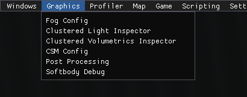

It consists of six windows - **Fog Config**, **[Clustered Light Inspector](/lighting/clustered/clustered_light_inspector)**, **Clustered Volumetrics Inspector**, **CSM Config**, **Post Processing** and **SoftBody Debug**.

****

## Fog Config

Fog Config allows to override the fog (if enabled) and set the custom fog values. Each value is presented as a slider, so changing, for example, fog radius is easy and visually convenient. Both general and skybox fogs can be overridden and changed. This menu is great for setting up fogs, as you can tweak it in realtime in-game easily.

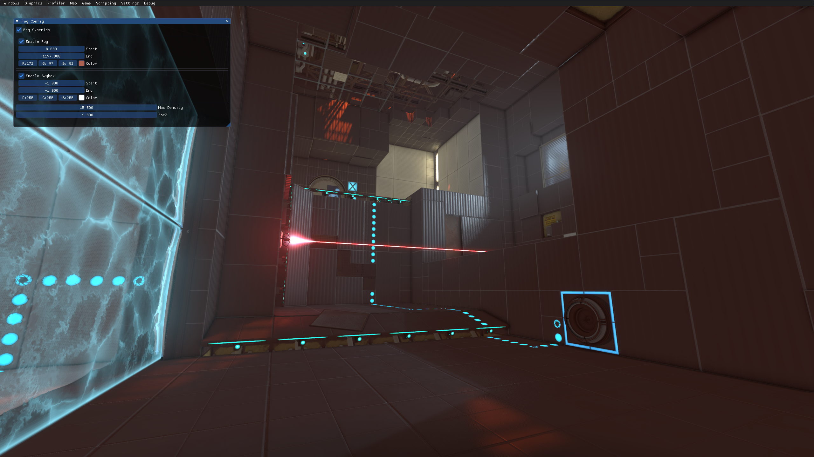

**Fog Config has the following list of values:**

* `Fog Override` overrides the existing fog. Without this enabled, you will not be able to change the fog using the Fog Config.
* `Enable Fog` enables the overridden fog. Unchecking this will turn off the fog, even if there is an active `env_fog_controller` in the map.
* `Enable Skybox` enables the skybox fog.
* `Max Density` is the density of the fog, from 0.0 to 100.0 (not 0.0 to 1.0 like in Hammer Editor!)
* `Far Z` changes the distance after which nothing will be rendered (player will not see anything further). It is recommended not to touch this slider.

There are 3 values that are duplicated for the regular fog and the skybox fog:
* `Start` is a slider which sets the distance where the fog starts.
* `End` is a slider which sets the distance where the fog becomes completely opaque.
* `Color` is an RGB value which sets the color of the fog.

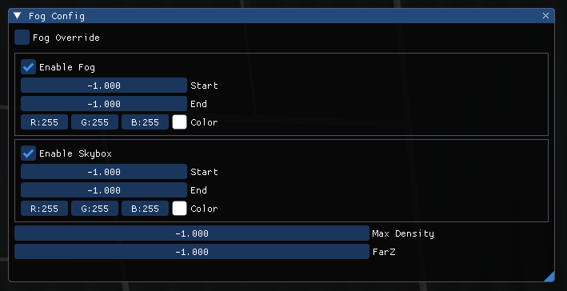

****

## Clustered Volumetrics Inspector

Clustered Volumetrics Inspector allows setting the volumetrical value for all clustered lights globally, allowing to preview the new volumetric lighting on the maps that were compiled before the update. It does that by applying a pseudo-`obb_fogvolume` that covers the whole map, values of which are controlled by this menu.

**Clustered Volumetrics Inspector has the following list of values:**

* `Show Volume Bounds` - if an `obb_fogvolume` entity is present, it will show its bounds as a white box.
* `Show Only in Radius` will only show `obb_fogvolume` entities in a specified radius. This only affects the `obb_fogvolume` list below.
* `Default Fog Emissive Color` sets the emissive fog color for the whole map. Appears on top of the regular fog created by `env_fog_controller`, works similarly.
* `Default Fog Density` sets the density of the fog for the whole map, similarly to the `env_fog_controller`'s fog density.
* `Default Fog Scattering Color` sets the color for the volumetric rays that are casted by CSM and Clustered lighting. Useful only in maps that were compiled before the update.
* `Default Fog Phase` changes the starting / ending point of the volumetric rays. Only values from -1 to 1 are accepted. Default is 0 - no changes. Value of 0.5 cuts the volumetric rays in half, value of -0.5 makes only the ending half of the rays appear.

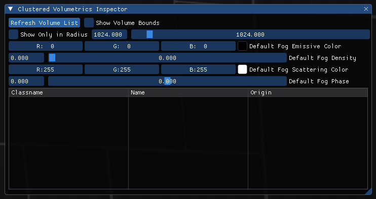

If an `obb_fogvolume` entity is specified in the fogvolume list, the following properties will appear:
* `Position` of the fog entity, with the value being the center of the fog;
* `Angles` of the fog entity;
* `Half Size` of the fog, which is split into width, length and height;
* `Spheroid Volume`, which determines whether the fog should be drawn as a cube or as a sphere;
* `Fog Density`;
* `Emissive Color`, which is the color of the fog itself;
* `Scattering color`, which is the color of the volumetric rays that go through the fog's volume;
* `Fog Phase`, which is similar to the `Default Fog Phase` except it is applied individually to this `obb_fogvolume`.

****

## Cascade Shadow Mapping Config

CSM Config allows toggling and changing the rotation of the light casted by `env_cascade_light`, as well as capturing the current "sharpness" of all the shadows produced by this entity and changing the shadow distance. *(the way CSM works is that, the closer the shadows are to the player, the sharper they get)*

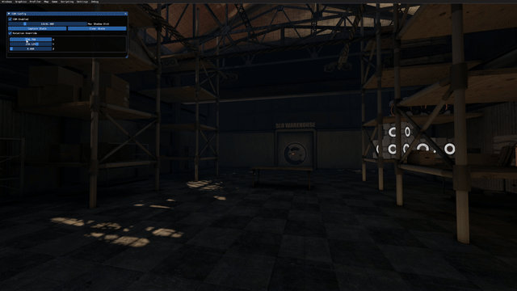

The menu has the following values:
* `CSM Enabled` toggles the CSM, if present;
* `Max Shadow Dist` changes the shadow distance, higher values are blurrier;
* `Capture State` / `Clear State` captures and clears the state of each shadow produced;
* `Rotation Override` toggles the ability to change the `env_cascade_light` entity's angles by using the `X`, `Y` and `Z` bars below.

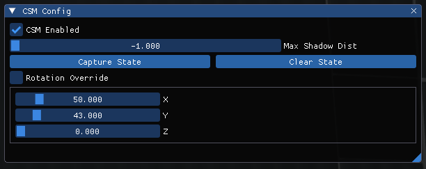

****

## Post Processing

This menu controls post-processing options, similarly to `env_tonemap_controller`, but without needing to spawn and give inputs to one. All the values are present as sliders, allowing a precise and convenient change of all the post-processing options.

**There are 3 submenus present:**

### Depth of Field

Depth of Field menu allows setting the DoF effect - blurring the view after a certain distance, or before a certain distance. This cinematic effect recreates how the human eye focuses - focusing on objects that are far away makes the objects that are close to the eye blur, and counterwise.

The menu has the following values:
* `DoF Override` overrides the current DoF values, if those were set
* `Slider Range` changes the maximum range for the sliders below;
* `Near Blur Depth` changes the minimum distance of the near blur effect *(blur will be applied to objects if they are this close to the player)*
* `Near Focus Depth` changes the maximum distance of the near blur effect
* `Far Focus Depth` changes the maximum distance of the far blur effect *(blur will be applied to objects if they are this far from the player)*
* `Far Blur Depth` changes the minimum distance of the far blur effect
* `Near Blur Radius` changes the intensity of the near blur effect
* `Far Blur Radius` changes the intensity of the far blur effect
* `DoF Quality` changes the method used for DoF effect. 0 means no DoF, 1 is default, 2 is pretty much identical.
* `Copy Settings` copies all the DoF settings to the clipboard as console commands.

> [!NOTE]
> Example of the output of the `Copy Settings` button:
> 
> `mat_dof_override 0;mat_dof_near_blur_depth 168.099;mat_dof_near_focus_depth 277.157;mat_dof_far_focus_depth 271.157;mat_dof_far_blur_depth 1000.0;mat_dof_near_blur_radius 10.0;mat_dof_far_blur_radius 5.0;mat_dof_quality 1;`

* `Copy All Settings` copies all the settings related to Motion Blur effect.

> [!NOTE]
> Example of the output of the `Copy All Settings` button:
> 
> `mat_motion_blur_enabled 1;mat_motion_blur_forward_enabled 1;mat_motion_blur_falling_min 8;mat_motion_blur_falling_max 20.0;mat_motion_blur_falling_intensity 1.0;mat_motion_blur_roll_intensity 1.0;mat_motion_blur_rotation_intensity 1.0;mat_motion_blur_strength 1.0;`

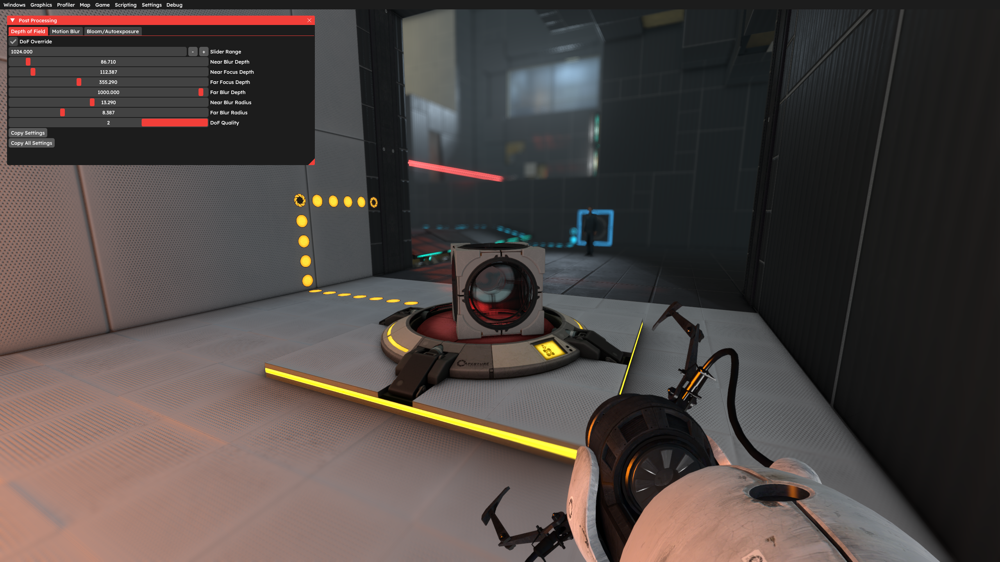
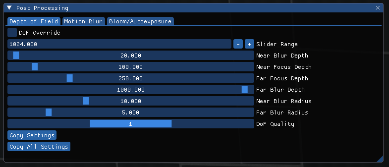

### Motion Blur

Motion Blur menu allows controlling the motion blur effect. There are two types of Motion Blurs. The first one is applied upon camera movement, smoothing the image. The second one is applied upon player movement, blurring the edges of the screen when the player moves fast.

The menu has the following values:
* `Blur Enabled` enables and overrides the Motion Blur effect that is applied on camera movement.
* `Blur Forward Enabled` enables and overrides the Motion Blur effect that on player movement.
* `Blur Falling Min` sets the minimum value at which the player movement Motion Blur will start to appear.
* `Blur Falling Min` sets the maximum value at which the player movement Motion Blur will be fully visible.
* `Blur Falling Intensity` sets the intensity of the effect. High values make the edges appear extremely blurry.
* `Blur Roll Intensity` sets the intensity of the roll effect for the Motion Effect used for camera movement.
* `Blur Rotation Intensity` changes the intensity of the effect.
* `Blur Strenght` sets the strength (length) of the blur.
* `Copy Settings` copies all the Motion Blur settings to the clipboard as console commands.

> [!NOTE]
> Example of the output of the `Copy Settings` button:
> 
> `mat_motion_blur_enabled 1;mat_motion_blur_forward_enabled 1;mat_motion_blur_falling_min 0;mat_motion_blur_falling_max 0.529;mat_motion_blur_falling_intensity 0;mat_motion_blur_roll_intensity 1.058;mat_motion_blur_rotation_intensity 1.587;mat_motion_blur_strength 1.851;`

* `Copy All Settings` is identical to the `Copy Settings` button.

High values create unrealistic blur.

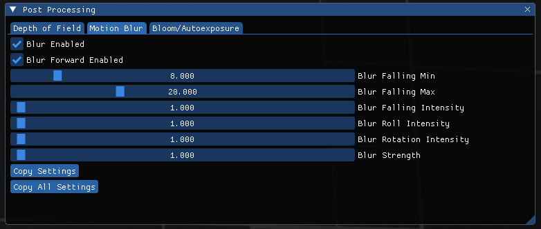

### Bloom

Bloom menu allows to control the bloom effect, which brightens the edges of bright pixels, creating a cinematic shine effect. Additionally, this menu allows to control the Autoexposure effect, which brightens / darkens the overall image based on where the player is looking (also know as the HDR effect).

The menu has the following values:
* `Force Bloom` overrides the bloom effect.
* `Disable Bloom` disables the bloom completely.
* `Bloom Scale` scales the bloom effect.
* `Bloom Scalefactor Scalar` scales the scale of the bloom effect.
* `Bloom Rate` sets the time it takes for the bloom changes to occur. Values are accepted from 0 to 1, where 1 is exactly a second.
* `Autoexposure Max` sets the maximum brightness for the autoexposure effect.
* `Autoexposure Max Multiplier` scales the maximum brightness value for the autoexposure effect.
* `Autoexposure Min` sets the minimum brightness for the autoexposure effect.
* `Uncap Autoexposure` uncaps autoexposure, making everything appear bright.
* `Accelerate Exposure Down` sets the acceleration percentage for the autoexposure to darken. Higher values make the autoexposure effect disappear faster.
* `Copy Settings` copies all the Bloom & Autoexposure settings to the clipboard as console commands.

> [!NOTE]
> Example of the output of the `Copy Settings` button:
> 
> `mat_bloomscale 0.827;mat_bloomamount_rate 1;mat_dynamic_tonemapping 1;mat_autoexposure_max 0.837;mat_autoexposure_max_multiplier 0.899;mat_autoexposure_min 0.196;mat_show_histogram 0;mat_hdr_uncapexposure 0;mat_force_bloom 0;mat_accelerate_adjust_exposure_down 6.719;mat_non_hdr_bloom_scalefactor .3;mat_bloom_scalefactor_scalar 0.826;`

* `Copy All Settings` copies all the settings related to Motion Blur effect.

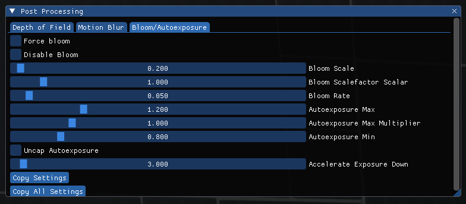

****

## SoftBody Debug

SoftBody Debug helps with debugging models that use the new cloth system.

SoftBody is a system that allows models to have cloth-like parts. It simulates cloth physics and softbody physics on the model. To make a model compile as a cloth / softbody object, add `$cloth` to the model's .qc file before compiling it.

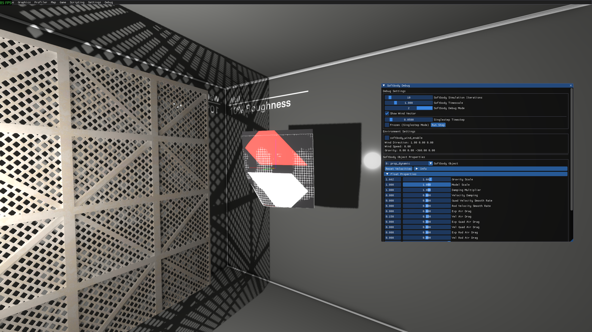

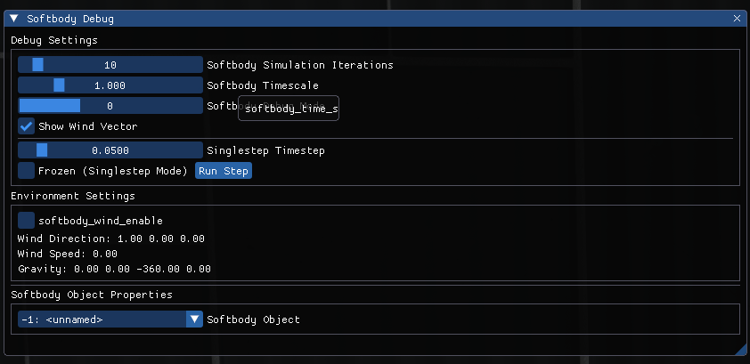

****
