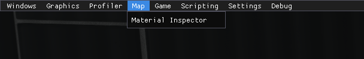
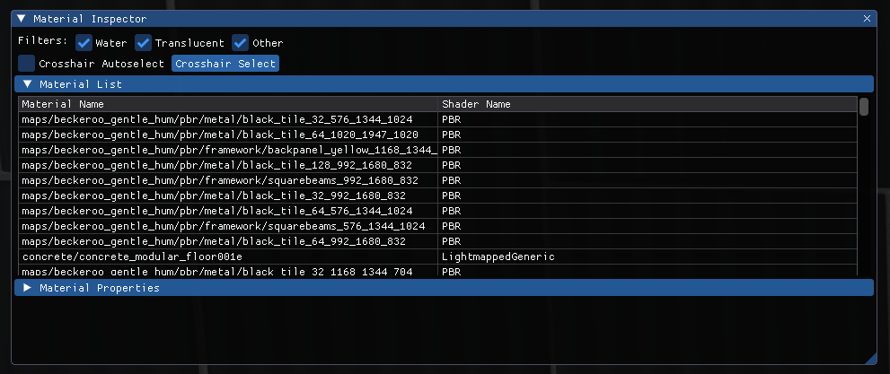
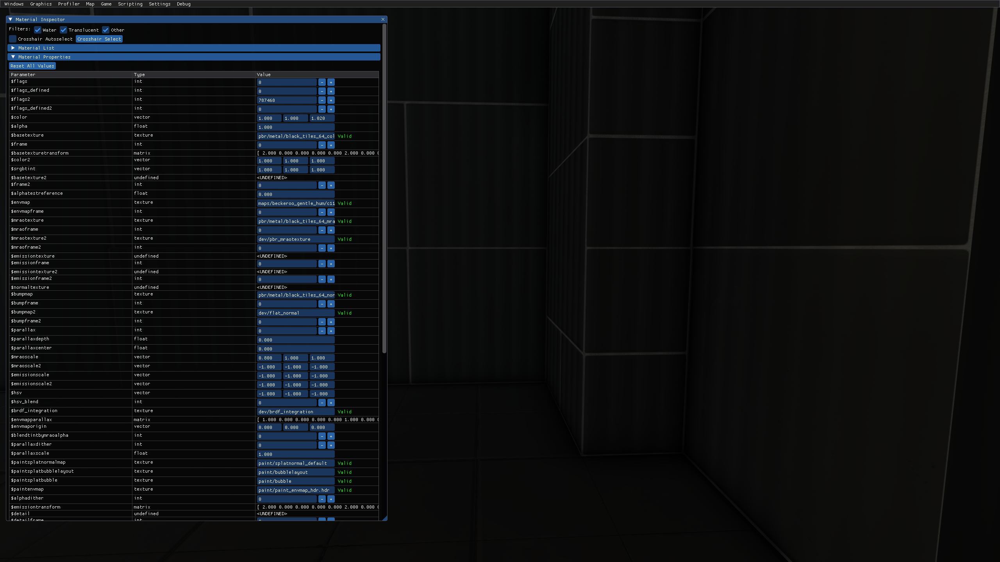

# Map

The fourth tab contains windows related to map's properties.

This tab consists of only one menu - **Material Inspector.**

****

## Material Inspector

### Material List

This menu allows users to see the list of all the materials used in the map.

### Material Properties

This menu allows users to change the properties of the material the user is looking at. All the properties will appear as the material is selected. Properties will be applied automatically as soon as any change is detected. Additionally, the Material Inspector will check if the textures used in the material are valid.

****
