> There are 2 screenshots - one showing texture budget with the whole map visible, and the second showing the corner. TOTAL GRAPH MUST BE SHOWN BIGGER. The difference is huge.

> In the budgets, show that the values are map-specific. Also don't forget to describe each of them.

# Profiler

The Profiler tab is the third tab in the Developer UI menu. Its main purpose is dynamically debugging different aspects of the map and the engine, showing the exact budget and usage. Additionally, a `.txt` report can be generated, containing every event that happened in a specified period of time. The menus of this tab are useful for optimising maps, materials and game events.

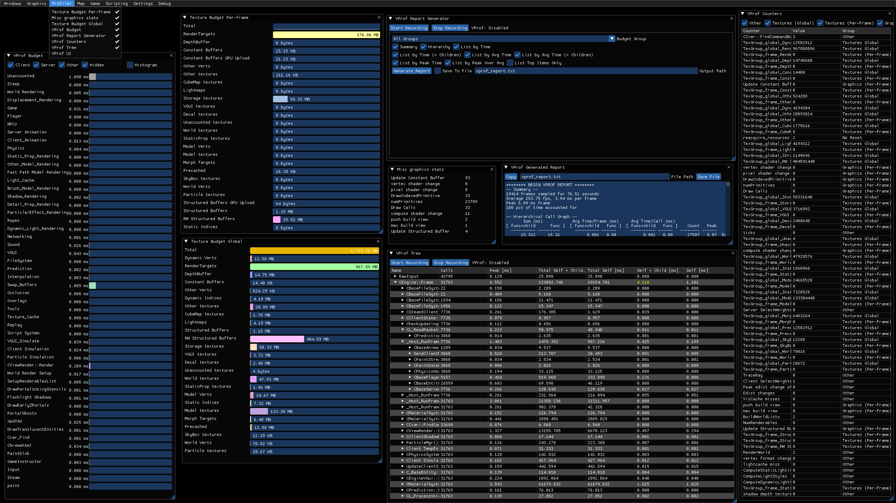

It consists of 8 windows - **Texture Budget Per-Frame**, **Texture Budget Global**, **Misc Graphics Stats**, **VProf Budget**, **VProf Report Generator**, **VProf Counters**, **VProf Tree** and **VProf UI**.

****

## Texture Budget Per-Frame

Texture Bugdet Per-Frame shows how much of the GPU memory is used by the textures right now in-game. There are many different graphs, each of which showing precise information about the buffer usage of various renderables. This menu is useful for searching for frame drops and various optimisations.

The graphs automatically update each frame, so it is easy to check for differences in various parts of the map, for frame holes as example.

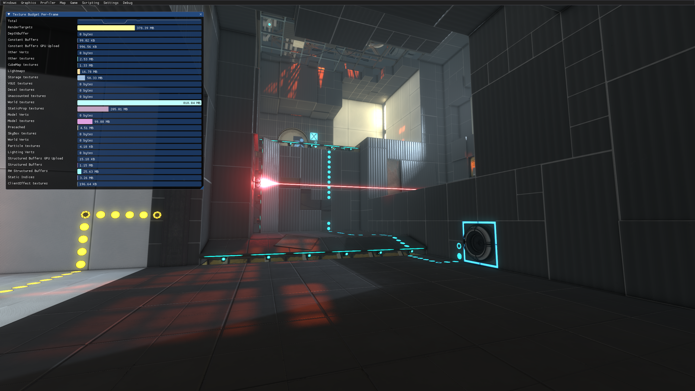

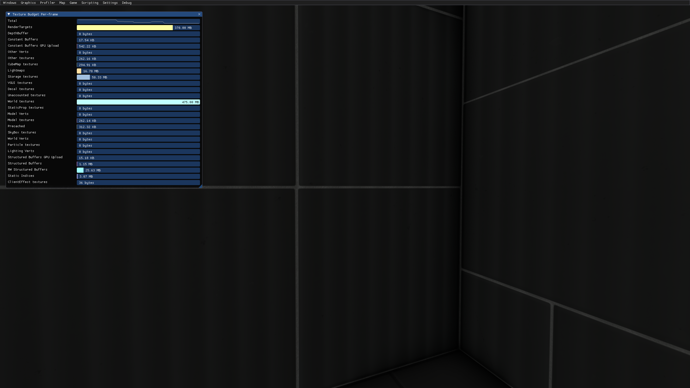

There is a total of 27 graphs:
* `Total` shows the total amount of GPU usage as a histograph
* `RenderTargets` shows ...
* `DepthBuffer` shows ...
* `Constant Buffers` shows ...
* `Constant Buffers GPU Upload` shows ...
* `Other Verts` shows ...
* `Other Textures` shows ...
* `CubeMap Textures` shows the memory usage taken by cubemap textures.
* `Constant Buffer` shows the memory usage taken by lightmaps.
* `Constant Buffer` shows the memory amount taken by buffered textures.
* `VGUI textures` shows the memory usage taken by VGUI elements.
* `Decal textures` shows the memory usage taken by decals and overlays.
* `Unaccounted textures` shows memory usage taken by ... 
* `World textures` shows the memory usage taken by textures used on world geometry.
* `StatisProp textures` shows the memory usage taken by textures used on static models.
* `Model Verts` shows memory usage taken by ... 
* `Model textures` shows the memory usage taken by textures used on dynamic and physics models.
* `Precached` shows the memory amount taken by precached textures.
* `SkyBox textures` shows the memory usage taken by skybox textures (applies to 3D skybox as well)
* `World Verts` shows ... 
* `Particle textures` shows the memory usage taken by particles.
* `Lighting Verts` shows ... 
* `Structured Buffers GPU Upload` shows how much space individual buffers take before being sent to the GPU.
* `Structured Buffers` shows how much space buffers take overall.
* `RV Structured Buffers` shows ... 
* `Static Indices` shows ... 
* `ClientEffect textures` shows the memory usage taken by screen effects (lens circle, hints, etc)

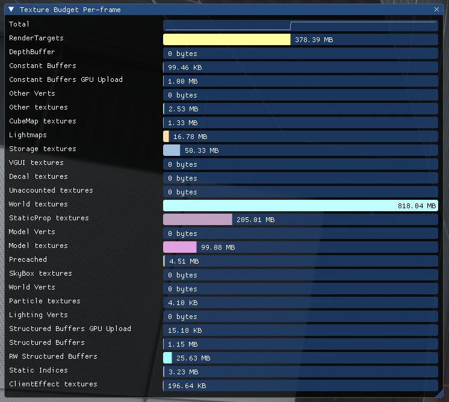

****

## Texture Budget Global

Texture Bugdet Global shows how much of the GPU memory is precached overall when loading a map. There are many different graphs, and each shows precise information about the memory usage of various renderables. This menu is useful when optimising texture usage, and when writing minimal requirements.

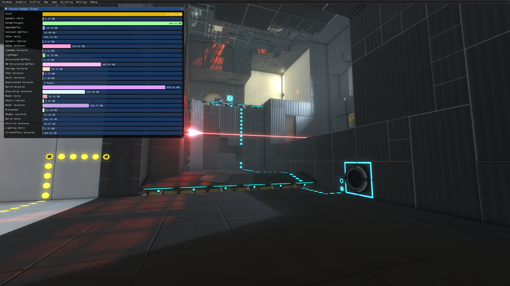

There is a total of 27 graphs. Their names, functionality and positions in the menu are identical to the `Texture Budget Per-Frame` menu.

<!--    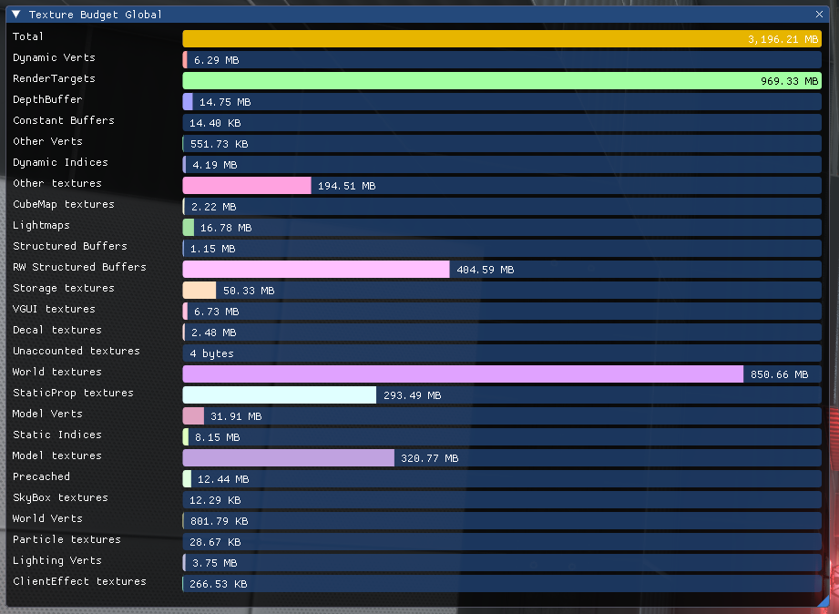     -->
<!--    ^^^ Takes to much space for a cheap copy of another window ^^^      -->

****

## Misc Graphics Tab

Misc Graphics Tab is a small menu that shows the amount of calls sent to the GPU every frame. Values in the menu update each frame.

There are 10 values in the menu:
* `Update Constant Buffer` shows ...
* `vertex shader change` shows the amount of calls telling to update model textures.
* `pixel shader change` shows the amount of calls telling to update brush textures.
* `DrawIndexedPrimitive` shows ... 
* `numPrimitives` shows the total amount of ... 
* `DrawCalls` shows the amount of calls telling GPU to draw something.
* `compute shader change` shows ...
* `push build view` shows ...
* `max build view` shows ...
* `Update Structured Buffer` shows the amount of updates of the structured buffer. Always 4.

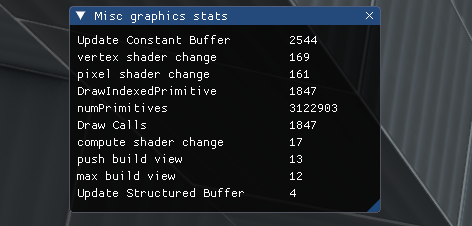

****

## VProf Budget

VProf Budget shows how much time the GPU takes to render different parts of the game, in milliseconds. The engine freezes each time it needs to redraw something, so this menu basically tells what exactly causes the game to lag. If something takes longer than 5 milliseconds, consider optimising that!

> [!CAUTION]
> When having `Historgam` enabled, do not oversize the window! Developer UI can only have a certain amount of graphs drawn at the same time, drawing too many of them overflows the buffer and crashes the game!

There is a total of- HOW MANY??? HOLY SHIT
* `Unaccounted` shows the amount of time it takes to draw unaccounted textures.
* `Sleep` shows ... 
* `World Rendering` shows the amount of time it takes to draw world geometry.
* `Displacement Rendering` shows the amount of time it takes to draw displacements.
* `Game` shows the amount of time it takes to draw ... 
* `Player` shows the amount of time it takes to draw the playermodel and/or the visibility rays.
* `NPCs` shows the amount of time it takes to draw NPCs.
* `Server Animation` shows the amount of time it takes to draw server-side model animations.
* `Client Animation` shows the amount of time it takes to draw client-side model animations.
* `Physics` shows the amount of time it takes to draw vphysics interactions.
* `Static Prop Rendering` shows the amount of time it takes to draw static props.
* `Other Model Rendering` shows the amount of time it takes to draw non-static props.
* `Fast Path Model Rendering` shows the amount of time it takes to draw ...
* `Light Cache` shows the amount of time it takes to cache lights.
* `Brush Model Rendering` shows the amount of time it takes to render brush entities.
* `Shadow Rendering` shows the amount of time it takes to render shadows *(WHICH ONES??? 0.004 MS)*
* `Detail Prop Rendering` shows the amount of time it takes to draw detail props.
* `Particle/Effect Rendering` shows the amount of time it takes to draw particles and other particle-like effects (sparks, bullet shots, etc).
* `Ropes` shows the amount of time it takes to draw ropes.
* `Dynamic Light Rendering` is obsolete, supposed to draw render-to-texture shadows, but those were removed.
* `Networking` shows the amount of time it takes to ... 
* `Sound` shows the amount of time it takes to ...
* `VGUI` shows the amount of time it takes to draw VGUI elements.
* `FileSystem` shows the amount of time it takes to draw the filesystem, if any is on-screen.
* `Prediction` shows the amount of time it takes to draw physics prediction, if the debug tool is enabled.
* `Interpolation` shows the amount of time it takes to ...
* `Swap Bullets` shows the amount of time it takes to ...
* `Occlusion` shows the amount of time it takes to ... *(NOT XeGTAO!!)*
* `Overlays` shows the amount of time it takes to draw decals and overlays.
* `Tools` shows the amount of time it takes to draw the engine tools (-tools launch option)
* `Texture Cache` shows the amount of time it takes to cache textures (always shows 0 ms)
* `Replay` shows the amount of time it takes to draw the replay of CS:GO demos. What a leftover!
* `Script System` shows the amount of time it takes to calculate the AS rendering script system.
* `VGUI Simulate` shows the amount of time it takes to simulate VGUI elements on-screen (for hints).
* `Client Simulation` shows the amount of time it takes to calculate the client-side rendering calculations.
* `Particle Simulation` shows the amount of time it takes to calculate the particles.
* `CViewRender::Render` shows the amount of time it takes to ... 
* `World Render Setup` shows the amount of time it takes to ...
* `SetupRenderablesList` shows the amount of time it takes to ...
* `DrawPortalsUsingStencils` shows the amount of time it takes to ... 
* `Flashlight Shadows` shows the amount of time it takes to render player's flashlight (impulse 103)
* `Fast Path Brush Rendering` shows the amount of time it takes to ... *(ABSURDLY HEAVY!!! >15 MS)*
* `DrawEarlyZPortals` shows the amount of time it takes to calculate the relative view posisiton between the player and the portal.
* `PortalGhosts` shows the amount of time it takes to draw the portal ghosts.
* `DrawSimplePortalMesh` shows the amount of time it takes to draw the simple mesh in the portal view.
* `XeGTAO` shows the amount of time it takes to draw the new XeGT Ambient Occlusion.
* `DrawTranslucentEntities` shows the amount of time it takes to draw translucent entities.
* `Cvar Find` shows the amount of time it takes to ... 
* `ChromeHTML` shows the amount of time it takes to draw the HTML web-page, if any is visible.
* `Paintblob` shows the amount of time it takes to draw a paint blob.
* `GameInstructor` shows the amount of time it takes to draw ... *(i genuenly forgor, are those hints or smth else)*
* `Input` shows the amount of time it takes to ...
* `Steam` shows the amount of time it takes to render the Steam overlay.
* `paint` shows the amount of time it takes to draw paint.
* `CBaseEntity::EmitSound` shows the amount of time it takes to calculate the visual ambiance of the sound.

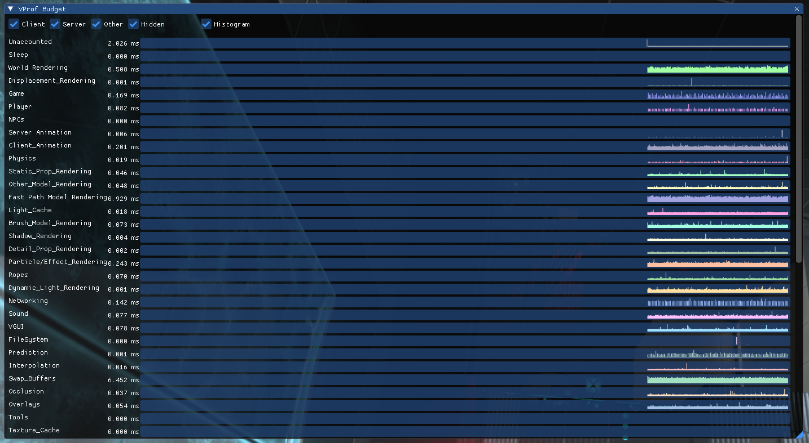

****

## VProf Report Generator

VProf Report Generator allows players to record all the events from above and save them as a text file. It has filters to list the result by specific criterias.

The menu has the following functionality:
* `Start Recording` starts the recording. All the events are stored in RAM until the recording stops.
* `Stop Recording` stops the recording.
* `Generate Report` writes all the values from RAM to the text file and opens the VProf Generated Report window.
* `Save To File` saves the text file.
* `Output Path` is the output path of the text file.

The menu has the following filters:

* `Budget Group` is a dropdown filter, allows to select a specific budget filter from the VProf Budget list.
* `Summary` ... 
* `Hierarchy` ... 
* `List by Time` lists the events by their date
* `List By Time (< Children)` ... 
* `List by Avg Time` lists the events by the average time they took.
* `List by Avg Time (< Children)` ... 
* `List by Peak Time` lists the events from the longest to the shortest.
* `List by Avg Time (< Children)` ... 
* `List by Peak Over Avg` ... 
* `List Top Items Only` lists only the top items, ignoring minor events

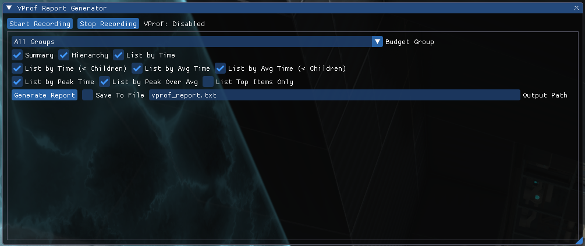

### VProf Generated Report

Generate Report button opens an after-report window called **VProf Generated Report** that contains the reported file. The menu contains the generated report, a text entry to change the name of the text file, the `Copy` and the `Save File` buttons.

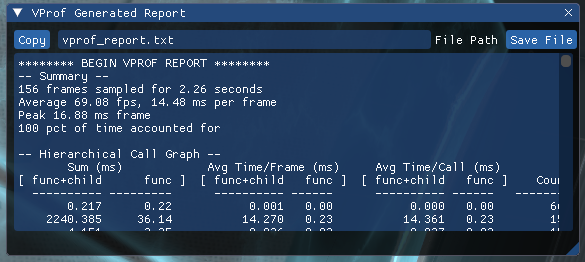

****

## VProf Counters

VProf Counters window contains values that represent various details about rendering and GPU usage. Average Developer UI user shouldn't need this information, it is more for internal usage of the engine and how it handles various stuff.

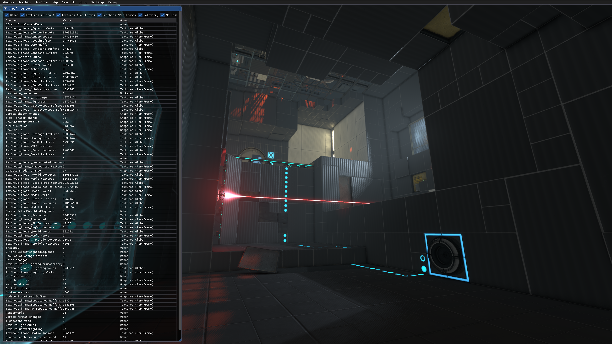

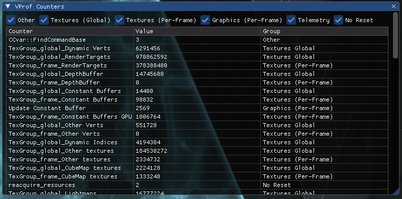

****

## VProf Tree

VProf Tree allows developers to record specific engine events for a specified period of time, allowing them to see... what? what will they find there? more numbers? for what?

> [!BUG]
> Pressing `Stop Recording` button without pressing `Start Recording` beforehand starts recording with no way to stop it. Eventually the numbers overfill the RAM!

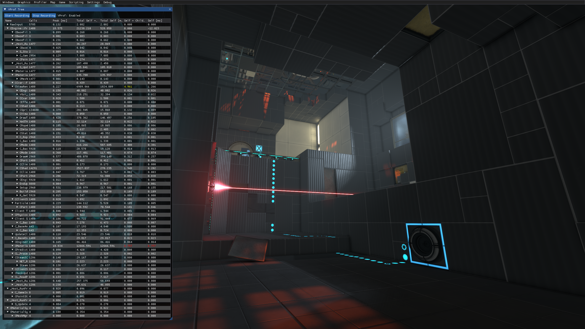

This window contains the list of all the events, and the following buttons:
* `Start Recording` begins recording engine events.
* `Stop Recording` stops recording engine events.

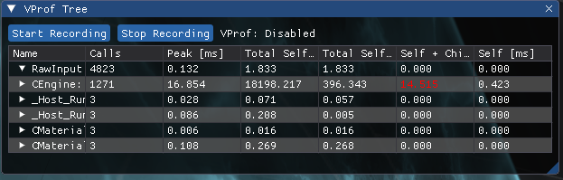

****

## VProf UI

VProf UI is an ultimate window containing VProf Tree, VProf Counters, VProf Budget and VProf Generated Report in a single window, allowing developers to quickly switch between them using the top menu.

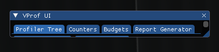

****
