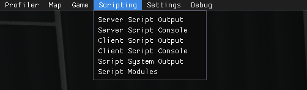
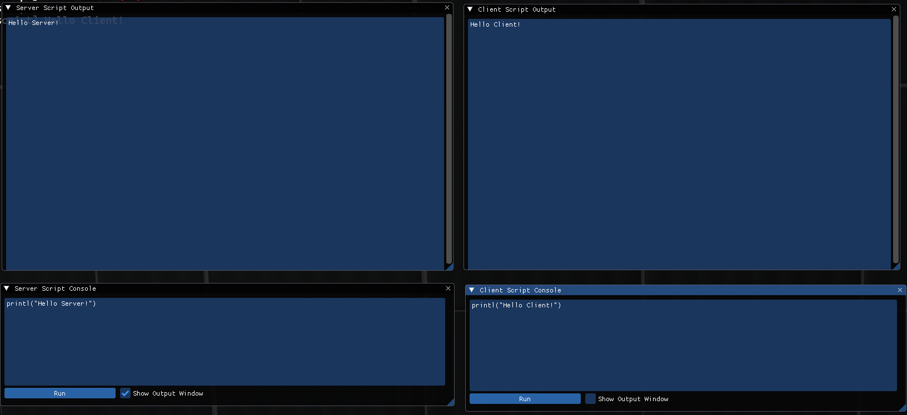
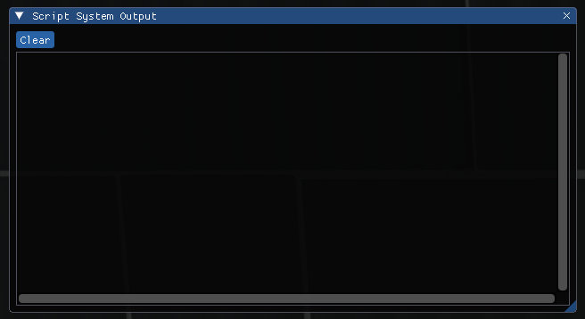
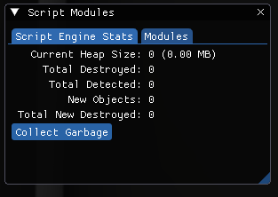
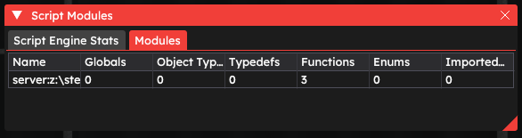

# Scripting

The Scripting tab is the sixth tab in the Developer UI menu. It contains windows related to the Angelscript programming language, having abilities such as additional consoles, module viewer and much more. Users that are not familiar with this language should not need this window.

It consists of 6 windows - **Server Script Output**, **Server Script Console**, **Client Script Output**, **Client Script Console**, **Script System Output** and **Script Modules**

****

## Server / Client Script Console

The consoles and output windows for VScript.

****

## Script System Output

Script System Output is an output window for Angelscript.

Can be cleared using the `Clear` button.

****

## Script Modules

Script Modules window shows information about all Angelscript files, functions and classes registered in the engine.

### Script Engine Stats

Script Engine Stats window shows information about registered classes, globals, and other Angelscript objects.

* `Current Heap Size` is the size of all the new objects, in megabytes.

### Modules

Shows the amount of files, or "modules", registered in the engine. The values are shown as a table.

* `Name` is the absolute path and the name of the file.
* `Globals` is the amount of global objects registered in the file.
* `Object Types` is the amount of global object types registered in the file.
* `Typedefs` is the amount of object type definitions registered in the file.
* `Functions` is the amount of functions registered in the file.
* `Enums` is the amount of variables registered in the file.
* `Imported Funcs` is the amount of imported (from other modules) functions registered in the file.

****
