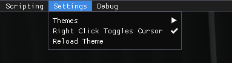
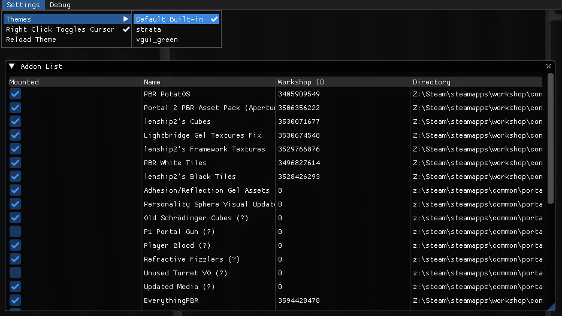
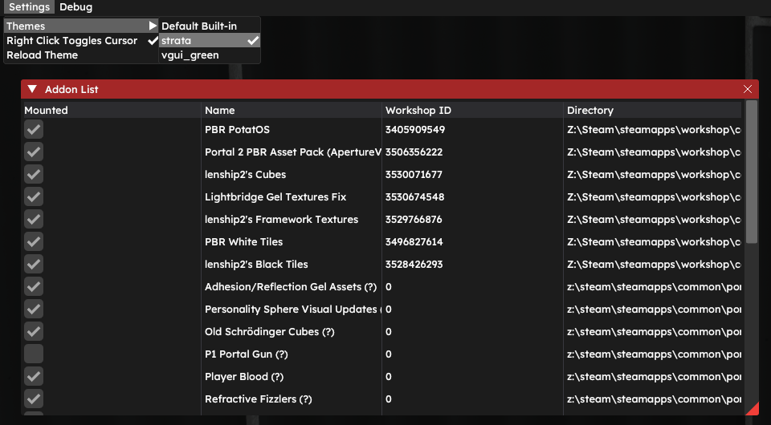
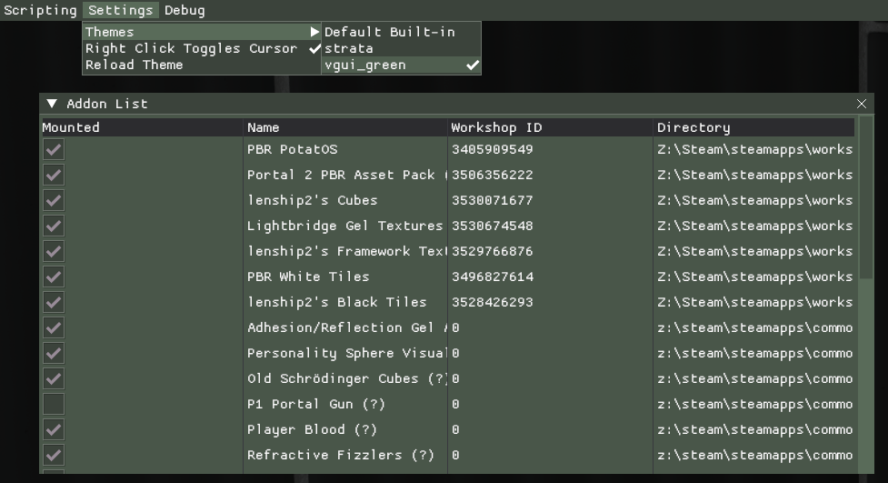

# Settings

The Settings tab is the seventh tab in the Developer UI menu. It has settings related to the Developer UI itself, such as custom themes and utilities.

It consists of one window and two buttons - **Themes**, **Right Click Toggles Cursor** and **Reload Theme**.

****

# Themes

There are three pre-made themes avaliable.

Additionally, you can make your own themes. See [the custom theme format for ImGui](/misc/devui/devui-themes)

****

# Buttons

### Right Click Toggles Cursor

Toggles the cursor when right-clicking with the Developer UI menu enabled. Made for ...

### Reload Theme

Reloads the theme if any changes were made.

****
