# Windows

The Windows tab is the first tab in the Developer UI menu. It contains various options that control different parts of the engine, from material properties to NPC behaviors. Being very useful for debugging entities and rendering, it has proven to be a great replacement for the basic console commands, making debugging faster and easier.

It consists of two windows - **Addon List** and **Debug Menu**.

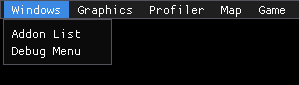

****

## Addon List

The Addon List window shows all the addons that are installed, with their name, workshop ID and absolute local path. It also shows which addons are currently mounted and which are not.

Additionally, you can mount and unmount addons by checking / unchecking addons, and then applying changes using the button at the bottom of the menu.

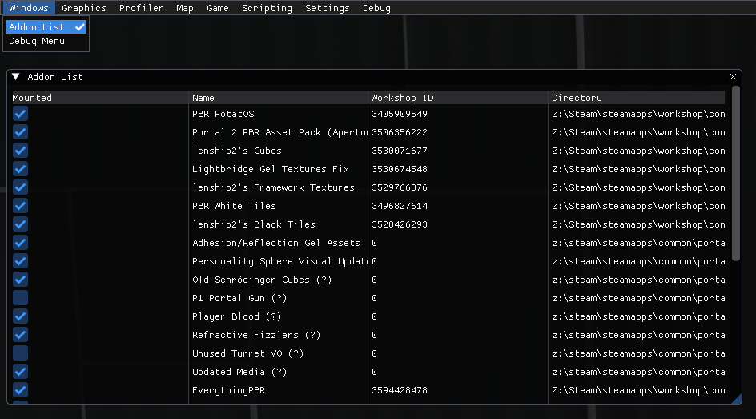

****

## Debug Menu

The Debug Menu is made to improve the debugging by reducing the amount of console usage. The menu intends to replaces commands with buttons and checkmarks that are easier and more convenient to use than console ConVars.

The debug menu consists of 5 tabs: Performance, MatSys, Renderer, Entities and AI.

### Performance

The first tab has basic buttons - show host speed, FPS counter and player's position with angles.

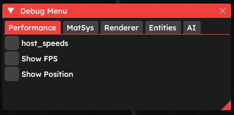

### MatSys

The second menu has options related to rendering and debugging objects, brushes, prop models, lightfaces, visleafs and more.

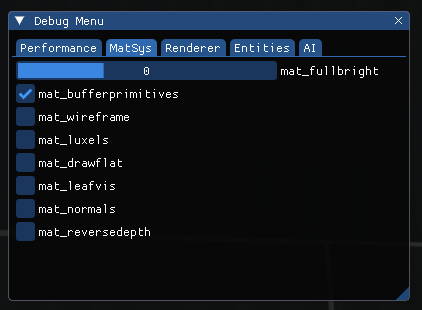

In P2CE, you can set `mat_fullbright` to 2. This draws all texture white, allowing to see exactly what lights add to the scene.

* `mat_bufferprimitives` enables world geometry buffering. Does not draw anything on-screen, barely affects anything.
* `mat_wireframe` draws light-blue lines on edges of each model visible and pink lines on edges of each brush with additional diagonal lines indicating faces. Use this caution, as it may cause lag when used in huge areas with lots of entities / brushes visible.
* `mat_luxels` shows lightmaps of each lightmapped face. Each square is a light pixel. Only relevant to bakes lighting, where bigger lightmaps creates sharper shadows. Non-lightmapped faces (i.e. fizzlers) are drawn completely blue.
* `mat_drawflat` disables normals on textures that have them, making them appear "flat". Not relevant for PBR shader.
* `mat_leafvis` draws the visleaf the player is currently in.
* `mat_normals` highlights normals of each face of models with tiny blue lines, and adds XYZ lines to each corner of brushes.
* `mat_reversedepth` undraws everything, including world geometry, so basically it holds the frame the option was checked. If SSAO is enabled, a lens circle appears after some time. The image blurs when moving the camera.

Screenshots, showing each of the settings, are added below.

1. Map with `mat_fullbright` set to 2.
2. Map with `mat_wireframe` checked.
2. Map with `mat_luxels` checked.
4. Map with `mat_leafvis` checked.
5. Map with `mat_normals` checked.
6. Map with `mat_reversedepth` checked.

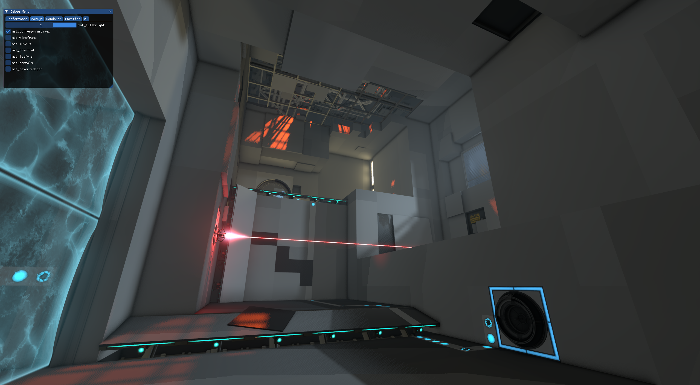

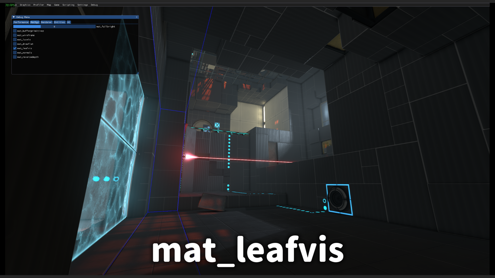
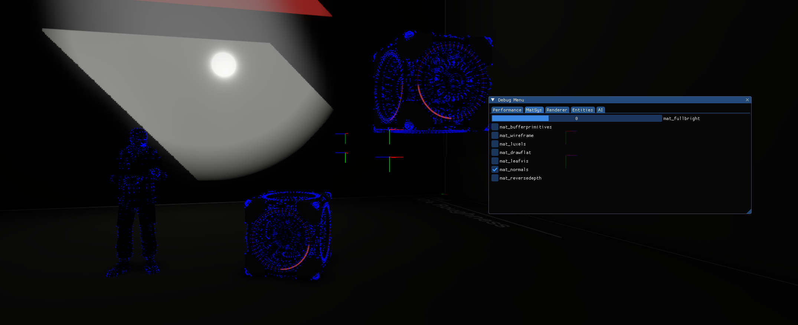
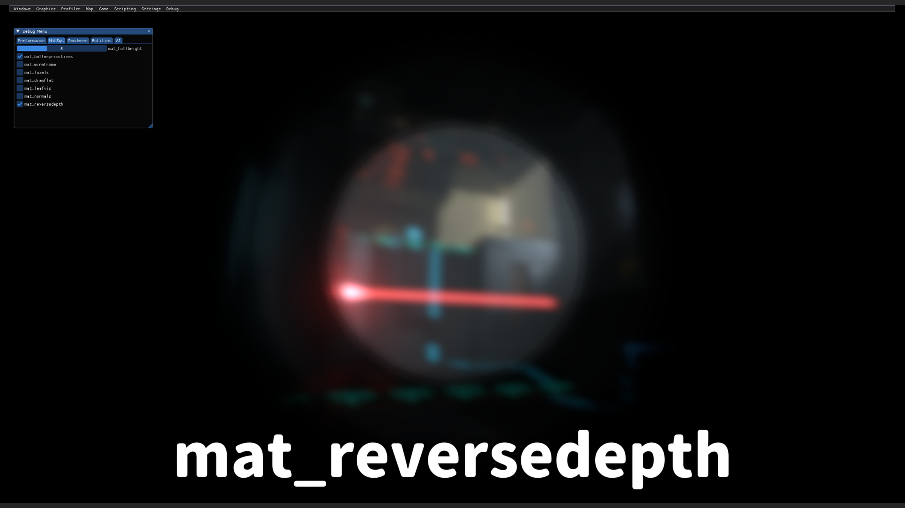

### Renderer

The third menu consists of options related to drawing different parts of the engine.

* `Draw Skybox` toggles the skybox. 3D skybox will disappear and 2D skybox will appear black.
* `Draw VGUI` toggles the legacy VGUI. Obsolete since both P2CE and Momentum Mod use Panorama instead of VGUI.
* `Draw Panorama` toggles Panorama, therefore toggling the pause menu, all the screen elements except the crosshair, and `panorama_screen` entities.
* `Draw World` toggles the visibility of all brush entities and world geometry.
* `Draw Entities` toggles the visibility of all point entities.
* `Draw Viewmodel` toggles the visibility of the viewmodel.
* `Draw Static Props` toggles the visibility of static props.
* `Draw Detail Props` toggles the visibility of detail props mentioned in the .vbsp file inside the map.
* `Draw Model Light Origin` draws green Xs at models' light origins and additionally draws 4 grey lines to each corner of models' bounding boxes.
* `Draw Light Info` draws sprites in each light of the map. The sprites can be seen through world geometry.
* `Draw Decals` toggles decals and overlays.
* `Draw Brush Models` toggles the visibility of brushes that use models in any way.
* `Draw Area Portals` toggles all the area portals in the map.
* `Draw Beams` toggles beams created by `env_laser`, `env_beam` and `beam_spotlight` entities.
* `Draw Ropes` toggles `move_rope` and `keyframe_rope` entities.
* `Draw Sprites` toggles sprites.
* `Draw Particles` toggles particles.
* `Draw Rain` toggles the visibility of rain particles.
* `Draw Water Surface` toggles water visibility. WHen inside the water, only the fog is seen.
* `Draw VPhysics objects` toggles the visibility of objects that use VPhysics for collisions.
* `Draw Portal Frustum` cannot be enabled as of now. It probably draws the debug lines for cameras used in portals.

### Entities

The fourth menu contains buttons that draw information about the entity the player is looking at.

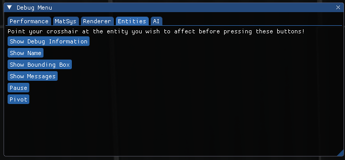

* `Show Debug Information` displays the debug information of the entity as if the `ent_text` command was used.
* `Show Name` displays the targetname of the entity.
* `Show Bounding Box` shows the bounding box of the entity by drawing 8 pink lines on its edges and 4 tiny green cubes on the bottom corners of the bounding box.
* `Show Messages` shows messages output by this entity.
* `Pauses` freezes the entity.
* `Pivot` draws the pivot point of the entity.

> [!NOTE]
> `developer 1` is required to see the effects of this menu.

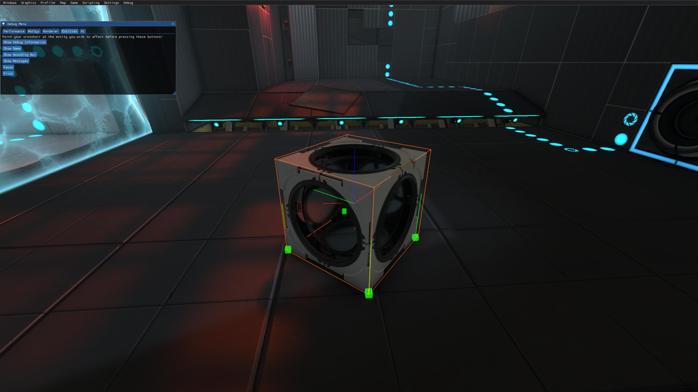

### AI

The last, fifth menu utilizes control over the NPC entity the player is looking at.

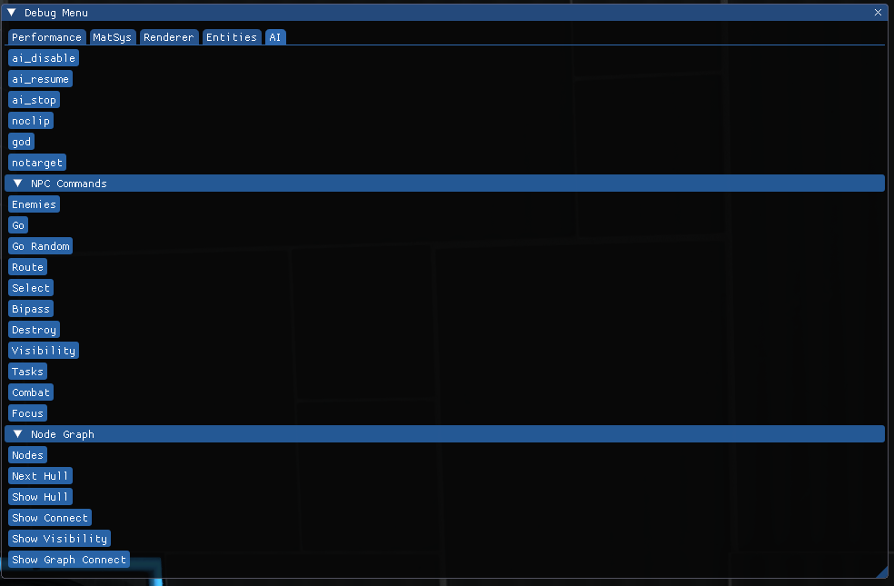

* `ai_disable` bypasses all AI logic routines and puts all NPCs into their idle animations.
* `ai_resume` resumes normal processing if the NPC is stepping through tasks.
* `ai_stop` completely disables AI for the NPC.
* `noclip` enables noclip for the player.
* `god` enables godmode for the player.
* `notarget` makes enemies ignore player.

#### `NPC Commands` dropdown contains the following:

* `Enemies` outputs this NPC's current entities.
* `Go` tells the NPC to continue following its path.
* `Go Random` tells the NPC to go in a random direction.
* `Route` outputs this NPC's current route to their goal.
* `Select` "selects" the NPC by drawing a dark red box around its bounding box.
* `Destroy` removes the NPC.
* `Visibility` tries to call a missing command called `npc_visibility`.
* `Tasks` outputs this NPC's current tasks (rush, cover, heal player, etc.)
* `Combat` sets this NPC to its combat mode.
* `Focus` tells this NPC to focus on the target.

#### `Node Graph` dropdown contains the following:

* `Nodes` displays this NPC's current nodes
* `Next Hull` tells the NPC to move to the next cover position.
* `Show Hull` shows this NPC's current cover position.
* `Show Connect` shows connection of this NPC.
* `Show Visibility` shows visibility of this NPC.
* `Show Graph Connect` shows graph connections of this NPC.

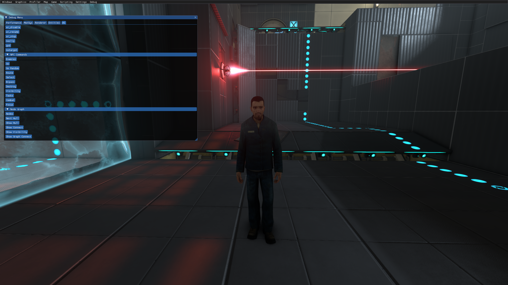

****
