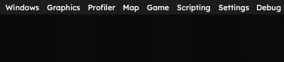

# Developer UI

Developer UI is the rewritten version of the broken leftover developer menu from the vanilla Portal 2. This menu provides various information about the engine, entities and materials inside the map and the game overall, as well as debuggers for Angelscript and material inspector.

## Usage

There are two ways to open the Developer UI - using the `devui_toggle_menu` console command, or by pressing `shift + f1`.

There are 8 tabs total: 
[Windows](categories/windows), 
[Graphics](categories/graphics), 
[Profiler](categories/profiler), 
[Map](categories/map), 
[Game](categories/game), 
[Scripting](categories/scripting), 
[Settings](categories/settings) 
and [Debug](categories/debug). 
Each tab is a dropdown menu containing buttons, each button opens up a window.

## Implementation

In Strata Source, Developer UI is implemented using ImGUI - a bloat-free graphical user interface library for C++. More about ImGUI in [here](https://github.com/ocornut/imgui).

## Misc

The map used on the screenshots is [Gentle Hum by Beckeroo.](https://steamcommunity.com/sharedfiles/filedetails/?id=3485953221).
