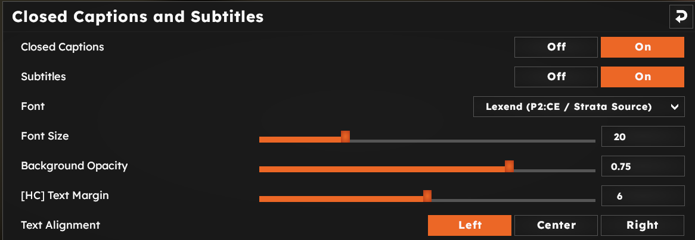

# Options & Commands

There are plenty of options in the settings menu to configure the captions.

* `Closed Captions` enables closed captions.
* `Subtitles` determines whether the SFX effects are shown in captions. If set to On, only dialogues will appear.
* `Font` is the font that the caption system uses.
    * `Lexend` as the default P2CE / Strata source font;
    * `Univers` from Portal 2;
    * `DIN 1451` from Half-Life 2;
    * `Verdana` as the fallback option;
    * `Noto Sans` from Steam Deck interface;
    * `Stratum2` from CS:GO
* `Font Size` is the size of the font, in units per pixel (pt)
* `Background Opacity` is the opacity of the black background box
* `Text Margin` determines how far the text is from the edge of the background box
* `Text Alignment` determines alignment of the captions (left, middle, right)

Additionally, there are the following console commands:

| Command | Description |
| --- | --- |
| `cc_panorama` | Enable usage of Panorama Closed Captions over Legacy VGUI
| `cc_lang` | Sets the language for the captions. Does not require map restarts - the next caption token will be displayed with a new language.
| `cc_captions_debug` | smth
| `cc_captiontrace` | Shows missing closecaptions (0 = no, 1 = devconsole, 2 = show in hud)
| `cc_emit` | Shows a specified caption and plays its sound
| `cc_emit_raw` | Same as `cc_emit` but raw text can be inserted
| `cc_findsound` | Prints name of the sound the specified token is attached to
| `cc_linger_time` | Close caption linger time
| `cc_minvisibleitems` | Minimum number of caption items to show
| `cc_norepeat` | In multiplayer, don't repeat captions more often than this many seconds
| `cc_panorama_log` | Enables Panorama CC verbose logging
| `cc_panorama_reload` | Reloads caption definitions for Panorama subtitles only
| `cc_sentencecaptionnorepeat` | How often a sentence can repeat.
| `cc_sfx_linger_time` | Close caption linger time for items marked as SFX
| `cc_showmissing` | Shows missing closecaption entries.
| `cc_subtitles` | If set, don't show sound effect captions, just voice overs
