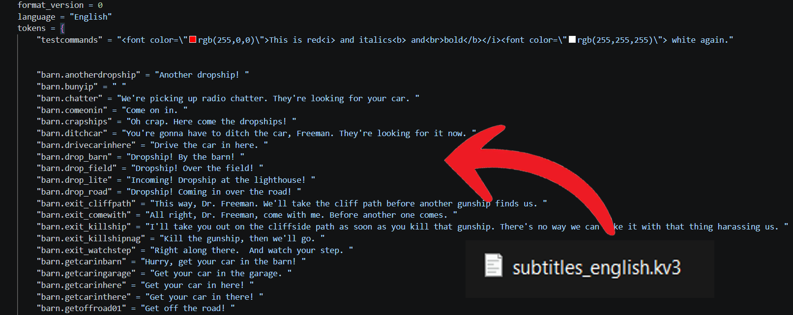
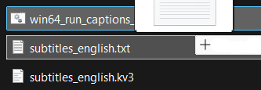

## Porting captions

The new caption system does not read the old caption files. Instead, it requires a new caption file with a custom structure - `subtitles_*language*.kv3`.

A converter script is made to port the regular captions to the new system. The script is located in `sdk_tools\panorama_captions_converter` as a Python file. Additionally, there are `.sh` drag-n-drop launcher for Linux and `.bat` for Windows. To port the captions, simply drag the `.txt` caption file onto `win64_run_captions_to_panorama.bat` or `linux_run_captions_to_panorama.sh`, and the new `.kv3` caption file will appear next to the original one.

If the script fails (i.e. syntax error in the original captions), it will show the line and column where the error occurred.

> [!NOTE]
> The converter only parses `.txt` files, it is not possible to convert `.dat` using it

Then copy the converted caption file to `resources`. Done!
