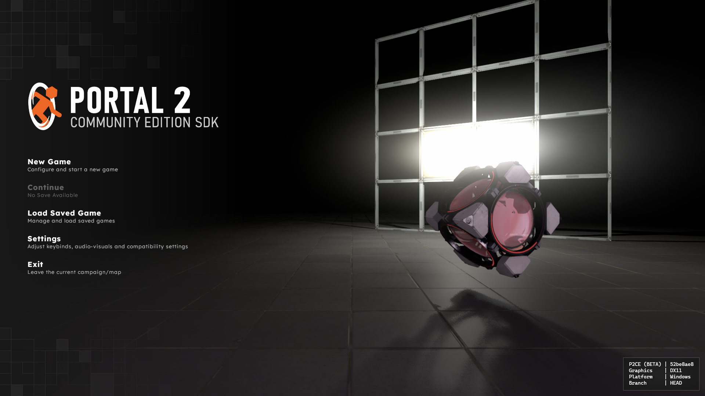
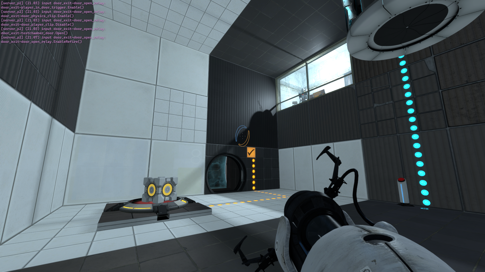
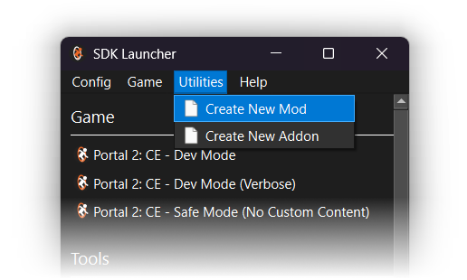
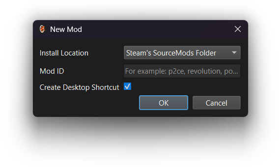
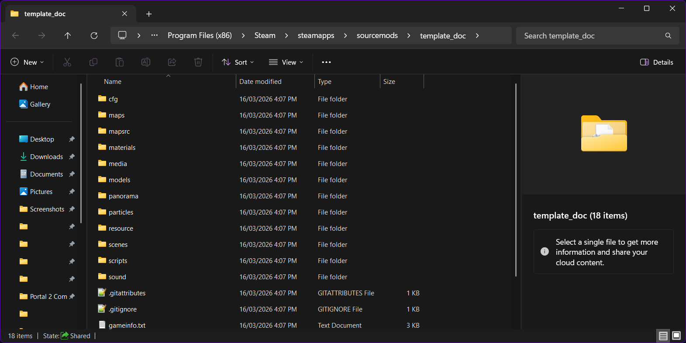
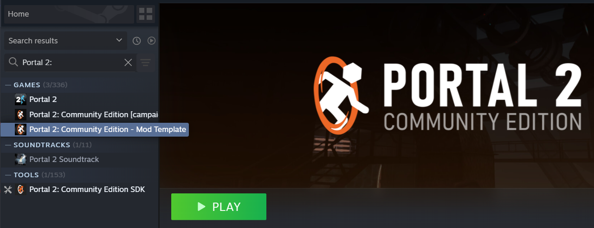

# P2:CE Mod Template
The P2:CE Mod Template is a basic skeleton that can be used to create mods building upon the Portal 2: Community Edition feature set. It has one sample campaign with a single test chamber that can be played through to completion.  
You can find its contents at https://github.com/StrataSource/p2ce-mod-template





## Setup Instructions

### SDK Launcher
From the P2:CE SDK launcher, select the Utilties drop-down and click on "Create New Mod":



The SDK launcher will prompt for an install location and a mod ID (your mod's internal name). A desktop shortcut to your mod's working directory can also be optionally specified.



Your newly-created mod will be downloaded and placed in the appropriate directory, depending on the install location you have selected:



### Git

Clone the Mod Template repository into a new working tree directory using the following commands:

```bash
mkdir p2ce-mod-work
cd p2ce-mod-work
git clone https://github.com/StrataSource/p2ce-mod-template.git my-new-mod-name --recurse
```

Then, rename `p2ce-mod-template_english.txt` in the `resources` directory to `[mod-name]_english.txt` to enable mod-specific localization.

## Launch Options

### Steam Client

Mods can be launched directly from the Steam client if placed in the `steamapps/sourcemods` folder:



> [!NOTE]
> You must quit and relaunch Steam for your mod to show up when you first create it.

### Command Line

Launching your mod can also be done programmatically via the P2:CE executable. Pass `-game "path\to\mod"` along with any additional command-line arguments to the P2:CE game executable in your game install.

To launch on Windows:

```sh
"X:\path\to\steam_library\SteamApps\common\Portal 2 Community Edition\bin\win64\p2ce.exe" -game "X:\path\to\mod"
```

To launch on Linux:
```sh
"path/to/steam_library/SteamApps/common/Portal 2 Community Edition/p2ce.sh" -game "path/to/mod"
```

## Contents
The template includes a few files and folders that you can use for easy customization of P2:CE. This section will go over the most important ones, or ones that are different from a typical sourcemod.

### `gameinfo.txt`
This file contains information about your mod and tells Steam which game it's based off of. The only thing you need to edit is the `game` property that sets the name. If you need to mount content from other games, you can specify this in the `mounts` block. 

### `cfg` folder
`cfg` contains important configuration files for your mod.

### `maps` folder
This folder is where all your maps should be placed. P2:CE will look inside of this directory for map files.

### `panorama` folder
The `panorama` folder contains assets and XML files for customization of Panorama, P2:CE's UI framework.

### `resource` folder
This folder contains resource files, configurations, and notably, your mod's icon (`game.ico` and `game-icon.bmp`).

`resource` also contains closed caption and localization files.

### `scripts` folder
The `scripts` folder contains some useful configurations for UI elements as well as VScripts.

