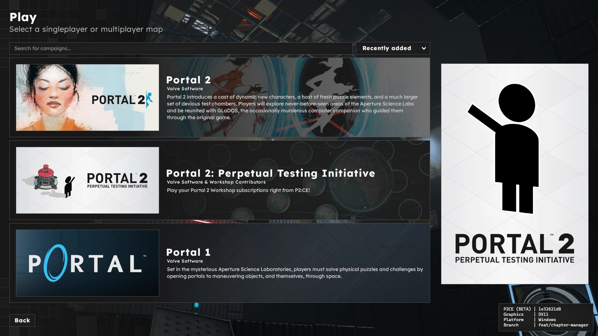
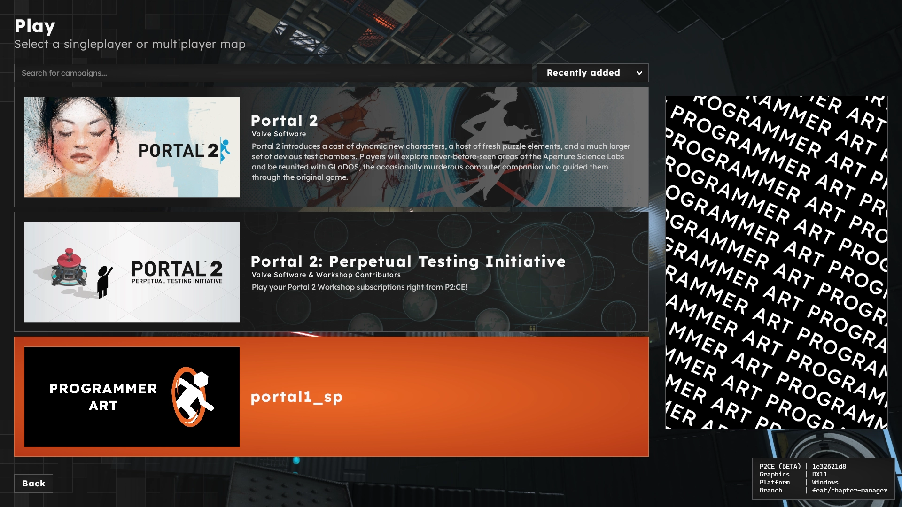

# Getting Started with P2:CE Campaigns



P2:CE includes the ability for sourcemods, mappers, and addon authors to create custom campaigns. These custom campaigns can then be published to the Steam Workshop. A campaign refers to an organized bundle of maps, which could be tightly related (such as story-based campaigns) or have no relation at all (map/competition packs).

P2:CE's campaign system is the primary form of user created playable content. Standalone maps are still available, but are folded into a "P2:CE Workshop" campaign as a playlist.

# Creation

A campaign addon is much like a standard addon. It will contain all required assets, and optionally link to other external dependencies on the Steam Workshop. Campaign addons ship with additional image assets that the game's menu will use in various locations.

To begin, [create a new addon](/modding/workshop/workshopgui) and include all required content. Next, create a `campaigns.kv3` file within the `scripts` folder of the addon. This will define the campaign to the game.

Each campaign has a subset of metadata that all dictate your how your chapters are ordered and unlocked, and what art assets are used. The campaign script is a KeyValue3 file, structured in the following way:

> [!NOTE]
> This snippet is not valid syntax and will not work in P2:CE!

```
{
    meta = {
        (asset information)
    }
    "campaigns" = {
        "CAMPAIGN_ID" = {
            title = (string)
            unlock_all = (boolean)
            meta = {
                (overrides)
            }
            chapters = [
                // chapter block
                {
                    title = (string)
                    save_comment = (string)
                    meta = {
                        (overrides)
                    }
                    maps = [
                        // map entry
                        {
                            name=(string)
                            meta = {
                                (overrides)
                            }
                        }
                    ]
                },
                // etc.
            ]
        }
    }
}
```
In order:
- `meta`, a block that details information for P2:CE to use in its menu presentation and loading screens.
  - Meta keys are unique to the respective mod and it is up to the menu script to recognize and use them.
  - Meta blocks can exist at the Root/Campaign/Chapter/Map level. Priority is established in reverse order.
    - Matching fields inside the meta block will override based on this priority. For example, `background_map` specified at the chapter level overrides that field at the campaign or root level.
  - Full meta keys for P2:CE are described in the [Full Script Reference](/modding/p2ce-campaigns/script-reference#meta-keys) page.
- `campaigns`, top-level block that groups all campaigns provided by the addon together.
- `CAMPAIGN_ID`, an internal name to refer to the campaign by.
- `title`, a human readable name for the campaign/chapter. This string will be localized if a token is set.
- `unlock_all`, should all chapters be unlocked to start with?
- `chapters`, an array containing blocks that describe each chapter.
  - `save_comment`, optional field that sets the save comment for saves created at the belonging chapter.
  - `maps`, an array containing blocks that describe each map.
    - Each map must specify the `name` field.

Fill in as much information as possible in the above snippet, or copy the sample from the [Full Script Reference](/modding/p2ce-campaigns/script-reference#ideal-meta-locations) page.

Duplicate the chapter block for each individual chapter. Duplicate the map block inside the `maps` array for every map that belongs to that chapter.

For example:
```
chapters = [
    // chapter block
    {
        title = "My Cool Chapter 1"
        maps = [
            // map entry
            { name="sp_a1_intro1" },
            { name="sp_a1_intro2" },
            // comma on the last entry in an array is valid syntax
            { name="sp_a1_intro3" },
        ]
    },
    {
        title = "My Cool Chapter 2"
        maps = [
            // map entry
            { name="sp_a1_intro4" },
        ]
    },
]
```

If you are having trouble placing meta keys, or want a script to copy and paste, see the [Full Script Reference](/modding/p2ce-campaigns/script-reference#ideal-meta-locations) page.

Once the campaign script has been created with the necessary information, it can be found in the campaign selector.

The bare minimum script to have a campaign appear on the selector can be found below:
```
{
    "campaigns" = {
        "[CAMPAIGN_ID]" = {
        }
    }
}
```
Required art assets will be replaced with one of several fallback images if they are not found. Art assets that are optional will instead be hidden from the UI. Consult the [Full Script Reference](/modding/p2ce-campaigns/script-reference#meta-keys) for information on which assets are optional, and art asset guidelines.



**All art assets must reside in the `.assets` subfolder in the respective addon. The game will not find the art assets if they are in another location.**

# Example Campaign Files

P2:CE ships with local addons to play Portal 2, Portal 1, and Half-Life 2 (including its episodes). These addons can be found [here](https://github.com/StrataSource/p2ce-addons/tree/feat/campaign-tests).

# Campaign Progression

Campaigns have their progression information saved inside `SAVE/campaign_save_data.kv3`. This file can be erased using the `campaign_savedata_reset` command. Campaign progression is currently tracked by chapter & map number.

# Developing a Sourcemod?

P2:CE and its menu system was designed as a gateway to sourcemods/standalone games. If a default campaign is specified (cvar: `campaign_default`), the game will use that campaign as the base menu state instead of the standard P2:CE menu. This can be helpful for mods that cannot or do not want to create a custom menu system (or simply as a starting platform while developing the mod).

> [!NOTE]
> **There are extra considerations to take when developing a menu script that leverages the campaign system. Full details can be found on [the Technical Notes page](/modding/p2ce-campaigns/technical-notes).**
