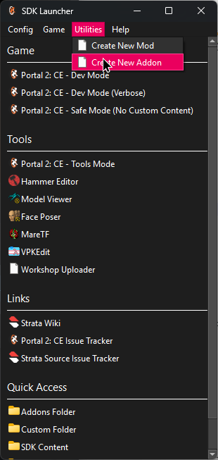
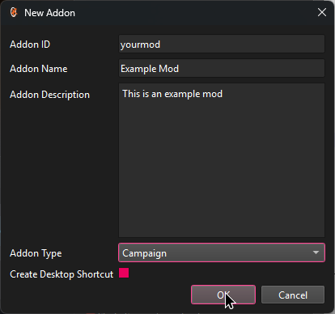
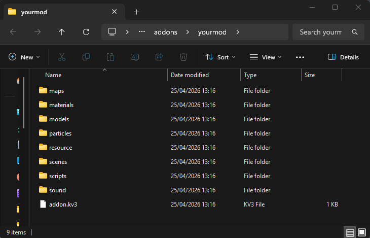

# Creating an Addon

Campaigns in P2:CE are addons that ship with all required maps / custom resources and define a campaign. To create a new campaign focused addon, open the P2:CE SDK Launcher and create a new addon.

|                                |                                             |
|--------------------------------|---------------------------------------------|
|  |  |

Your addon will be created in the `addons` folder within the `p2ce` folder. On a default installation, the path would be `C:\Program Files (x86)\Steam\steamapps\common\Portal 2 Community Edition\p2ce\addons\yourmod`.

## Next steps
Now that we have created our addon, we can start setting up our campaign.

Head over to [the campaign setup page](/modding/p2ce-campaigns/getting-started/02-setting-up-your-campaign) to continue.