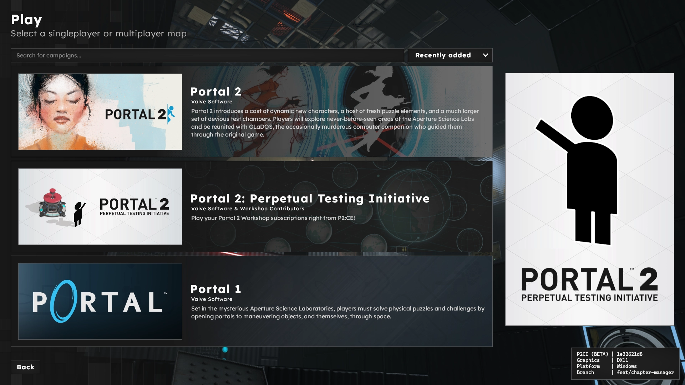

# Getting Started

P2:CE includes the ability for sourcemods, mappers, and addon authors to create custom campaigns. These custom campaigns can then be published to the Steam Workshop. A campaign refers to an organized bundle of maps, which could be tightly related (such as story-based campaigns) or have no relation at all (map/competition packs).

P2:CE's campaign system is the primary form of user created playable content. Standalone maps are still available, but are folded into a "P2:CE Workshop" campaign as a playlist.