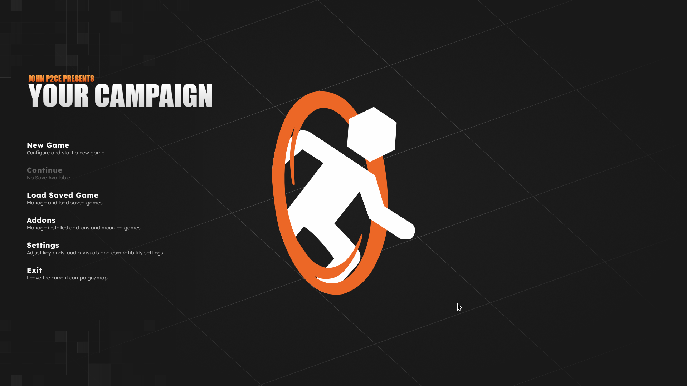

# Setting up your campaign
To create a campaign in your newly created addon, we need to create a `campaigns.kv3` file that holds all information about your campaign and references to the chapters, maps and additional metadata. Create a file named `campaigns.kv3` in the `scripts` folder of your addon.
Copy the following code into the file:

> [!NOTE]
> An example of a functioning campaign script is available [here](https://github.com/StrataSource/p2ce-addons/blob/main/portal2/scripts/campaigns.kv3).

```
{
    meta = {
        // Meta keys on an addon level
        author = "John P2CE"
        desc = "An example campaign"
        full_logo = "logo.png"
    }
    "campaigns" = {
        "yourcampaign" = {  // "yourcampaign" is the ID of the campaign, it is required to be unique within your mod, chosing a unique identifier in general is preferred
            title = "Your Campaign"
            unlock_all = false
            meta = {
                // Meta keys on a campaign level
            }
            chapters = [
                {
                    title = "Your Chapter 1"
                    meta = {
                        // Meta keys on a chapter level
                    }
                    maps = [
                        {
                            name = "sp_a1_intro1"
                            meta = {
                                // Meta keys on a map level
                                title="Container Ride"
                            }
                        },
                        {name = "sp_a2_intro" meta={ title="Incinerator" }}
                    ]
                },
                {
                    title = "Your Chapter 2"
                    meta = {
                        // Meta keys on a chapter level
                    }
                    maps = [
                        {name = "sp_a2_laser_intro" meta={ title="Laser Intro" }},
                        {name = "sp_a2_fizzler_intro" meta={ title="Fizzler Intro" }}
                    ]
                }
            ]
        }
        // You can add additional campaigns here
    }
}
```

### Explaination
The campaigns file defines four nested levels of information. Addon, Campaign, Chapter and Map. Each level has its own properties that can be set and an additional "meta" block holding information for the P2:CE interface. While some meta keys are related to a specific level, most can be defined on each level and will be overriden by deeper levels (eg: An addon can define a background image and each chapter can define their own background image that will be used when the player is in that chapter). It makes sense to define keys on the highest level possible (eg: title/logo on the addon level) to prevent duplication or unwanted display. For more information, please refer to the [campaign.kv3 reference page](/modding/p2ce-campaigns/key-reference/00-general).

Each chapter is a list of maps and unlocks with the last map of the previous chapter played. The `unlock_all` property determines if all maps in the chapter are unlocked at the start of the chapter or if they are unlocked as the player completes the previous map.

This `campaigns.kv3` file is a minimal example. There are lots of other properties that can be set and change how your campaign will be displayed in the game's campaigns menu. For more information, please refer to the [campaign.kv3 reference page](/modding/p2ce-campaigns/key-reference/00-general).

## `.assets` folder
Inside your addons folder, you should create a folder named `.assets`. This folder enables you to store assets for the interface such as a logo, campaign icons or backgrounds. In our example, we've placed this placeholder logo in the `.assets` folder and referenced it in the `campaigns.kv3` file with the `full_logo` property.


## Testing
Now that we have defined a campaign in our addon, we should test if it shows up in the game's campaign menu.
Open P2:CE and head to the Campaigns section. You should now see your newly created campaign and be able to start it.
It should look something like this:



## Next steps
We've successfully created a campaign in our addon. Next up, we need to setup Hammer for an easier development experience.

Head over to [the Hammer setup page](/modding/p2ce-campaigns/gettings-started/03-setting-up-hammer) to continue.