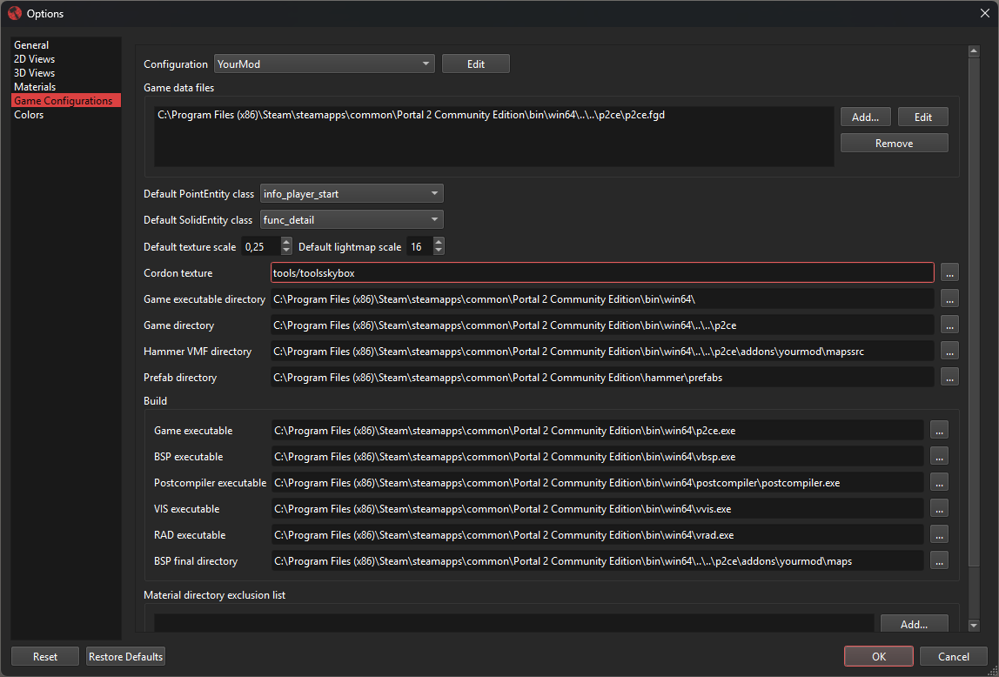
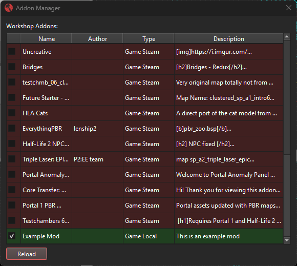
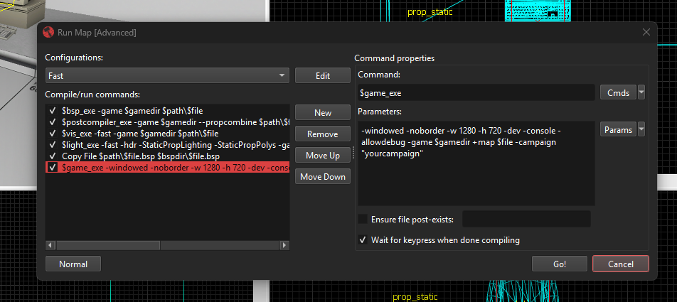

# Setting up Hammer
Next up, we'll be setting up Hammer. While this step is not strictly necessary, it will teach you to setup a seamless workflow for editing your campaign.

## Game Configuration
We want to create a new game configuration for our campaign. Open the SDK Launcher and Hammer. Next, go to the upper menu bar and open the Game Configurations through "Tools" → "Options" → "Game Configurations.

Click on `Edit` to open the list of game configurations and create a duplicate of the `P2:CE` configuration. Close the game configuration dialog and select your newly created game configuration.

Now we can make some changes to our game configuration. Make sure to create a folder named `mapsrc` in your addons folder for this step.

Under the setting `Hammer VMF directory`, enter the path to your `mapsrc` folder. In a default installation, this path will be `C:\Program Files (x86)\Steam\steamapps\common\Portal 2 Community Edition\p2ce\addons\yourmod\mapsrc` where `yourmod` is your addons folder name.

Under the setting `BSP final directory`, enter the path to your `maps` folder. In a default installation, this path will be `C:\Program Files (x86)\Steam\steamapps\common\Portal 2 Community Edition\p2ce\addons\yourmod\maps` where `yourmod` is your addons folder name.

> [!NOTE]
> Please restart Hammer after making these changes. You should see a dialog asking you to select a game configuration with your newly created configuration and `P2:CE` as options.

## Run Configuration
For this next step, open the Addon Manager through Window → Addon Manager and enable the checkbox next to your addon.

Create a small sample map in Hammer and click on the "Run Map" button at the top. If you don't see the expert modal, click on "Expert" at the bottom left.

Add the following to your configuration that starts with `$game_exe` to automatically load your campaign when running the map: `-campaign "yourcampaign"`.

> [!NOTE]
> You can use the full identifier of your campaign `addon:yourmod/yourcampaign`, a simplified variant `yourmod/yourcampaign` or the smallest variant `yourcampaign`. To prevent loading into the wrong campaign, your campaign identifier should be unique. If more than one addon share the same campaign name, use the longer variants to prevent loading into the wrong campaign.

Now you should be able to run your map. After the compilation is finished, a game window should open with your custom campaign loaded. To check if you have loaded into the correct campaign, enter `campaign_info` in the console.

## Next Steps
You have now fully set up your campaign addon and should be good to go.

Head to [the campaigns.kv3 reference page](/modding/p2ce-campaigns/key-reference/00-general) to get more information about how to customize the interface of your campaign.