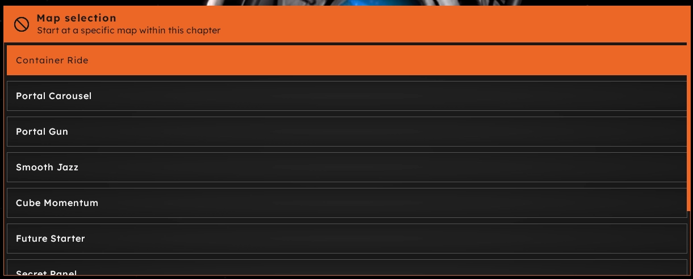
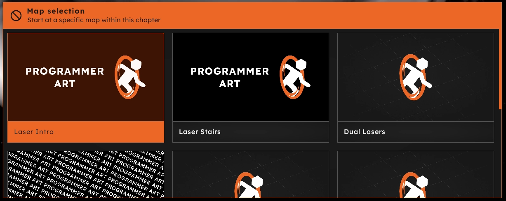

# Keys for Maps
| Key    | Type   | Details                                                                                                                                                        | Optional |
|--------|--------|----------------------------------------------------------------------------------------------------------------------------------------------------------------|----------|
| `name` | string | The map filename, without the `.bsp` extension.                                                                                                                | No       |
| `meta` | block  | [Meta keys](/modding/p2ce-campaigns/key-reference/meta-keys) for the P2:CE interface. There are special *map meta keys* that are only available on this level. | Yes      |

## Map meta keys
> [!NOTE]
> These meta keys are only available for maps.

### `title`

An optional meta key that sets the map title. If not set, the `bsp` file name will be used. This string is used for the map selector interface.

### `img`

An optional path to an image. If at least one map in a chapter has this key set, it will display the map selector in a grid view.

