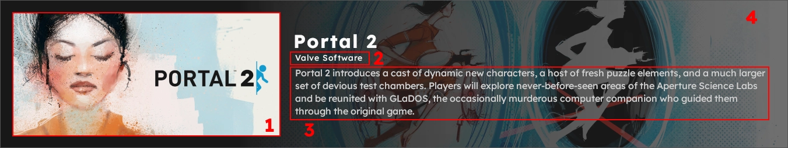
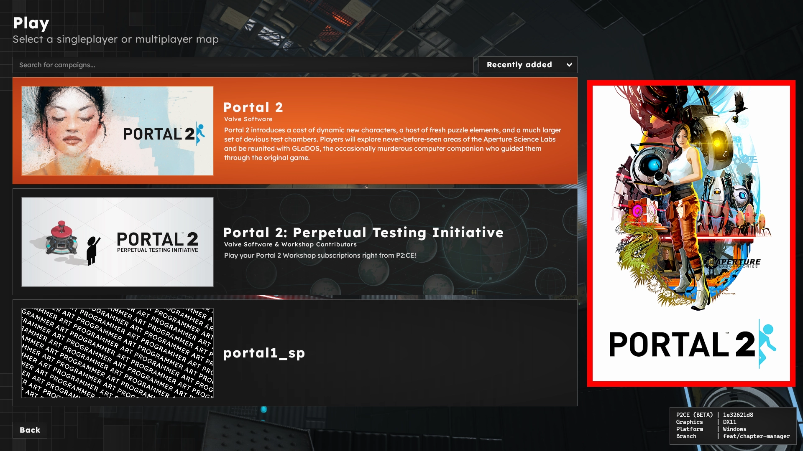

# Campaign Selector

> [!NOTE]
> All meta keys are strings. Asset paths are relative to the addons `.assets` directory.

## [1] `selector_cover`
This is the primary cover image. A placeholder will be displayed if no image is specified.

**Recommended Size:** 920x430 (or aspect ratio equivalent)

## [2] `author`
This is the name to display in the campaign selector, which will get localized if provided a token.

If no author is specified, the author defined in the ``addon.kv3`` will be used. If no other is specified in the ``addon.kv3``, the author will be hidden from the UI.

## [3] `description` / `desc`
This is the description to display in the campaign selector, which will get localized if provided a token.

If no description is specified, the description will be hidden from the UI.

## [4] `selector_button_background`
A path to an asset in the addons `.assets` folder. This is the background image for the campaign selector button. A placeholder will be displayed if no image is specified.

**Recommended Size:** 1920x620 (or aspect ratio equivalent)

This image will be sized to cover a region of the button. Upper and lower portions may be clipped. Important elements should be as close to the center vertically as much as possible.

## ``boxart``

A path to an asset in the addons `.assets` folder. This is the boxart image for the campaign selector. It will be displayed to the right of the campaign list.

**Recommended Size:** 600x900 (or aspect ratio equivalent)

This image will be sized to fit this aspect ratio.