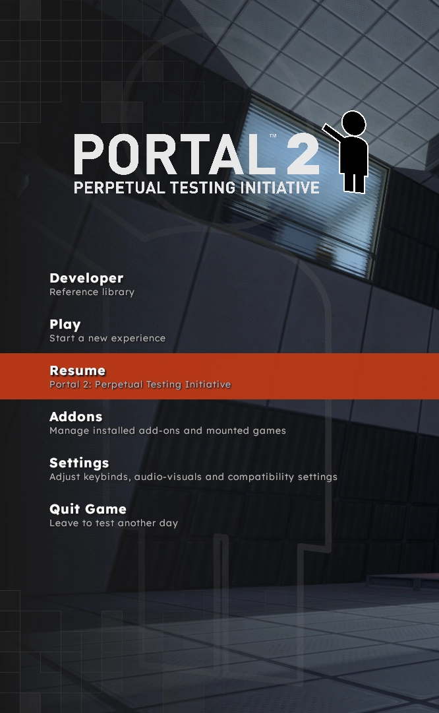
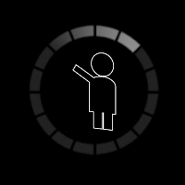
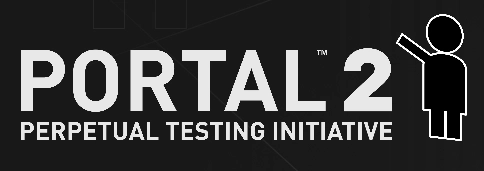

# Main Menu

> [!NOTE]
> All meta keys are strings. Asset paths are relative to the addons `.assets` directory.

## Logos
### `square_logo`

|                                                  |                                               |
|--------------------------------------------------|-----------------------------------------------|
|  |  |

A path to an asset in the addons `.assets` folder. The square logo will be displayed in the main menu to the right of the full_logo if the player hovers over the *Resume* menu item. it is also displayed inside the loading spinner.

**Recommended Size:** 256x256 (or aspect ratio equivalent)

**Recommended Format:** svg (As they scale nicely to any display size)

### `full_logo`

A path to an asset in the addons `.assets` folder. The full logo will be displayed on the main menu and in the pause menu. If not set, no logo will be displayed.

This image will be sized to fit on the main menu. Any resolution/ratio can be used and should appear fine. Currently, the full logo will be constrained to center fit inside a 540x130 pixel frame.

**Recommended Format:** svg (As they scale nicely to any display size)

### `full_logo_size_preset`
Used to change the display of `full_logo`. Defaults to `standard`.

| Value      | Description        |
|------------|--------------------|
| `standard` | Standard display   |
| `large`    | Larger display     |

## Background
### `background_map`
A map name to use for the background. If it is not set or the player has disabled background map loading, `background_movie` (and after that) `background_image` are used as fallbacks.

### `background_movie`
A path to an asset in the addons `.assets` folder. The video will be displayed as the background. If it is not set, `background_image` is used as fallback.

**Recommended Size**: 1920x1080 (or aspect ratio equivalent)

### `background_image`
A path to an asset in the addons `.assets` folder. The image will be displayed as the background if `background_movie` or `background_map` are not set. If not set, a fallback image will be used.

**Recommended Size**: 1920x1080 (or aspect ratio equivalent)

### `background_music`
This key's value is **not** a path to a raw asset file. Instead, it must be set to a valid [soundscript](https://developer.valvesoftware.com/wiki/Soundscripts) entry.
