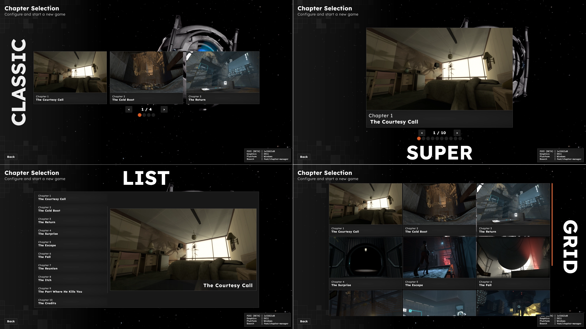
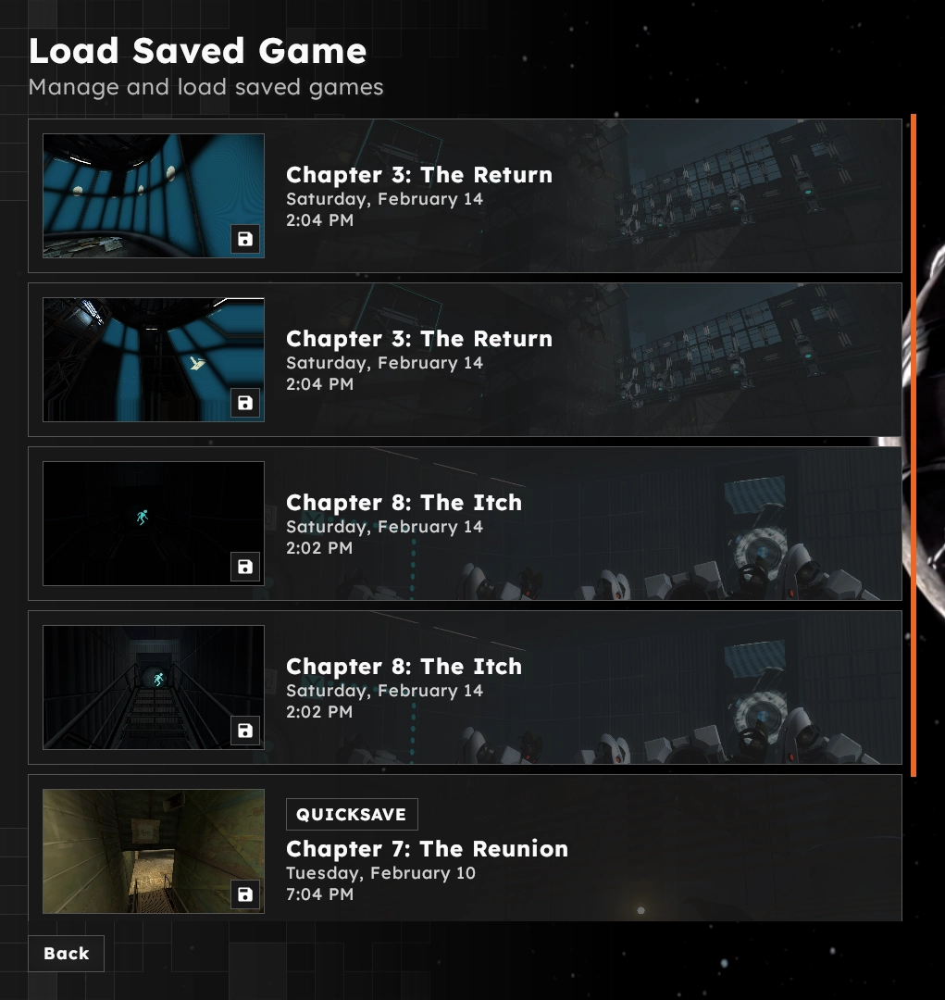

# Chapter Selector

> [!NOTE]
> All meta keys are strings. Asset paths are relative to the addons `.assets` directory.

## `locked_title`
Locked chapters can be assigned their own title when they are locked. By default they will appear as "????"

## `chapter_display_mode`

Defines the display mode of the chapter selector. The default display mode is `list`.

| Value     | Description                                                                                               |
|-----------|-----------------------------------------------------------------------------------------------------------|
| `classic` | Traditional Half-Life 2/Portal 1 film strip with 3 chapters displayed per page                            |
| `super`   | Simiar to `classic` but displaying a single chapter per page                                              |
| `list`    | Displays a list of all chapters on the left side with a detail view of the selected chapter on the right. |
| `grid`    | Displays chapters as a 3 column grid. Ideal for map packs.                                                |

## `thumbnail`

A path to an asset in the addons `.assets` folder. This thumbnail is not only used in the chapter selector but also appears as a background in the save menu. If no image is specified, a fallback will be used.

**Recommended Size:** 1920x1080 (or aspect ratio equivalent)

This image will be sized to fit for chapter selection entries. However, in the saves menu, this image will be sized to cover a region of the save button, so some parts of the thumbnail will be cropped.

