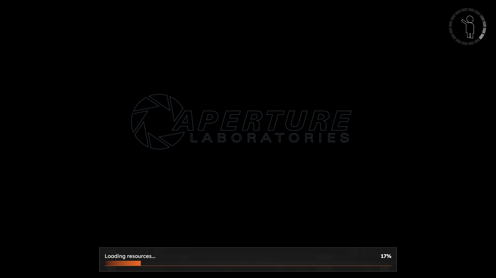
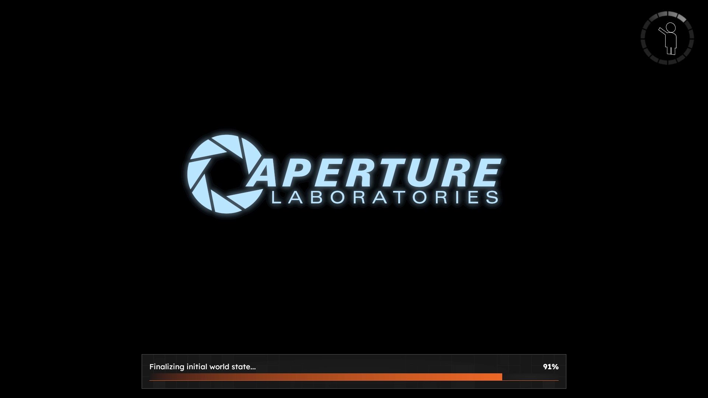

# Loading Screen

> [!NOTE]
> All meta keys are strings. Asset paths are relative to the addons `.assets` directory.

## `loading_square_logo_padding`
The amount of padding given to the loading icon in the corner. If not specified, no padding will be applied.

While this is a string, the value given must be a whole non-negative number.

## `loading_screen`
A path to an asset in the addons `.assets` folder. This image will be used when the player is loading into a map from the main menu. If not specified, a black screen will be shown.

**Recommended Size:** 1920x1080 (or aspect ratio equivalent)

This image will be sized to cover the entire screen as the background.

## `transition_screen`
A path to an asset in the addons `.assets` folder. This image will be used when the player is loading into a map from a previous map. If not specified, a black screen will be shown.

**Recommended Size:** 1920x1080 (or aspect ratio equivalent)

This image will be sized to cover the entire screen as the background.

## Loading/Transition Screen fading

|                                                   |                                                   |
|---------------------------------------------------|---------------------------------------------------|
|  |  |

As with the loading screen used in Portal 2, P2:CE's loading screen is layouted with overlayed images that are fading in/out based on the loading progress. Additionally, P2:CE differentiates between loading into a map from the main menu and transitioning into a map from a previous map.

The loading screen of P2:CE supports two images with a fade happening at 50%. To fade between two images, an index will be added to the asset path.

### Example
```
meta = {
	loading_screen="loading_screen.png"
}
```

With this, the loading screen will fade between `[ADDON PATH]/.assets/loading_screen_1.png` and `[ADDON PATH]/.assets/loading_screen_2.png`.