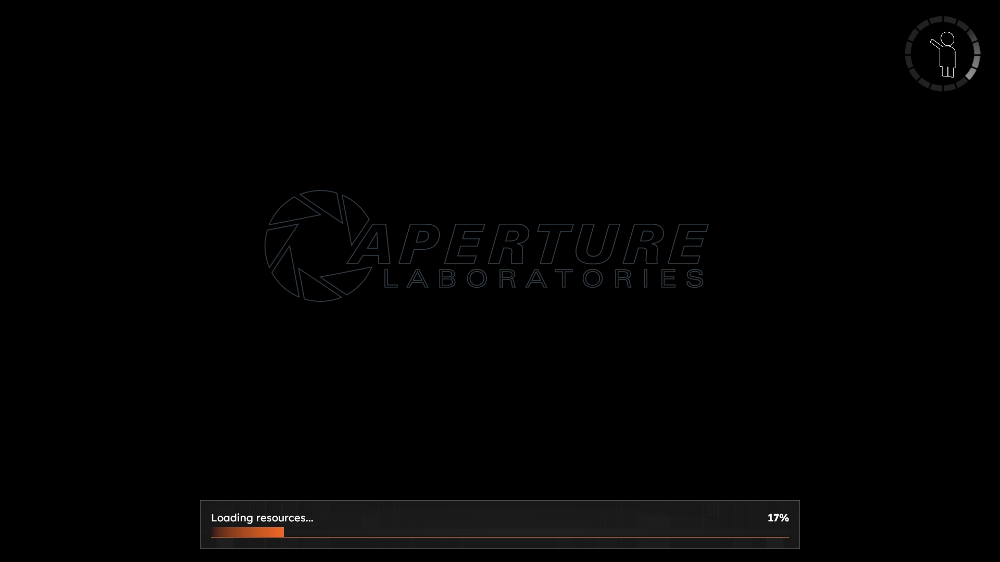
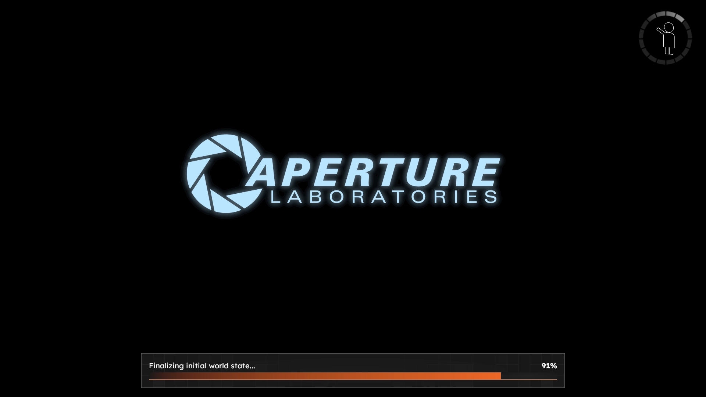

# Loading Screen

> [!NOTE]
> All meta keys are strings. Asset paths are relative to the addons `.assets` directory.

## `loading_square_logo_padding`

The amount of padding given to the loading icon in the corner. If not specified, no padding will be applied.

While this is a string, the value given must be a whole non-negative number.

## `loading_screen`

A path to an asset in the addons `.assets` folder. This image will be used when the player is loading into a map from the main menu. If not specified, a black screen will be shown.

**Recommended Size:** 1920x1080 (or aspect ratio equivalent)

This image will be sized to cover the entire screen as the background.

## `transition_screen`

A path to an asset in the addons `.assets` folder. This image will be used when the player is loading into a map from a previous map. If not specified, a black screen will be shown.

**Recommended Size:** 1920x1080 (or aspect ratio equivalent)

This image will be sized to cover the entire screen as the background.

### `loading_screen_movie`

**(OPTIONAL, DEFAULTS TO BLACK SCREEN IF NOT SPECIFIED)**

Path to the movie/video to use, including the file extension. This path is relative to the addon's `.assets` directory.

Resolution: 1920x1080 (or aspect ratio equivalent)

The movie/video to use when the player is loading into a map from the main menu.

This movie/video will be sized to cover the entire screen as the background.

**NOTE: If `loading_screen`/`transition_screen` is specified for showing a image, they will not show as the movie/video will be displayed on top.**

### `transition_screen_movie`

**(OPTIONAL, DEFAULTS TO BLACK SCREEN IF NOT SPECIFIED)**

Path to the movie/video to use, including the file extension. This path is relative to the addon's `.assets` directory.

Resolution: 1920x1080 (or aspect ratio equivalent)

The movie/video to use when the player is transitioning to a map from a previous one.

This movie/video will be sized to cover the entire screen as the background.

**NOTE: If `loading_screen`/`transition_screen` is specified for showing a image, they will not show as the movie/video will be displayed on top.**

### `show_progress_bar`

**(OPTIONAL, DEFAULTS TO TRUE IF NOT SPECIFIED)**

Setting this to `"false"` will make the progress bar not show up at all on the loading screen. `"true"` or `"false"` should be surrounded with quotes so make sure they are parsed out correctly.

### `show_spinner`

**(OPTIONAL, DEFAULTS TO TRUE IF NOT SPECIFIED)**

Setting this to `false` will make the spinner at the top right not show up at all on the loading screen. `"true"` or `"false"` should be surrounded with quotes so make sure they are parsed out correctly.

## Loading/Transition Screen fading

|                                                   |                                                   |
|---------------------------------------------------|---------------------------------------------------|
|  |  |

As with the loading screen used in Portal 2, P2:CE's loading screen is layouted with overlayed images that are fading in/out based on the loading progress. Additionally, P2:CE differentiates between loading into a map from the main menu and transitioning into a map from a previous map.

The loading screen of P2:CE supports two images with a fade happening at 50%. To fade between two images, an index will be added to the asset path.

### Example

```kv
meta = {
    loading_screen="loading_screen.png"
}
```

With this, the loading screen will fade between `[ADDON PATH]/.assets/loading_screen_1.png` and `[ADDON PATH]/.assets/loading_screen_2.png`. If only one background image is wanted with no fade between images, just having `[ADDON PATH]/.assets/loading_screen_1.png` available will suffice.
