# Full Campaign Script Reference

> [!TIP]
> **SEE ALSO:** [Bundled Campaign Scripts for Portal 1, Portal 2 & Half-Life 2](https://github.com/StrataSource/p2ce-addons/tree/feat/campaign-tests)

# Setup
Script must exist in `scripts/campaigns.kv3` to be loaded. The file's format is KeyValues 3. This file contains a root block that then has an optional `"meta"` block, and a required `"campaigns"` block, in which every campaign will live, using a string as the ID.

# Ideal Meta Locations

The following is a baseline snippet of ideal meta key locations. Note that keys pointing to asset paths should be filled in and the existence of these will result in placeholder assets being used instead.
```
{
	meta = {
		author = "Author"
	}
	campaigns = {
		"campaign_1" = {
			title = "Campaign 1 Title"
			unlock_all = false
			meta = {
				desc = "Campaign 1 Description"
				box_art = ""
				selector_cover = ""
				selector_button_background = ""
				square_logo = ""
				full_logo = ""
				chapter_display_mode = "list"
				loading_square_logo_padding = "0"
			}
			chapters = [
				// copy the below block for every chapter that should be a part of this campaign
				{
					title = "Campaign 1 Chapter 1 Title"
					save_comment = ""
					maps = [
						// copy the below line for every map that should belong in this chapter
						{name="campaign_1_map" meta={ title="Map 1 Title" img="" }},
					]
					meta = {
						thumbnail = ""
						background_map = ""
						background_movie = ""
						background_music = ""
						loading_screen = ""
						transition_screen = ""
					}
				}
			]
		}
	}
}
```

# Campaign Level Keys

| Key | Type | Details |
| --- | ---- | ------- |
| `title` | string | Human readable string that will be localized if a token is provided. This is the name of the campaign. |
| `unlock_all` | boolean | (OPTIONAL, DEFAULT: FALSE) Determines if all chapters are unlocked and no unlock state should be tracked.|
| `meta` | block | (OPTIONAL) Block that describes art/background assets to P2:CE's menus. These values apply to all chapters/maps unless overridden. |
| `chapters` | array | Array of chapter blocks. |

# Chapter Level Keys

| Key | Type | Details |
| --- | ---- | ------- |
| `title` | string | Human readable string that will be localized if a token is provided. This is the name of the chapter. |
| `save_comment` | string | (OPTIONAL) Appended string to save files. |
| `meta` | block | (OPTIONAL) Overrides fields in the campaign's meta block. These values apply to all maps unless overridden. |
| `maps` | array | Array of chapter blocks. |

# Map Level Keys

| Key | Type | Details |
| --- | ---- | ------- |
| `name` | string | The map filename, without the `.bsp` extension. |
| `meta` | block | (OPTIONAL) Override values in the chapter and campaign `meta` blocks. [This block has unique keys.](#maps) |

# Meta Keys

> [!WARNING]
> Meta level keys are unique to P2:CE's menu implementation. Changing the UI scripts will lose what these keys provide, unless they are reimplemented. See P2:CE's [Panorama code](https://github.com/StrataSource/p2ce-panorama-ui) to see how these meta keys are implemented, and see the [Technical Details](/modding/p2ce-campaigns/technical-notes) page for more information.

Most meta keys define art assets which are used in various locations/stretch to certain sizes. Some detail may be cropped. If you use non-standard ratios or something the UI is not expecting, it may not display properly.

Optional keys are marked **(OPTIONAL)**. In the absence of this tag, it is either strongly recommended or required (and would result in a fallback image being used).

**All art assets must reside in the `.assets` subfolder in the respective addon. The game will not find the art assets if they are in another location.**

> [!WARNING]
> **ALL META KEYS ARE STRINGS, NO EXCEPTIONS.**

## Campaign Selector

> [!NOTE]
> Some of these assets and their specifications are derived from the [Steamworks Partner game asset requirements](https://partner.steamgames.com/doc/store/assets/libraryassets). These requirements were chosen to allow campaign authors to easily migrate their work to a standalone Steam mod at any time if they so choose.

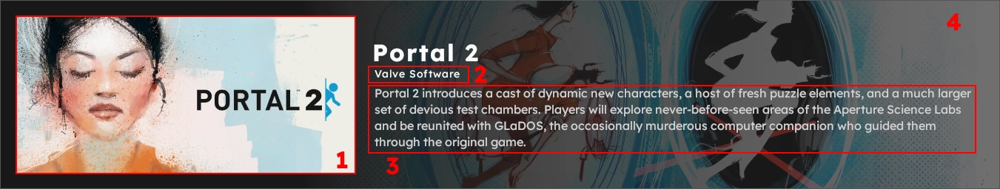

### (1) `selector_cover`

Recommended resolution: 920x430 (or aspect ratio equivalent)

Path to the image to use, including the file extension. This path is relative to the addon's `.assets` directory.

### (2) `author`

**(OPTIONAL)**

The name to display in the campaign selector, which will get localized if provided a token. This will override the addon author, if it can be retrieved. If no author is specified and it cannot be retrieved, it will be hidden from the UI.

### (3) `desc`

**(OPTIONAL)**

Optional description to display in the campaign selector, which will get localized if provided a token.

### (4) `selector_button_background`

**(OPTIONAL)**

Path to the image to use, including the file extension. This path is relative to the addon's `.assets` directory.

Resolution: 1920x620 (or aspect ratio equivalent)

This image will be sized to cover a region of the button. Upper and lower portions may be clipped. Important elements should be as close to the center vertically as much as possible.


### `box_art`

Path to the image to use, including the file extension. This path is relative to the addon's `.assets` directory.

Resolution: 600x900 (or aspect ratio equivalent)

This image will be sized to fit this aspect ratio.

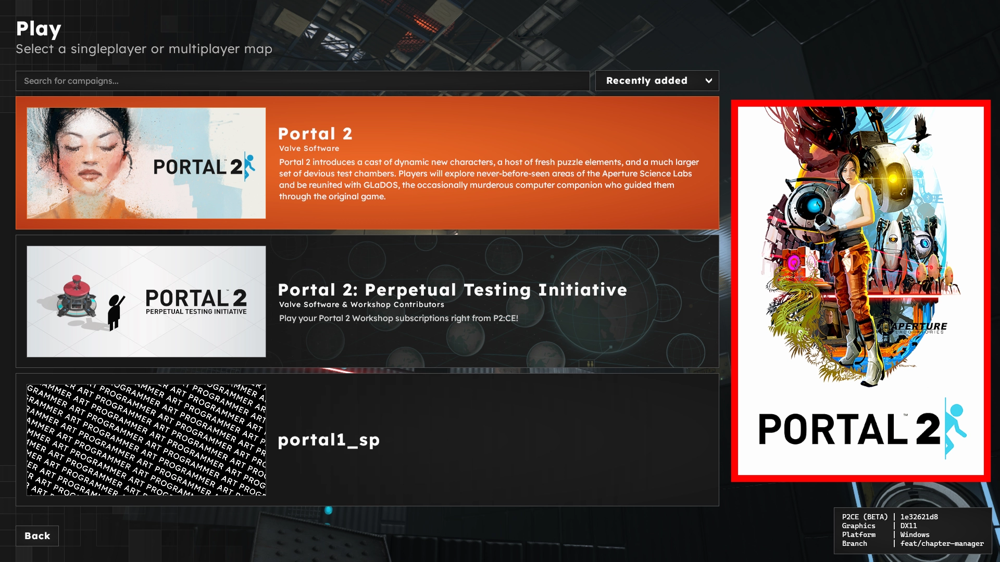

## Menu

### `square_logo`

**(OPTIONAL)**

Path to the image to use, including the file extension. This path is relative to the addon's `.assets` directory.

Recommended resolution: 256x256 (or aspect ratio equivalent)

`.svg` file format recommended. All official logos are provided in this format.

Used in loading screen and main menu.

This logo is used in the main menu and appears when the user hovers over the resume button. If this image is not an `.svg`, it will not appear.

This sample has the logo as Bendy, appearing behind the menu.
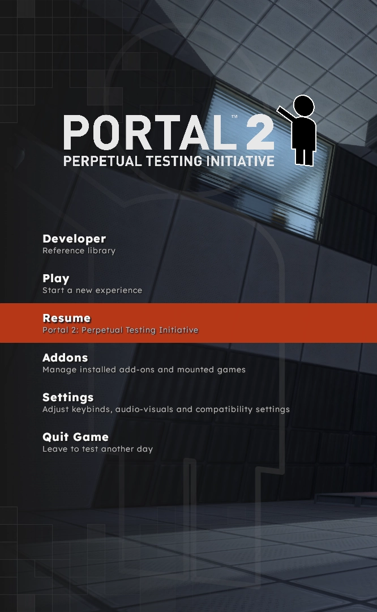

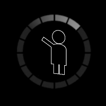

### `background_map`

The background map to load into while on the menu when the player has progressed into the point where this field is defined (usually a chapter block). This normally takes priority over `background_movie` or `background_image`. If the user has disabled background map loading, `background_movie` or `background_image` is used as a fallback.

### `background_movie`

Path to the video to use, including the file extension.

Resolution: 1920x1080 (or aspect ratio equivalent)

The movie to play on the menu when the player has progressed into the point where this field is defined (usually a chapter block). This takes priority over `background_image`.

### `background_image`

> [!NOTE]
> **This field is the final resort. If none of the prior `background_` asset fields are specified and this asset does not exist or fails to load, a fallback image will be used instead.**

Path to the image to use, including the file extension. This path is relative to the addon's `.assets` directory.

Resolution: 1920x1080 (or aspect ratio equivalent)

The image to display on the menu when the player has progressed into the point where this field is defined (usually a chapter block).

This image will be sized to cover the entire screen as the background.

### `background_music`

**(OPTIONAL)**

The music to play on the menu. This must be a soundscript entry and **cannot** be a raw sound reference. If this field is specified, it will play regardless of which `background_` asset is used on the menu.

### `full_logo`

**(OPTIONAL, HIDES LOGO IF NOT SPECIFIED)**

Path to the image to use, including the file extension. This path is relative to the addon's `.assets` directory.

Also used in main menu.

This image will be sized to fit on the main menu. Any resolution/ratio can be used and should appear fine. Currently, the full logo will be constrainted to center fit inside a 540x130 pixel frame.

All official logos are provided in `.svg` format.


## Chapter Selection

### `chapter_display_mode`

**(OPTIONAL, DEFAULT: "LIST")**

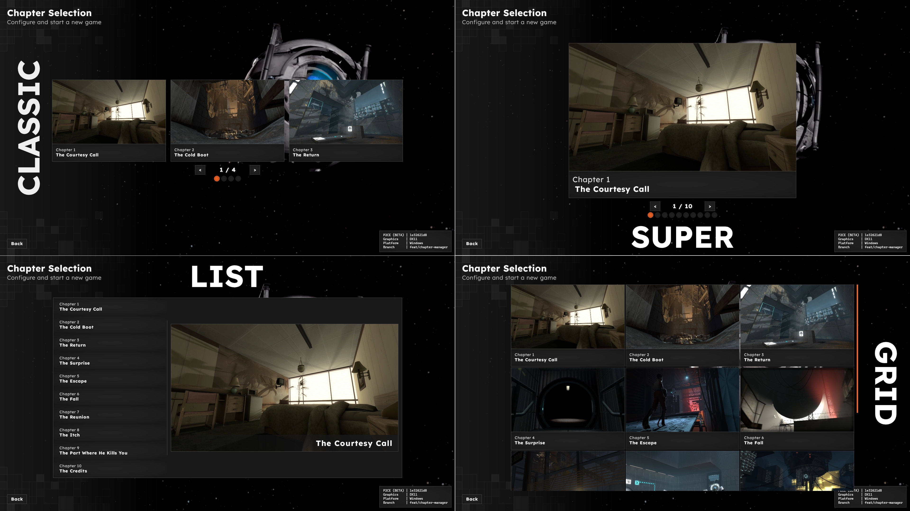

The display mode when the player enters the chapter selection screen.

Valid values are:
- `classic` (traditional VGUI film strip with 3 chapters displayed per page)
- `super` (singular massive tile)
- `list` (default)
- `grid` (ideal for map packs)

### `thumbnail`

Resolution: 1920x1080 (or aspect ratio equivalent)

Path to the image to use, including the file extension. This path is relative to the addon's `.assets` directory.

Chapter thumbnail predominantly used in the chapter selection screen, but also appears in the saves menu.

This image will be sized to fit for chapter selection entries. However, in the saves menu, this image will be sized to cover a region of the save button. Some parts of the image may be clipped in that regard.

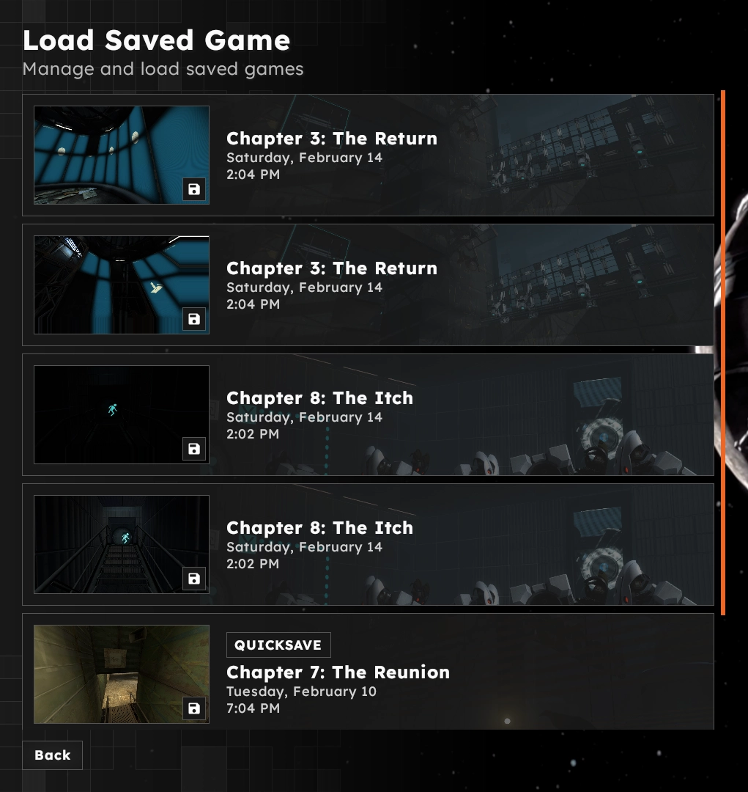

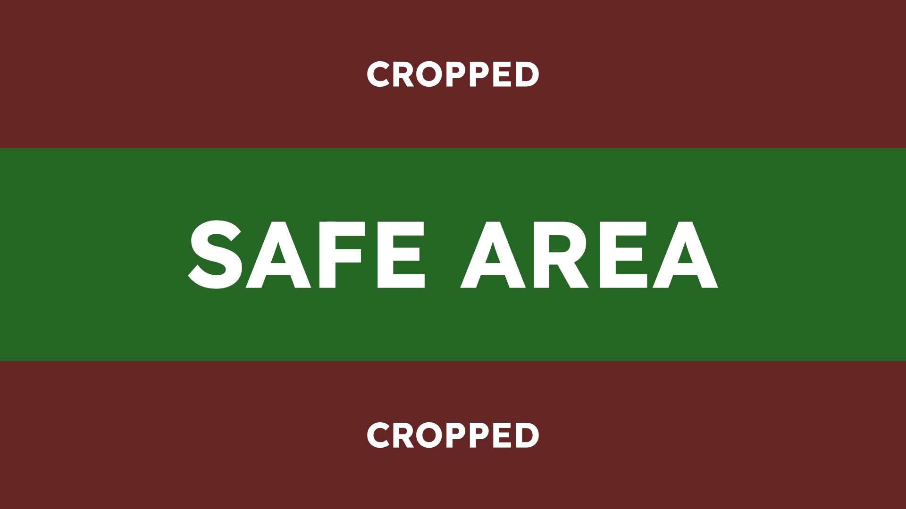

## Loading Screens

### `loading_screen`

**(OPTIONAL, DEFAULTS TO BLACK SCREEN IF NOT SPECIFIED)**

Path to the image to use, including the file extension. This path is relative to the addon's `.assets` directory.

Resolution: 1920x1080 (or aspect ratio equivalent)

The image to use when the player is loading into a map from the main menu.

This image will be sized to cover the entire screen as the background.

### `transition_screen`

**(OPTIONAL, DEFAULTS TO BLACK SCREEN IF NOT SPECIFIED)**

Path to the image to use, including the file extension. This path is relative to the addon's `.assets` directory.

Resolution: 1920x1080 (or aspect ratio equivalent)

The image to use when the player is transitioning to a map from a previous one.

This image will be sized to cover the entire screen as the background.

### Loading/Transition Screen Considerations
> [!WARNING]
> **PLEASE READ THE FOLLOWING SECTION CAREFULLY.**

P2:CE's loading screen is derived from Portal 2's where there are multiple images faded on top of each other based on loading progress. Additionally, it has two different loading screens, one for loading into a map from the menu (`loading_screen`), and another for transitioning between maps (`transition_screen`). In P2:CE specifically, the number of assets to provide is two, and the second image is faded in after the loading progress exceeds 50%. To facilitate this, `loading_screen` and `transition_screen` paths are treated specially.

The campaign script specifies the asset name prefix and image extension, while the UI script adds a numeric suffix to the information provided. If a field is not specified, the background will be a solid black color. If a field is specified and the second asset the UI searches for does not exist, a fallback image will be used.

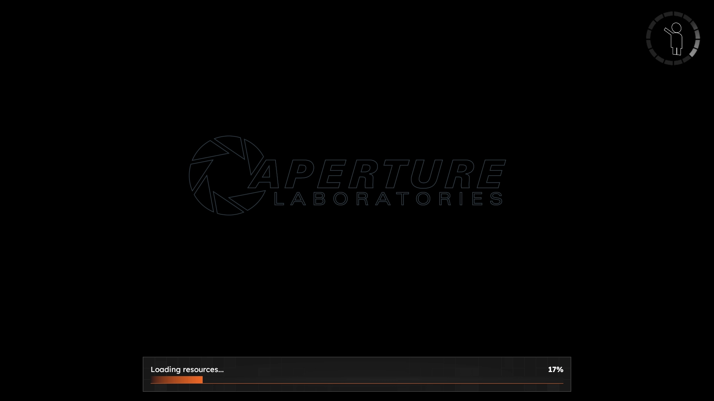
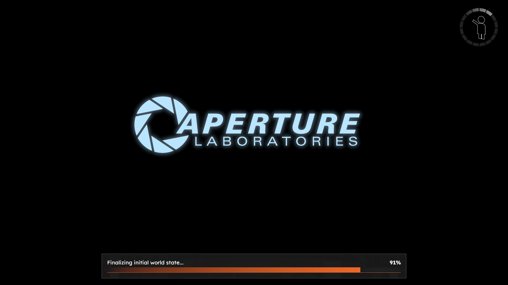

**Example:**

Suppose that loading screen assets are defined as such within a meta block:
```
meta = {
	loading_screen="loading_screen.png"
	transition_screen="transition_screen.png"
}
```

In the UI, these would then be translated into:
```
loading_screens = [
	"[ADDON PATH]/.assets/loading_screen_1.png",
	"[ADDON PATH]/.assets/loading_screen_2.png"
]
transition_screens = [
	"[ADDON PATH]/.assets/transition_screen_1.png",
	"[ADDON PATH]/.assets/transition_screen_2.png"
]
```
**(Note that this does not represent the actual campaign information as laid out in memory or by the campaign system, this is an example for human readability)**

### `loading_square_logo_padding`

**(OPTIONAL, APPLIES NO PADDING IF NOT SPECIFIED)**

The padding to give to the logo in the spinner that appears in the loading screen to help fit it inside better. This is used for Half-Life 2's campaign script.

While this is a string, the value given must be a whole non-negative number.

## Maps

> [!NOTE]
> The following keys are for meta blocks within a map block. These keys are not used anywhere else.
>
> ```
> maps = [
>     { name = "cool_map" meta = { title = "My Awesome Map", img = "cool_map.png" } }
> ]
> ```

### `title`

**(OPTIONAL)**

Human-readable name for this map, used in the map selector. If not specified, the map selector will use the map's name.

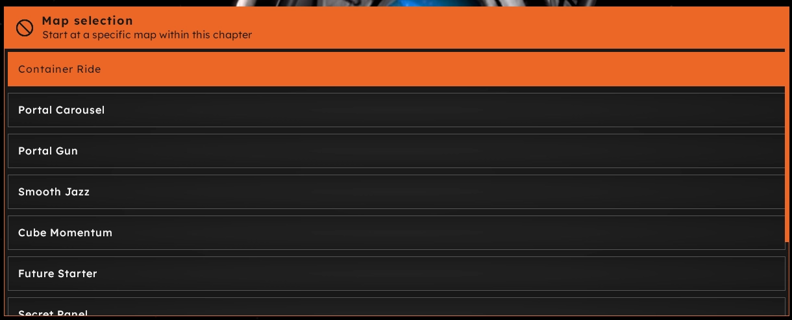

### `img`

**(OPTIONAL)**

Map thumbnail asset path, used in the map selector. If this field is not specified in *any* map in the current chapter block, the asset will not appear. If there is at least one `img` field specified, the map selector turns into a grid layout and displays images for all maps (even if a map does not define one).

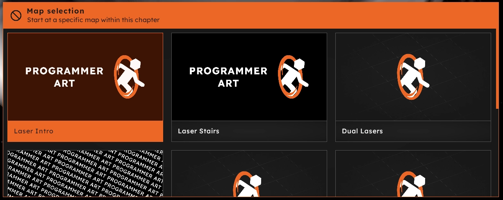
