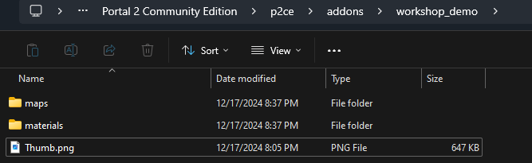
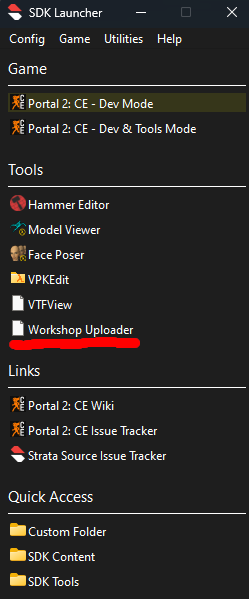
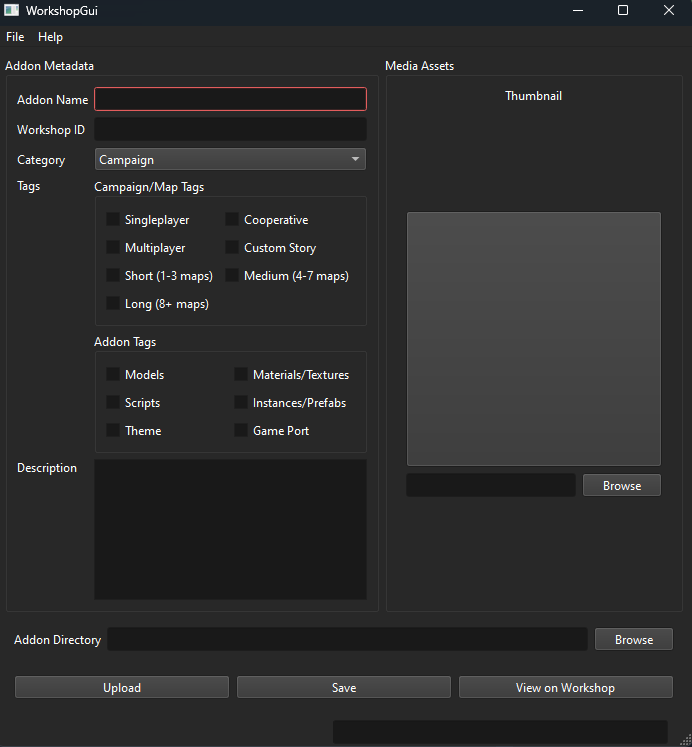
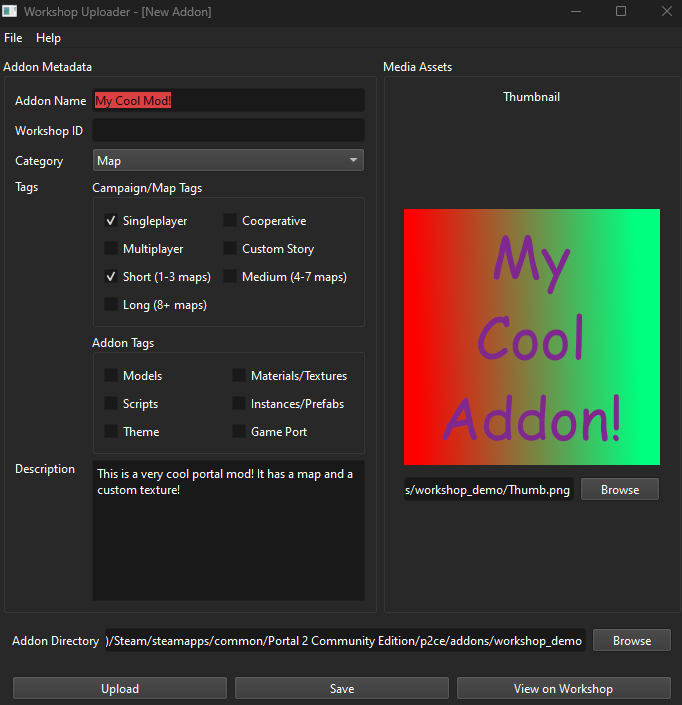
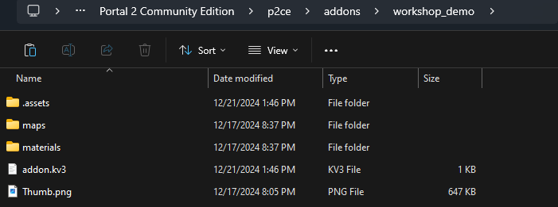
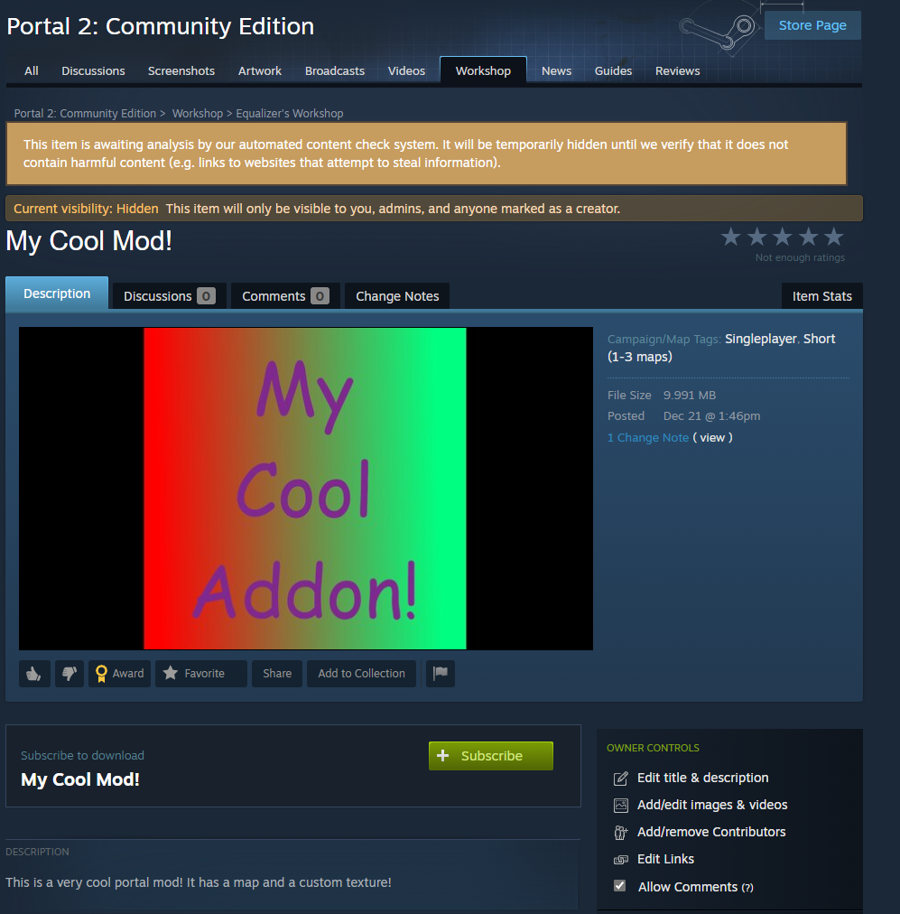
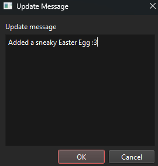

# Workshop Uploader

The workshop uploader is a GUI frontend that can upload addons to the Steam workshop.
Addons may contain maps, models, textures, materials and anything else that can be put in a normal Source Mod.

## Setting up your Addon
Before uploading your addon, you must make sure all of your addon's assets (maps, materials, scripts, models, etc) are all in the right folders. Your Addon should be structured similar to a custom folder or sourcemod, with the root folder being your MOD folder and the subfolders being where your assets are located. It is usually the best practice to put your addon inside of `p2ce\addons`, as the game can register your addon as a local addon and you can manage it like any other addon from the workshop inside of the game. Your folder setup should look similar to this:

Now, we can proceed with making this an actual addon.

## How to use the Workshop Uploader
The first step of using the Workshop Uploader is to launch it. You can find the Workshop Uploader by launching the SDK Launcher, then double-clicking the "Workshop Uploader" button under the "tools" heading.

Now that you have opened the sdk launcher, you will get this screen:

This is the Workshop Uploader GUI, where you will be able to manage most of how your addon will be uploaded to the workshop. From here, you can adjust the title, tags, description, and thumbnail of your addon. Here is an example of a fully filled out addon:

Now, if you re-examine your addon folder, you should see some new files that have been added:

Now, you will see a folder named `.assets` and a file named `addon.kv3`. You can imagine `addon.kv3` to be the `gameinfo.txt` of your addon, holding all the various information about your addon, including its name, the workshop ID, its thumbnail, tags, etc. You should never have to manually edit this file, as you can edit most of its properties from the Uploader.

> [!CAUTION]
> If you choose to manually edit this file, you run the risk of breaking your addon! The format for this file is very specific, and if it is not met exactly, it could prevent your addon from being uploaded. Proceed with caution when manually editing this.

You will also find a `.assets` folder if you chose a thumbnail for your mod, which will contain your thumbnail image. You shouldn't need to mess with this folder either, unless you want to change your thumbnail in the future.

From here, click "Save" at the bottom of your addon. Now, launch Portal 2: Community Edition so you can test your addon before publishing it.

> [!TIP]
> Disable your custom folder and `mounts.kv` file before opening the game, that way you can see if you properly packed all the necessary materials and models!

After you have fully tested your addon to make sure all necesary components are there, open back up the uploader, reopen your addon if you closed out of it, then click "Upload". After your addon gets fully packed, it will show you a popup with the URL to your uploaded mod. Now, click the "View on Workshop" button to open the page for your addon in your default browser. Don't worry if you do not have all the info you would like on your page, it automatically is marked as "Hidden", so only you can see it!

## Adjusting your addon from the workshop page
From here, you can adjust the various aspects of your mod, including additional pictures, videos, contributers, etc. Here is an example of a barebones workshop page:

Adjust your addon using the various options underneath the "Owner Controls" menu. After you have finished perfecting your addon's appearence, click on the "Change visiblity" dropdown and change it from "Hidden" to "Public". 

Congratulations! You have now successfully uploaded your addon to the Portal 2: Community Edition workshop! 

## Updating your addon
Updating an addon is as simple as uploading it. Add the new files to the addon folder and then reopen your addon in the Uploader. If you get a message saying that `addon.kv3` has been changed, accept the popup and move on. Now, make any additional changes to your addon, and click "Upload". You will get a popup asking you for an update message that looks like this:

Add any message you want, and then click Ok. Now, your addon will be updated!